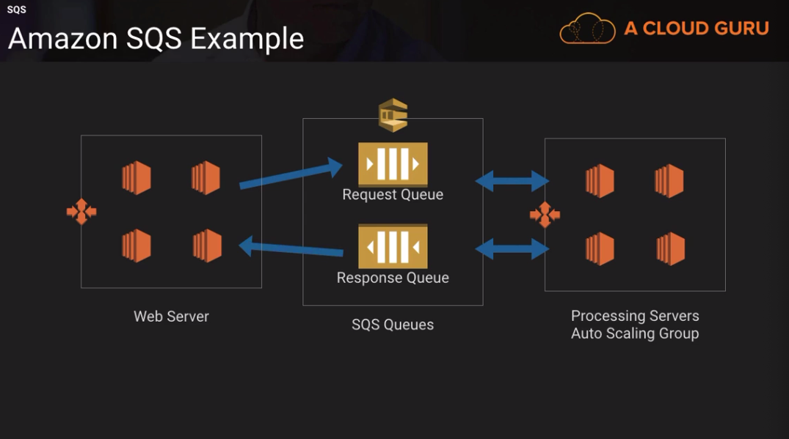
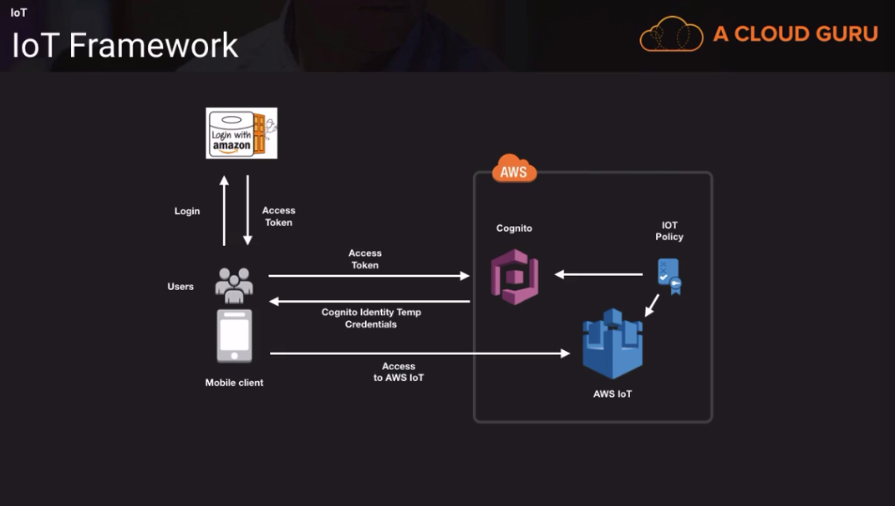

# Introduction

### Kinesis Streams
* Scenarios:
  * Fast log and feed intake and processing
  * Real-time metrics and reporting
  * Real-time data analytics (e.g. for the website in realtime)
  * Complex stream processing (chaining streams together)

* Benefits:
  * Loading the aggregate data into a data warehouse / map reduce cluster
  * Real-time aggregation of data
  * Durability and Elasticity

* Methods to load/get data
  * Kinesis Producer Library (KPL) - any app that put records into Kinesis
    stream
  * Kinesis Client Library (KCL) - consumers get records and process them the
    consumers can emit data to lambda, s3, EMR, DynamoDB, Redshift
  * Kinesis REST API
  * Kinesis Agent

#### Kinesis Streams Core Concepts
* What is a shard?
  * Uniquely identified group of data records in a stream

* You can create multiple shards in a stream
  * Stream with 2 shards
  * 2MB/sec input
  * 4MB/sec input
  * 10 trans/sec for reads
  * 2000 records/sec for writes
  * Resharding:
    * Shard split to increate the capacity (divide 1 into 2)
    * Merge shards to reduce the capacity (combine)

* What is a record?
  * Unit of data stored in a stream
  * Partition key: 
    * Allows to group the data by shard
    * Tells you which shard the data belogs to
  * Sequence number:
    * Unique identifiers for records inserted into a shard
    * Think of it as a qunie key that identifies a data blob
    * Assigned when a producer calls PutRecord or PutRecords operations to add
      data to a stream
    * You can't use sequence number to distribute records among shards, you need
      a partition key for that
  * Data blob
    * Data blog is the data your data producer adds to a stream
    * The max. size of data blob is 1MB
  * Retention period:
    * 24hrs default
    * increase to 7 days
    * change the retention by CLI

* Data producers:
  * Streams Api
    * SDK for Java
      * PutRecord
      * PutRecords (higher throughput)
  * KPL (Producer Library)
    * Configurable library to create producer apps
    * Collects records to rwite multiple records to multiple shardds per request
    * Emits errors to CloudWatch
    * Should use if you want to write 1000 of events per second into Kinesis
      Stream
    * Don't use KPL if your producer app use case cannot incur an additional
      processing delay
    * Aggregation (batching)
      * better throughput: User records (actual data from server) and streams
        records
      * combines aggregation
    * Collection (batching)
      * Multiple streams records are batched and sent as a single http call
    * Read this post for more information: https://aws.amazon.com/blogs/big-data/implementing-efficient-and-reliable-producers-with-the-amazon-kinesis-producer-library/
  * Agent
    * Standalone Java Application
    * Web server, log server, database servers
    * Download and install the agent
    * Monitor multiple directories and write to multiple streams
    * Pre-process data before it gets sent to a stream

* Data consumers:
  * KCL
    * consume and process data from the stream
    * uses connector library to send the data to s3, redshift etc.
    * KCL handles compex tasks
    * Java, Node.js, Python
    * Runs on the ec2
    * Handles checkpointing with DynamoDB table (application state)

* For the exam:
  * Any kind of scenario where you are straming large amount of data that needs
    to be processed quickly and you have a requirement to build a custom
    application to process and analyze streaming data
  * You should know the capacity of shard, records, data producers (KPL), data
    consumer (KCL), additional throughput for DynamoDB exception errors

#### Emitting data to other AWS services

* Consumers can emit data to S3, DynamoDB, ElasticSearch, Redshift, EMR
* To emit the data, the consumer needs to use the consumers connect library
  (java)
* With EMR emit the data to S3 and consme the data from S3
* Spark Streaming can consume the data from Kinesis
* Use cases:
  * S3 - archiving data 
  * Dynamodb - for realtime metrics / live dashboard
  * Elasticsearch - searchable and indexing
  * Redshift - micro batching loading to use within the warehouses
    * If you need to consume the data in near-realtime you can load the data
      e.g. hourly into dwh
  * EMR - Process and Analyze data from the stream with the Spark Streaming
  * Lambda - Automate emitting data in order to emit the data to DynamoDB, S3,
    Redshift
* Kinesis Connector Library to send the data to other AWS services
  * Java based
  * Used with the Kinesis Client Library
  * Connectors for:
    * DynamoDb
    * Redshift
    * S3
    * ElasticSearch
  * Kinesis Connector Library is a pipeline for how records form the Kinesis
    Stream will be handled:
      * The records are retrieved from the stream
      * The records are transformed according to user data model
      * Buffered for batch processing
      * Emitted to the AWS service s. above
  * Pipeline workflow:
    * Kinesis Stream ->
    * iTransformer: defines the transformation of records from the Kinesis
      stream in order to suit the user-defined data model ->
    * iFilter: excludes irrelevant records from the processing ->
    * iBuffer: buffers the set of records to be processed by specifying size
      limit (# of records) & total byte count ->
    * iEmitter: makes client calls to other aws services and persists the
      records stored in the buffer  ->
    * S3, DynamoDB, ElasticSearch, Redshift
  * Interfaces and Classes:
    * S3Emittter class
      * Writes buffer content into a single file S3 (when the buffer is full)
      * Requires the configuration of an S3 bucket and endpoint
* For the exam:
  * Data can be emitted to S3, DynamoDB, Elasticsearch and Redshift from Kinesis
    Streams using the Kinesis Connector Library
  * Lamba function can automatically read records from a Kinesis Stream, process
    them and send the records to S3, DynamoDB or Redshift

### Firehose Core Concepts
* Collect and loads stream data in near real-time
* Load data into S3, Redshift, and Elasticsearch
* Use existing BI tools and dashboards
* Can batch and compress the data
* Encrypt the data before it's loaded
* Buffer size is between 1MB to 128MB
* Data is replicated through 3 AZs

* Producers (web servers) ---> generate logs ---> Kinesis Firehose (buffer size
  / buffer interval) -----> S3 -----> copy command ---> Redshift

* Methods to load data (send to Firehose)
  * Kinesis Agent
    * Java app that can collect and send logs
    * Monitor files and sends to a Delivery Stream
    * Checkpointing / CloudWatch metrics
    * Pre-process data
  * AWS SDK
    * PutRecord
    * PutRecordBatch (multiple data records within one call)

* Transforming Data Using Lambda
  * Parameters for Transformation
    * recordId - transformed record must have the same recordid prior to
      transformation
    * result - transformed record status: 'Ok', 'Dropped' and 'Processingfailed'
    * data - transformed data payload after 64base encoding
  * Failure handling:
    * 3 retries (if not succeed skips the batch of records)
    * Invocation errors can be logged to CloudWatch Logs
    * S3
      * retries delivery for up to 24 hours
    * Redshift
      * retry duration 0-7200 seconds from S3
      * skips s3 objects (if the cluster is under maintanance) -> lists them
        into manifest file for manual backfill
    * ES:
      * retry from 0-7200 secods
      * skipped documents delivered to s3 bucket for manual backfill
  * Frequencey:
    * S3:
      * Depends on buffer size or buffer interval
      * Firehose can raise the buffer size dnymically
    * REdshift
      * How fast can the redshift can issue the copy command
    * Elasticsearch
      * Buffer size or interval
      * can raise dynamically
* For the exam:
  * Firehose can load streaming data into S3, Redshift and ElasticSearch +
    Splunk
  * How is Lambda used w/ Firehose

### SQS
* Where to use SQS where to use Kinesis
* Reliable, Scalable, Hosted Queues service for sending, storing and retrieving
  data between servers.
* SQS allows you to move data between distributed components of your
  applications without loosing messages or requiring each application component
  to be available all the time
* The Queue acts as a buffer between the component producing and sending data and
  the componenent receiveing the data for procesing
* Use cases:
  * It solves issues e.g. a producer produces the work faster as a consumer can
  process it
  * Or if the producers and consumers are only available interventently
* The messages you can store can contain up to 256kb of text in any format
* Any component in a distributed app can store in the queue
* Any component in the application can retrieve from the queue using the SQS API
* > 256KB can be managed using SQS Extended Client Libraray, which uses S3 for
  storing larger payloads
* Ensure delivery of a message at least once
* Supports multiple readers and writers. A single queue can be shared by many
  components with no need for coordination
* FIFO queues are supported (de-duplication)
* Messages can be retained for up to 14 days
* Long polling reduces extraneous polling (when queue is empty it waits 20s for
  new polling)
* Examples:
  * Web server autoscaling group scales based on amount of orders. The web
    servers place a message to a Request Queue
  * These orders are sitting in the queue until they are picked up by one of the
    free processing servers
  * Processing servers auto scaling consume the messages from the queue. The
    processing server processes the queue and sends a response back to a
    Response queue
  * The response queue gets polled by the web servers that are managing orders
    the information gets send back to the customer
  * The main advantage that both the web servers and processing servers can
    scale up and down based on the incoming traffic and amount of messages in
    the queue. Now you can save money on resources that you don't need, you
    decouple web servers from processing servers

* SQS Architecture Priority Systems
  * You can use two queues to create priority
  * The webserver can send messages to either high or low priority queue
  * Then the processing servers will query the high priority queue, if there are
    not messages left it will query the low prioerity queue

* SQS Architecture Fanout (parallel processing)

* For the exam:
  * SQS allows you to move data between distributed components of the
    applications without loosing messages or require each application component
    to be available all the time
  * vs. Kinesis stream is to enable real-time processing of big data 
  * SQS use cases with the architectures: order processing, image processing
  * Kinesis Streams use cases
    * Fast log and data feed intake and processing
    * Real-time metrics and reporting 
    * Real-time data analytics
    * Complex stream processing
    * Data gets consumed from Kinesis and emitted into other AWS services: S3,
      Redshift, DynamoDb, ElasticSearch

### AWS IoT
* Managed cloud platform
* Connects devicces securely with app and other devices
* Can connect those devices to other AWS services
  * Analyze streaming data in real-time
  * Processing the data that comes from devices
* Thing sends to IoT -> Firehose | Streams | DynamoDb, ML, CloudWatch, Lambda
* AWS provides with SDK to connect with AWS via MQ and other protocols

* Authentication: 
  * Each connected device requires a X.509, upload your own CSR or CA
  * IoT uses IAM policies for users, groupd and roles (allows to access other
    AWS services)
  * Cognito can be used to authenticate against AWS IoT
    * Allows you to use your own identity provider
    * Login with Amazon, Facebook, Google, Twitter
    * Cognito Identity User Pools (allows create your own directory of users)

* Authorization
  * Aws IoT policies and IAM policies to control operations an identity can
    perform
  * AWS IoT operations:
    * Control plane API for administrative tasks (like creating certificates,
      rules)
    * Data plane API for sending and receiving data from AWS IoT

* Device Gateway (Message Broker) - a topic
  * Maintains sessions and subscriptions for all connected devices
  * Allows secure one-to-one and one-to-many communications
  * Protocols:
    * MQTT (message queue telemetry transport)
    * WebSockets
    * Http
  * Scales automatically

* Device Registry
  * What is a Thing?
    * Physical device or logical entity (application)
  * Registry is a central location for storing attributes related to each thing

* Thing Shadow
  * Json document to store and retrieve the current state for a thing
  * Acts as a message channel to send commands to a thing

* Rules engine
  * Provide a thing the ability to interact with the AWS IoT service and other
    services
  * Routes messages to various Aws services
  * SQL syntax
  * Rule actions can be for:
    * Lambda
    * DynamoDb
    * Kinesis Streams
    * SQS
    * S3
    * Firehose
    * Machine Learning

* For the exam:
  * Authentication and Authorization
  * Cognito w/ IoT
  * Device gateway, shadow
  * Rule engine and rule actions for other AWS services

### Data Pipeline
* Backup and restore data into another regions
* Web service that helps you process and move data between AWS compute and
  storage services and on-premise data sources
* Create an ETL workflow to automate processing and movevemtn of data at
  scheduled intervals, then terminate the resource
* Lambda can do a lot of things that Data Pipeline can do
* One of the features of data pipeline is to move data across regions (us-east-1
  export the data to s3 bucket in us-west-2 and import that data into dynamodb
  in us-east-2 - it starts EMR clusters)
* Pipeline is a name of the container that contains...
  * Datanodes
  * Activities
  * Preconditions
  * Schedules
  * These components help you to move your data from one location to another
  * EC2 instanc eor an EMR cluster which are provisioned and terminated
    automatically (run a shell script, Pig, Hive)
* Pipline can run on-premise:
  * Install a Task runner package on your on-premise hosts
  * Once installed the package continuously polls the data pipeline for work to
    perform
  * When it's time to run a particular activity on your on-premise resources,
    for example, executing a DB stored procedure or a database dump, AWS Data
      Pipeline will issue the appropriate command to the Task Runner
* Datanode
  * is the end-destination for your data
* Activity
  * is an action that pippeline initiates on your behalf
* Precondition
  * readiness check that can be optionally associated with a data source or
    activity
  * Check if:
    * DynamoDBDataExits
    * DynamoDBTableExists
    * S3KeyExists
    * S3PrefixExists
    * Shell custom preconditions
* Schedules:
  * When the pipeline should run

* For the exam:
  * Web service that helps you reliably process and move data between different
    AWS compute and storage services
  * Can be integrated with on-premise environments
  * Data pipeline will provision and terminate resources as, and when, required
  * Pipeline components include datanode, activity, precondition and schedule
  * A lot of its functionality has been replacted by Lambda

### Getting Data into AWS
* Direct connect:
  * Increase bandwith throughput and connection to VPC

* Storage Gateway
  * Allows on-premises applications to use cloud storage
  * Backup/archiving, storage and migration
  * Applications connect throough a virtual machine or hardware gateway
    appliance

* S3 Transfer Acceleration
  * Uploading to a centralized buckets from various parts of the world
  * Transfer Acceleration uses CloudFront

* Database Migration Service
  * Source database remains operational/minimize downtime
  * Supports open source and commercials
  * Homogenous/Hereogenous migration
  * One-time or continous replication to AWS
  * Combination of Snowball and DMS (> 5 TB)
  * Depends on use case

* Lambda has an aws redshift data loader. With this AWS Lambda function, it's never been easier to get file data into Amazon Redshift. You simply drop files into pre-configured locations on Amazon S3, and this function automatically loads into your Amazon Redshift clusters.
