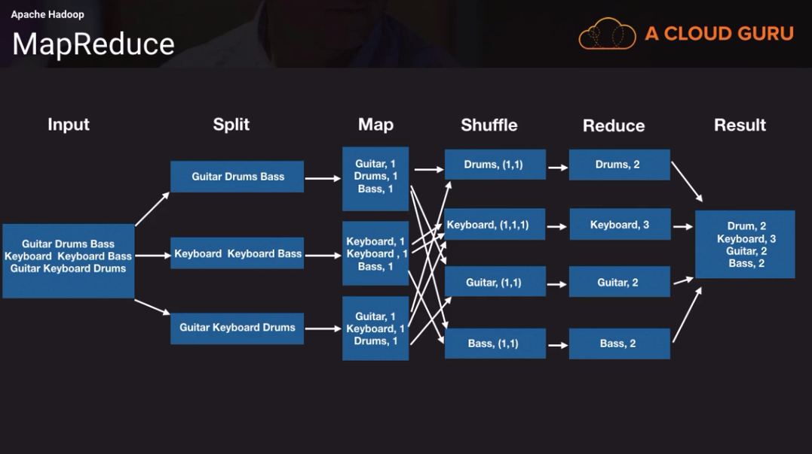
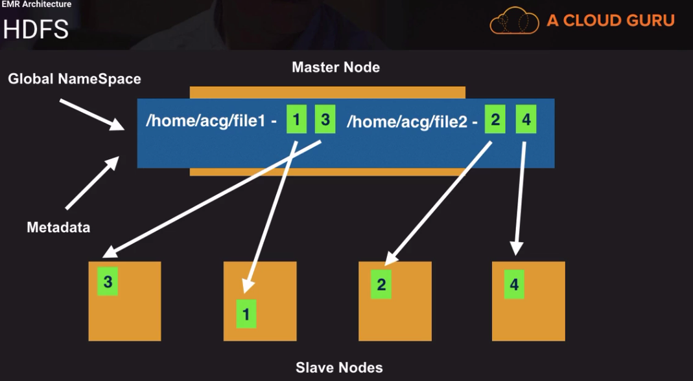
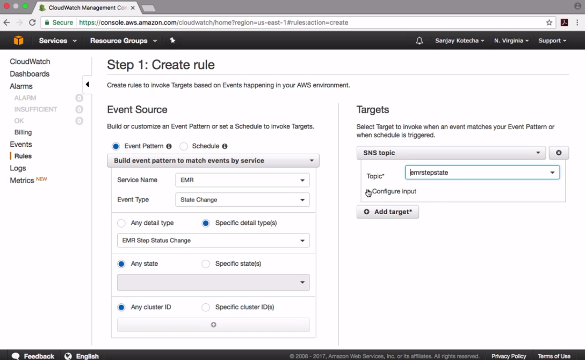

# EMR

### Introduction
* Instance group is a collection of ec2 instances
* EMR can have up to 50 instance instance groups
* 1 master instance group
* 1 core instance group
* 48 tasks instance groups (you can use different instance groups e.g. spot
  instances)
* Master node:
  * Single master node
  * Manages the resources of a cluster
    * Coordinates distribution and parallel execution of MapReduce executables
    * Tracking and directing against HDFS
    * ResourceManager
    * Monitors the health and task nodes
* Core node:
  * Slave node
  * Run tasks
  * HSDFS or EMRFS (instanste storage or EBS volumes for HDFS)
  * DataNode deamon read/write request on the core node
  * NodeManager on Slave nodes (takes the action from the master node who to
    manage the resources)
  * ApplicationMaster (monitors containers)
  * "Shrink" operation should be done when no jobs are running
* Task node:
  * Slave node
  * Optional
  * No HDFS
  * Added and removed from running clusters
  * Give extra capacity 
  * Containers - the data processing is happeing in the container

#### Hadoop Part 1
* EMR provides you with the Hadoop Distribution
* What is Hodoop?
  * The Apache Hadoop software library is a framework
  * Distributed processing of large data sets across clusters of computers using
    simple programming models
  * Can scale up from single servers to thousands of machines, each offering
    local computation and storage
  * The library itself is designed to detect and handle failures at the
    application layer
* Architecture / Modules:
  * Hadoop Common (Hadoop Core)
    * Libraries and utitlities needed by other Hadoop modules
    * Considered as the core of Hadoop framework
    * Abstraction of the underlying operating system and its file system
    * Contents JAR files and scripts required to start Hadoop
  * Hadoop Distributed File System (HDFS)
    * Distributed File Systems
    * Fault-tolerant
    * Data replication (stores a files as a sequence of blocks)
    * High troughput to data
  * Hadoop Yarn
    * Yet Another Resource Negotiator
    * Cluster resource-manager and job scheduler
    * Yarn allows other frameworks such as Tez, Spark etc. to access the same
      data set
  * MapReduce:
    * Programming framework for processing very large data sets
    * Parallel, distributed algorithm on a cluster
    * Filesystem (unstructured)
    * Database (structured)
    * Data locally is processed
  * MapReduce Job Tasks
    * Map
      * Splits data into smaller chunks
      * Processed in parallel
    * Reduce
      * Outputs of map task become input for the reduce task
      * Data is reduced to create an output file
    * Map and Reduce:
      * Input: (reads the records and process the data into splits, each record is a key/value pair) [Guitar, Drums, Bass, Keyboard, Keyboard Bass, Guitar, Keyboard
        Drums]
      * Split: [Guitar, Drums, Bass] [Keyboard, Keyboard Bass] [Guitar, Keyboard
        Drums] 
      * Map: (the resource manager assigns the map phase to start paralle
        processing, and intermediate key/value pairs are generated)
      * Shuffle: (sorted by keys)
      * Reduce: (runs the reduce function on all of them)



#### EMR Architecture 
* EMR includes a single master node
* The master node schedules jobs on core nodes and task nodes 
* Core and task nodes are slave nodes
* Nodes get categorized into instance groups:
  * An instance group is a collection of ec2 instances and it's a way to
    organize them
  * Master Instance group: 
    * Single master node
    * In order to make master node not as a single point of failure the metadata
      can be stored in a metadata store
    * Manages the resources of a cluster
      * Coordinates the distributionand parallel exectuion of MapReduce
        executables
      * Tracking and directing against HDFS
      * ResourceManager (scheduler to allocate resources on the cluster for
        competing applications)
  * Core instance group: 
    * Slave node
    * Run tasks
    * Store data on HDFS or EMRFS (you can use instance storage or ebs volumes)
    * EMRFS exteds storage to S3
    * NodeManager (takes direction from the Yarn how to manage the resources on
      core node)
    * ApplicationManager to execute and manage the containters
    * Container gives access to Spark, Tez etc. by giving them resources form
      the node
  * Task instance group:
    * Slave node
    * Optional (no need for task nodes)
    * No HDFS
    * Added and removed from running clusters
    * Extra capacity
* HDSF
  * What is a distirbuted file system?
    * Allow simultaneous access to data and files from many clients to a set of
      distributed machines
    * Share files and storage resources
    * Replication
    * Typical DFS would not work well for MapREduce, hence we have HDFS
  * HDSF is designed to hold large amounts of data
  * Data is replicated across 3 nodes
  * In HDFS data is broken into blocks:
    * Block sizes and files tend to be large
    * 64MB is default
    * No real limit on how large a block can be, generally a range from 64MB to
      256MB
    * Depends on the data
      * For very large files you may use 256MB
      * For smaller files you may use 64MB
    * Why are block size large in HDFS?
      * Minimize random diks seeks and latency
        * Disk seeks: Time takes from a disk drive to locate the area on the
          disk where the dat ato be read is stored
    * Block sizes can be set per file
    * The blocks are distributed sequentially
    * Default replication factor of 3
      * Set in the hdfs-site.xml file
      * Can be changed per file
  * Storage Options
    * Instance store (is atteched to the instance is phemeral)
      * High I/O performance
      * High IOPS at low cost
      * D2 and I3
    * EBS for HDFS
      * Warning: When unsing EBS with EMR the volumes don't persist after
        cluster termination
    * EMR File System (EMRFS)
      * An implementation of HDFS which allows clusters to store data on S3
      * Uses data directly on S3 without ingesting into HDFS
      * Reliability, durability and scalabiliy of S3
      * You can resize the cluster without loosing data
    * Use EMRFS (S3 store) and HDFS (local store) together
      * Copy data from S3 to HDSF using S3DistCp
      * High I/O performance
      * Processing the same dataset frequently
    * EMRFS and Consistent View
      * S3 - Read after write consistency for new put requests
      * S3 - Eventual consistency for overwrite of put and delete requests
      * Listing after quick write may be incomplete
      * For example an ETL pipeline that depends on list an input to subsequent
        steps. Therefore EMR has a feature which is called Consistent View
    * EMRFS and Consistent View
      * Check for list and read-after-write consistency for new S3 objects
        written or synched to EMRFS
      * If the Consistent view detects that the data is inconsistent, retry
        logic will be running
      * The consistent view feature does this by storing metadata in DynamoDb
        and keeps track of S3 objects
      * Read-after-write consistency is stricter than eventual consistency. A newly inserted data item or record will be immediately visible to all the clients. Please note that it is only applicable to new data. Updates and deletions are not considered in this model.
      * Amazon S3 provides read-after-write consistency for PUTS of new objects in your S3 bucket and eventual consistency for overwrite PUTS and DELETES in all regions.  So, if you add a new object to your bucket, you and your clients will see it. But, if you overwrite an object, it might take some time to update its replicas – hence the eventual consistency model is applied.
    * Single Availability Zone Concept
      * Blocks are replicated across nodes. While the latency between
        availability zones can be low, it's not ideal to replicate blocks across
        different AZs
      * Master core and task node communication won't be efficient
      * Access to metadata won't be efficient
      * Single master node (no need to run in multiple AZs)



#### EMR Operations
* EMR releases:
  * Set of software application and components
  * Two Hadoop distributions: AWS Hadoop and MapReduce Distributin
* Pre-built scripts and applications
  * Java, Hive, Pig, Pythong, Scala, Net
  * Automatically launch from S3 (code)
  * Interactive mode execute your script on master node
* Long-running clusters vs. transient clusters
  * Long-running clusters
    * Cluster stays up and running for queries against HBase
    * Jobs on the cluster run frequently
    * Data may be so large, that loading into a new cluster each time is
      inefficient
    * Keep HDSF data on core nodes
    * Auto-termination is disabled
    * Termination protection is enabled
  * Transiert clusters
    * Temporary cluster that shuts down after processing
    * Batch jobs when needed
    * Reduced costs - only billed when the EMR cluster is running
    * Input, output dat aand code stored in S3 (makes easy to start a new
      cluster)
    * Easy recover in case of failures
      * Data stored in S3
      * Hive metastore can be stored in MySQL RDS (partition names, data types)
* Apache Hive:
  * Data warehouse infrastructure on top of Hadoop
  * Summarize, Query, and Analyze very large data sets
  * Uses a SQL-like interface (HiveQL)

#### Hive Example - Lab
* Start a new cluter with only single master node
* Choose advanced configuration only install Hive and Hadoop
* Create an export / output bucket and upload the `hive.q` script
* The content of the `hive.q` script looks as following:
* We create an external table that holds the structure of the data in the Hive
  metastore. After the table creation we run a select query `select
  sum(l_discount) from lineitem` it does calculate the sum of all discounts
```sq
create external table lineitem
(
L_ORDERKEY INT,
L_PARTKEY INT,
L_SUPPKEY INT,
L_LINENUMBER INT,
L_QUANTITY INT,
L_EXTENDEDPRICE DOUBLE,
L_DISCOUNT DOUBLE,
L_TAX DOUBLE,
L_RETURNFLAG STRING,
L_LINESTATS STRING,
L_SHIPDATE STRING,
L_COMMITDATE STRING,
L_RECEIPTDATE STRING,
L_SHIPINSTRUCT STRING,
L_SHIPMODE STRING,
L_COMMENT STRING)
ROW FORMAT DELIMITED FIELDS TERMINATED BY '|'
LOCATION 's3://bigdatalabdt/emrdata/';

-- Total discounts all time

INSERT OVERWRITE DIRECTORY 's3://emrdemodt/output/' select sum(l_discount) from lineitem;
``` 
* Under `add steps` provide all necessary information to run the script from
  above  `hive.q`
* Activate auto-termination and remove auto-protection
* Finish starting a cluster and wait until the calculation is done and the
  cluster is auto-terminated
* The final result is a file `000000_0` that has one line in it:
```
▶ cat 000000_0
2999373.24005583
``` 

* Choosing Instance Type
  * MapReduce
    * Batch oriented (scheduled batch process)
    * M3 or M4 instance types
    * Scale horizontally
  * Machine Learning
    * P2 instance types
    * C3 or C4 instance types
  * Spark
    * R3 or R4 (in-memory caching)
  * Large instance store based HDFS
    * MapReduce that require high I/O performance and high IOPS
    * Large HBase clusters
      * I2 (I3 instance types releases but not supported in EMR yet)
      * D2
* How many instances do I need?
  * Instance types + number of instances will help you tune your cluster to
    handle the amount of data you need to process
  * You should test with your data
  * Master node sizing
    * Low compute requirements
    * Clusters with 50 nodes or less, use a m3.xlarge or m4.xlarge for your
      master node
    * Cluster with 50 nodes or more, use a m3.2xlarge or m4.2xlarge for your
      master node
  * Core node sizing:
    * Run tasks (processing)
    * Stores data (HDFS)
    * Will you use EMRFS? or HDFS?
    * Replication factor
      * In EMR by the defaupt the replication factor is:
        * Cluster of 10 nodes or more i 3
        * Cluster of 4-9 nodes is 2
        * Cluster of 3 nodes or less is 1
    * Calculate HDFS capacity of a cluster
    * Remember that EMRFS is an option, use HDFS (instance store or EBS) if you
      have high I/O requirements
    * Example:
      * High I/O requirements for my cluster
      * Amount of data I want to store on HDFS is 3 TB
      * 10 nodes of 800GB = 8 TB (across all nodes)
      * Replication factor is 3
      * To calculate HDFS capacity
        * 8 TB (total storage) / 3 (replication factor) = 2.6 TB
        * Data size is 3 TB, HDFS capacity is 2.6 TB - not enough space
      * To get 3 TB capacity needed to store the data you can either:
        * Add more nodes
        * Or add more EBS capacity for the storage
        * Or pick larger instances
  * Large cluster fo small nodes vs. small cluster of large nodes
    * 500 small nodes vs. 250 fewer larger nodes
    * Subject for debate with Big data professional
    * Aws best practice: smaller cluster of larger nodes
    * The case for smaller cluster of larger nodes...
      * Less amount of nodes, reduces failure possibilities because you have
        less nodes
      * Less amount of nodes, reduces the amount of maintanence
* Monitoring:
  * CloudWatch Events:
    * Respond to state changes in resources
    * Send event into the stream

    
