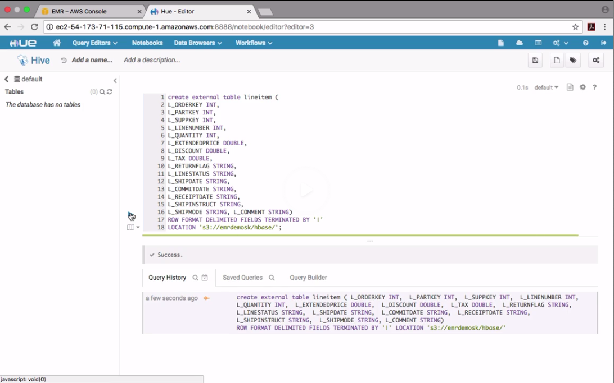
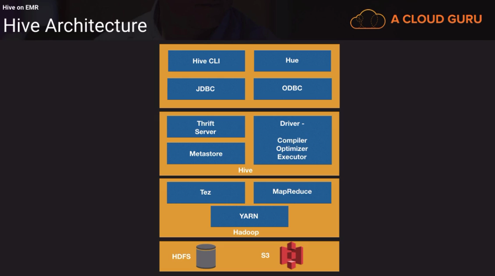
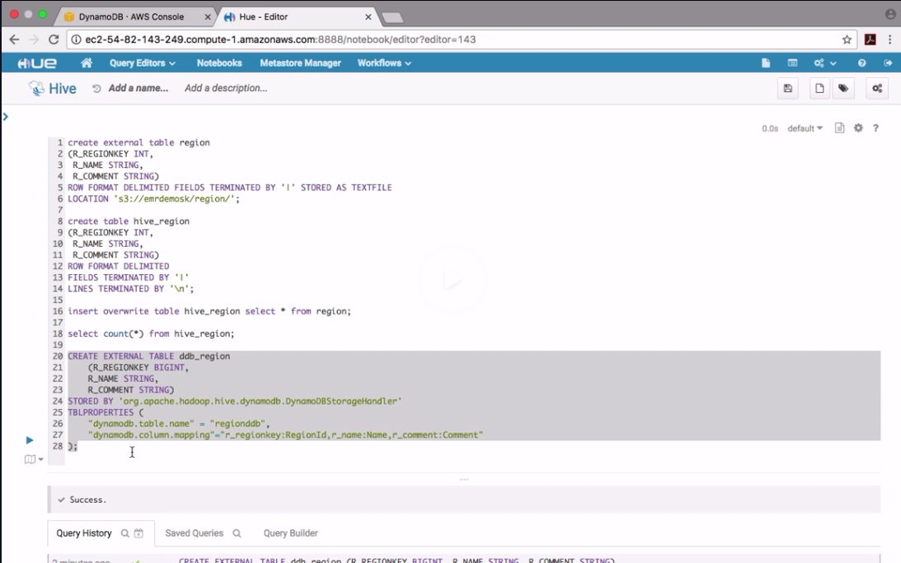
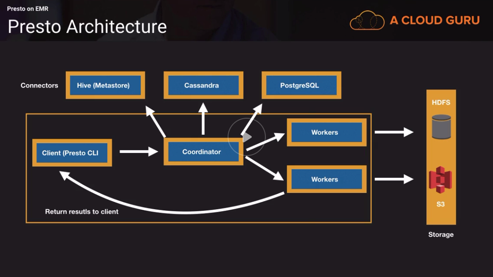
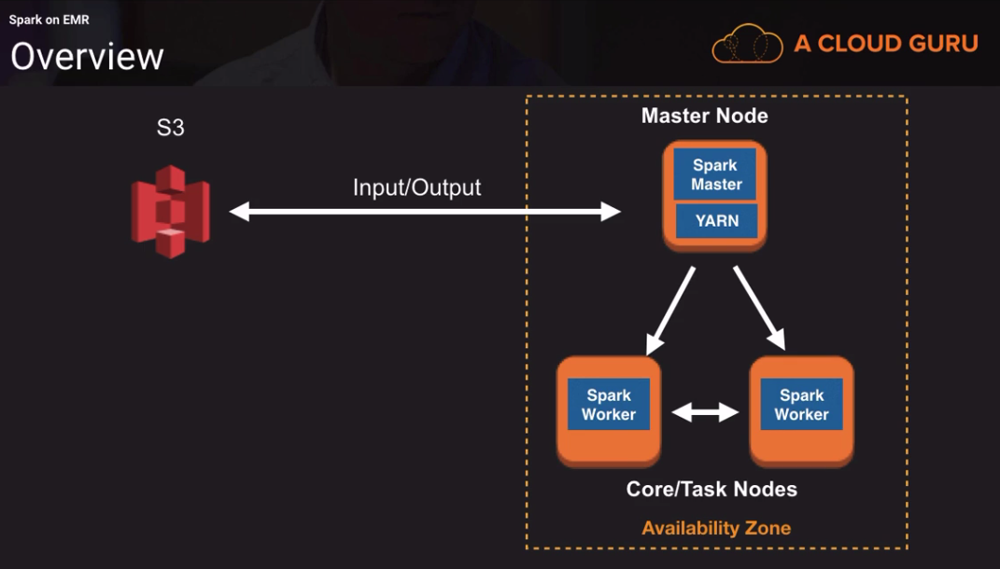

# EMR

### Introduction
* Instance group is a collection of ec2 instances
* EMR can have up to 50 instance instance groups
* 1 master instance group
* 1 core instance group
* 48 tasks instance groups (you can use different instance groups e.g. spot
  instances)
* Master node:
  * Single master node
  * Manages the resources of a cluster
    * Coordinates distribution and parallel execution of MapReduce executables
    * Tracking and directing against HDFS
    * ResourceManager
    * Monitors the health and task nodes
* Core node:
  * Slave node
  * Run tasks
  * HSDFS or EMRFS (instanste storage or EBS volumes for HDFS)
  * DataNode deamon read/write request on the core node
  * NodeManager on Slave nodes (takes the action from the master node who to
    manage the resources)
  * ApplicationMaster (monitors containers)
  * "Shrink" operation should be done when no jobs are running
* Task node:
  * Slave node
  * Optional
  * No HDFS
  * Added and removed from running clusters
  * Give extra capacity 
  * Containers - the data processing is happeing in the container

#### Hadoop Part 1
* EMR provides you with the Hadoop Distribution
* What is Hodoop?
  * The Apache Hadoop software library is a framework
  * Distributed processing of large data sets across clusters of computers using
    simple programming models
  * Can scale up from single servers to thousands of machines, each offering
    local computation and storage
  * The library itself is designed to detect and handle failures at the
    application layer
* Architecture / Modules:
  * Hadoop Common (Hadoop Core)
    * Libraries and utitlities needed by other Hadoop modules
    * Considered as the core of Hadoop framework
    * Abstraction of the underlying operating system and its file system
    * Contents JAR files and scripts required to start Hadoop
  * Hadoop Distributed File System (HDFS)
    * Distributed File Systems
    * Fault-tolerant
    * Data replication (stores a files as a sequence of blocks)
    * High troughput to data
  * Hadoop Yarn
    * Yet Another Resource Negotiator
    * Cluster resource-manager and job scheduler
    * Yarn allows other frameworks such as Tez, Spark etc. to access the same
      data set
  * MapReduce:
    * Programming framework for processing very large data sets
    * Parallel, distributed algorithm on a cluster
    * Filesystem (unstructured)
    * Database (structured)
    * Data locally is processed
  * MapReduce Job Tasks
    * Map
      * Splits data into smaller chunks
      * Processed in parallel
    * Reduce
      * Outputs of map task become input for the reduce task
      * Data is reduced to create an output file
    * Map and Reduce:
      * Input: (reads the records and process the data into splits, each record is a key/value pair) [Guitar, Drums, Bass, Keyboard, Keyboard Bass, Guitar, Keyboard
        Drums]
      * Split: [Guitar, Drums, Bass] [Keyboard, Keyboard Bass] [Guitar, Keyboard
        Drums] 
      * Map: (the resource manager assigns the map phase to start paralle
        processing, and intermediate key/value pairs are generated)
      * Shuffle: (sorted by keys)
      * Reduce: (runs the reduce function on all of them)


#### EMR Architecture 
* EMR includes a single master node
* The master node schedules jobs on core nodes and task nodes 
* Core and task nodes are slave nodes
* Nodes get categorized into instance groups:
  * An instance group is a collection of ec2 instances and it's a way to
    organize them
  * Master Instance group: 
    * Single master node
    * In order to make master node not as a single point of failure the metadata
      can be stored in a metadata store
    * Manages the resources of a cluster
      * Coordinates the distributionand parallel exectuion of MapReduce
        executables
      * Tracking and directing against HDFS
      * ResourceManager (scheduler to allocate resources on the cluster for
        competing applications)
  * Core instance group: 
    * Slave node
    * Run tasks
    * Store data on HDFS or EMRFS (you can use instance storage or ebs volumes)
    * EMRFS exteds storage to S3
    * NodeManager (takes direction from the Yarn how to manage the resources on
      core node)
    * ApplicationManager to execute and manage the containters
    * Container gives access to Spark, Tez etc. by giving them resources form
      the node
  * Task instance group:
    * Slave node
    * Optional (no need for task nodes)
    * No HDFS
    * Added and removed from running clusters
    * Extra capacity
* HDSF
  * What is a distirbuted file system?
    * Allow simultaneous access to data and files from many clients to a set of
      distributed machines
    * Share files and storage resources
    * Replication
    * Typical DFS would not work well for MapREduce, hence we have HDFS
  * HDSF is designed to hold large amounts of data
  * Data is replicated across 3 nodes
  * In HDFS data is broken into blocks:
    * Block sizes and files tend to be large
    * 64MB is default
    * No real limit on how large a block can be, generally a range from 64MB to
      256MB
    * Depends on the data
      * For very large files you may use 256MB
      * For smaller files you may use 64MB
    * Why are block size large in HDFS?
      * Minimize random diks seeks and latency
        * Disk seeks: Time takes from a disk drive to locate the area on the
          disk where the dat ato be read is stored
    * Block sizes can be set per file
    * The blocks are distributed sequentially
    * Default replication factor of 3
      * Set in the hdfs-site.xml file
      * Can be changed per file
  * Storage Options
    * Instance store (is atteched to the instance is phemeral)
      * High I/O performance
      * High IOPS at low cost
      * D2 and I3
    * EBS for HDFS
      * Warning: When unsing EBS with EMR the volumes don't persist after
        cluster termination
    * EMR File System (EMRFS)
      * An implementation of HDFS which allows clusters to store data on S3
      * Uses data directly on S3 without ingesting into HDFS
      * Reliability, durability and scalabiliy of S3
      * You can resize the cluster without loosing data
    * Use EMRFS (S3 store) and HDFS (local store) together
      * Copy data from S3 to HDSF using S3DistCp
      * High I/O performance
      * Processing the same dataset frequently
    * EMRFS and Consistent View
      * S3 - Read after write consistency for new put requests
      * S3 - Eventual consistency for overwrite of put and delete requests
      * Listing after quick write may be incomplete
      * For example an ETL pipeline that depends on list an input to subsequent
        steps. Therefore EMR has a feature which is called Consistent View
    * EMRFS and Consistent View
      * Check for list and read-after-write consistency for new S3 objects
        written or synched to EMRFS
      * If the Consistent view detects that the data is inconsistent, retry
        logic will be running
      * The consistent view feature does this by storing metadata in DynamoDb
        and keeps track of S3 objects
      * Read-after-write consistency is stricter than eventual consistency. A newly inserted data item or record will be immediately visible to all the clients. Please note that it is only applicable to new data. Updates and deletions are not considered in this model.
      * Amazon S3 provides read-after-write consistency for PUTS of new objects in your S3 bucket and eventual consistency for overwrite PUTS and DELETES in all regions.  So, if you add a new object to your bucket, you and your clients will see it. But, if you overwrite an object, it might take some time to update its replicas – hence the eventual consistency model is applied.
    * Single Availability Zone Concept
      * Blocks are replicated across nodes. While the latency between
        availability zones can be low, it's not ideal to replicate blocks across
        different AZs
      * Master core and task node communication won't be efficient
      * Access to metadata won't be efficient
      * Single master node (no need to run in multiple AZs)


#### EMR Operations
* EMR releases:
  * Set of software application and components
  * Two Hadoop distributions: AWS Hadoop and MapReduce Distributin
* Pre-built scripts and applications
  * Java, Hive, Pig, Pythong, Scala, Net
  * Automatically launch from S3 (code)
  * Interactive mode execute your script on master node
* Long-running clusters vs. transient clusters
  * Long-running clusters
    * Cluster stays up and running for queries against HBase
    * Jobs on the cluster run frequently
    * Data may be so large, that loading into a new cluster each time is
      inefficient
    * Keep HDSF data on core nodes
    * Auto-termination is disabled
    * Termination protection is enabled
  * Transiert clusters
    * Temporary cluster that shuts down after processing
    * Batch jobs when needed
    * Reduced costs - only billed when the EMR cluster is running
    * Input, output dat aand code stored in S3 (makes easy to start a new
      cluster)
    * Easy recover in case of failures
      * Data stored in S3
      * Hive metastore can be stored in MySQL RDS (partition names, data types)
* Apache Hive:
  * Data warehouse infrastructure on top of Hadoop
  * Summarize, Query, and Analyze very large data sets
  * Uses a SQL-like interface (HiveQL)

#### Hive Example - Lab
* Start a new cluter with only single master node
* Choose advanced configuration only install Hive and Hadoop
* Create an export / output bucket and upload the `hive.q` script
* The content of the `hive.q` script looks as following:
* We create an external table that holds the structure of the data in the Hive
  metastore. After the table creation we run a select query `select
  sum(l_discount) from lineitem` it does calculate the sum of all discounts
```sq
create external table lineitem
(
L_ORDERKEY INT,
L_PARTKEY INT,
L_SUPPKEY INT,
L_LINENUMBER INT,
L_QUANTITY INT,
L_EXTENDEDPRICE DOUBLE,
L_DISCOUNT DOUBLE,
L_TAX DOUBLE,
L_RETURNFLAG STRING,
L_LINESTATS STRING,
L_SHIPDATE STRING,
L_COMMITDATE STRING,
L_RECEIPTDATE STRING,
L_SHIPINSTRUCT STRING,
L_SHIPMODE STRING,
L_COMMENT STRING)
ROW FORMAT DELIMITED FIELDS TERMINATED BY '|'
LOCATION 's3://bigdatalabdt/emrdata/';

-- Total discounts all time

INSERT OVERWRITE DIRECTORY 's3://emrdemodt/output/' select sum(l_discount) from lineitem;
``` 
* Under `add steps` provide all necessary information to run the script from
  above  `hive.q`
* Activate auto-termination and remove auto-protection
* Finish starting a cluster and wait until the calculation is done and the
  cluster is auto-terminated
* The final result is a file `000000_0` that has one line in it:
```
▶ cat 000000_0
2999373.24005583
``` 

* Choosing Instance Type
  * MapReduce
    * Batch oriented (scheduled batch process)
    * M3 or M4 instance types
    * Scale horizontally
  * Machine Learning
    * P2 instance types
    * C3 or C4 instance types
  * Spark
    * R3 or R4 (in-memory caching)
  * Large instance store based HDFS
    * MapReduce that require high I/O performance and high IOPS
    * Large HBase clusters
      * I2 (I3 instance types releases but not supported in EMR yet)
      * D2
* How many instances do I need?
  * Instance types + number of instances will help you tune your cluster to
    handle the amount of data you need to process
  * You should test with your data
  * Master node sizing
    * Low compute requirements
    * Clusters with 50 nodes or less, use a m3.xlarge or m4.xlarge for your
      master node
    * Cluster with 50 nodes or more, use a m3.2xlarge or m4.2xlarge for your
      master node
  * Core node sizing:
    * Run tasks (processing)
    * Stores data (HDFS)
    * Will you use EMRFS? or HDFS?
    * Replication factor
      * In EMR by the defaupt the replication factor is:
        * Cluster of 10 nodes or more i 3
        * Cluster of 4-9 nodes is 2
        * Cluster of 3 nodes or less is 1
    * Calculate HDFS capacity of a cluster
    * Remember that EMRFS is an option, use HDFS (instance store or EBS) if you
      have high I/O requirements
    * Example:
      * High I/O requirements for my cluster
      * Amount of data I want to store on HDFS is 3 TB
      * 10 nodes of 800GB = 8 TB (across all nodes)
      * Replication factor is 3
      * To calculate HDFS capacity
        * 8 TB (total storage) / 3 (replication factor) = 2.6 TB
        * Data size is 3 TB, HDFS capacity is 2.6 TB - not enough space
      * To get 3 TB capacity needed to store the data you can either:
        * Add more nodes
        * Or add more EBS capacity for the storage
        * Or pick larger instances
  * Large cluster fo small nodes vs. small cluster of large nodes
    * 500 small nodes vs. 250 fewer larger nodes
    * Subject for debate with Big data professional
    * Aws best practice: smaller cluster of larger nodes
    * The case for smaller cluster of larger nodes...
      * Less amount of nodes, reduces failure possibilities because you have
        less nodes
      * Less amount of nodes, reduces the amount of maintanence
* Monitoring:
  * CloudWatch Events:
    * Respond to state changes in resources
    * Send event into the stream
    


  * CloudWatch Metrics
    * 5 minute updates
    * Archvied for two weeks
    * No charges

  * Web Interfaces
    * SSH tunnel to master node using local port forwarding
    * Ganglia (for monitoring) 
      * Open source monitoring system you can install with your cluster
      * Runs on the master node and can be connected through ssh
    * Zeppelin (also for monitoring)
    * Hue (also for monitoring)

* Resizing:
  * Manually:
    * Just in the interface you can click on the buttons
    * Scale down the task/core nodes manually (called Graceful shrink):
      * terminate at instance hour
      * terminate at task completion
      * Resizing core node group: The resizing process is minimize the data loss
        by minimizing HDFS
      * Keep replication factor in mind, you cannot have less core nodes than
        the replication factor
      * Change replication factor in hdfs-site.xml, restart NameNode daemon
  * Auto-scaling:
    * You need to create EMRAutoScalingCustomRole (you need to create this role
      while bootstraping the cluster, no possibility to change it later)
    * Scale out policy: e.g. if my HDFS running out of space (HDFSUtilization >
      70%)
    * Scale in policy:

#### Usng Hue & EMR
* Hadoop user experience
  * Open source web interface for Hadoop and other non-Hadoop applications
  * Browser-based without using the command line
  * Easier to manage the EMR cluster
  * Hue has S3 browser for seeing data in S3
  * You can use Hive to create tables (metastore) and run queries against the table  the data can be in S3
  * With Hue you can access the metastore from above and see more informations
  * HBase (NoSQL db) & Zookeepeer (key/value store) are also in the Hue and can
    be seen from the interface
  * Hue has a job browser where you can see the status of your jobs
  * You can search and access the server logs
  * With Hue you get an Ouzie editor you can schedule scoop jobs
  * Scoop is data migration tool that allows you to transfer data from RDS
  * You can use different auth (e.g. LDAP, the config should be in S3) providers to log in into Hue



#### Apache Hive
* Data warehouse infrastructure built on top of Hadoop
* Allows to Summarize, Query and Analyze very large data sets
* Is using SQL-like interface
* Hive is useful for non-Java programmers
  * Hive is implemented in Java
  * Hive provides SQL abstraction to intergrate HiveQL queries into the
    underlying Java API without having to write Java programs
* Hive is a high-level programming language
  * Programming language with strong abstraction from the details of the
    computer, surpassing the more complex details below the current level
  * Needs an interpreter (the high-level are not close to the hardware)
  * Process and analyze logs
  * Join every large tables
  * Batch jobs (Ouzie)
  * Ad-hoc interactive queries against S3 and HDFS
* You can use Hive CLI or Hue to fire the queries
  * Once the Hive driver receives the statement (query) and compiles and
    executes the Hive QL. The metastore stores data for each of the tables such
    as schema, location, partition metadata (resides in SQL database on the cluster), which helps the driver to find the
    data which is distributed over the cluster
  * The Hive query is converted into MapReduce code and executed
  * Yarn allocates resources across the cluster
  * Tez is a framework designed to improve performance for batch and interactive
    queries that are coordinated by Yarn. Hive queries can be converted to Tez
    and executed. In Emr version 5 and above. Tez is the default execution
    engine instead of MapReduce
  * The query is run agains HDFS or S3 where data is stored in different file
    formats such as json, avro, orc, parquet



* Apache Hive and Hive on ERM there are differences
  * Hive on EMR integrates w/ S3
    * Read from S3 and write to S3
    * EMRFS extends the data from Hadoop
    * Hive supports parititoning in Hive (better performance)
    * Time based data or source based with date (partitioning) 
    * You need to create the partitions first and load the partitions
    * If there are not partition and you specify a where claus, all data is
      scanned
  * DynamoDb
    * Join Hive and DynamoDb table
    * Query data in DynamoDb table
    * Copy data from DynamoDB to HDFS
    * EMR DynamoDB connector
    * When you create a new table in Hive and don't use the word `external` the
      data will end up on HDFS otherwise the data will be in the original source
    * You can also copy data from the external table into local table `insert
      overwrite table hive_region select * from region;` `hive_region = local`
      and `region = external`
    * Then we create an external table in Hive for DynamoDb that is mapped to
      the attributes in DynamoDB
    * When you run `insert overwrite table ddb_region select r_regionkey,
      r_name, r_comment from hive_region;` you can copy the data that was copies
      from external table to HDFS and will be copied to the DynamoDB table.
    * You can also query a DynamoDb table from Hive too `select * from
      ddb_region;` because `ddb_region = external table in DynamoDb`
  * Kinesis Streams (EMR connector is depricated)

* Serializer/Deserializer (SerDe)
  * Read data and write it back to HDFS or EMRFS in any format and vice versa
  * Everyone can write their own SerDe for their own formats
  * e.g. JSON SerDe, RegEx SerDe to read the log files (e.g. CloudFront logs)



#### HBase on EMR
* Apache HBase is a massively scalable, distributed big data store in the Apache
  Hadoop ecosystem. It is an open-source, non-relational, versioned database
  which runs on top of S3 (using EMRFS) or the Hadoop Distributed Filesystem
  (HDFS), an it is buiilt for random, strictly consistent realtime access for
  tables with billions of rows and millions of columns.
* Integrates with Hadoop, Hive and Phonenix so you can combine massively
  parallel analytics with fast data access.
* Use cases:
  * Ad tech for clickstream analysis to move incremental data 
  * Content (Facebook - messenger feature to store messages, Spotify)
  * Financial Data (FINRA) - run HBase on EMR to search and display market
    events
* When should you use HBase?
  * Large amounts of data - 100s of GBs to PBs
  * High write throughput and update rates
  * NoSQL, flexible schema
  * Fast access to data, random and real-time
  * Fault-tolerance in a non-relational environment
* When not to use HBase?
  * Transactional applications (e.g. online store)
  * Relational database type features
  * Small amount of data
* HBase vs. DynamoDB
  * wide column store vs. key/value store
  * no row size restrictions vs. item size restricted to 400kb
  * flexible row key data types vs. scalar types
  * index creation is more manual vs. easier index creation
* HBase vs. Redshift
  * column-oriented vs. column-oriented
  * write throughput and updates perform well vs. batch writes (copy
    recommended) and update are slow (not recommended)
  * near-real-time looksups (over fast changing data) vs. OLAP (large complex
    queries, JOINS, aggregations)
* Zookeeper is a distributed coordination service to maintain service state
  within a cluster
* HBase tables are split between regions
* HBase is built on top of HDFS
* HBase integrates with Hadoop can be used to read/write data
* HBase data can be accessed via Hive / Phoenix / HBase Shell `hbase shell &&
  create 'epl', 'teams' && put 'epl', 'r1', 'teams:col1', 'Liverpool'`  
* For the exam:
  * What is HBase?
  * When to use HBase and when NOT to?
  * Compared to DynamoDB and Redshift
  * HBase integration with Hadoop, Hive, Phoenix, HDFS and EMRFS

#### Presto on EMR
* Usually you can store a json file to install and configure component on EMR
* Open-source in-memory distributed fast SQL query engine
* Run iteractive analytic queries against a variety of data sources with sizes
  ranging from GBs to PBs
* Faster than Hive
* Advantages of using Presto
  * Query different types of data sources from relational databases, NoSQL
    databases, frameworks like Hive to stram procssing platforms like Kafka see
    the full list of connectors on aws website 
  * Hight concurrency, run thousands of queries per day (sub-second to minutes)
  * In-memory processing helps avoid unnecessary I/O, leading to low latency
  * Does not need an interpreter layer like Hive needs one
* Dont' use Presto for:
  * Not a database and not designed for OLTP
  * Joining very large (100M plus rows) requires optimization (use Hive instead)
  * Batch processing that require a lot of memory, Presto could fail (Presto is
    good for interactive queries)
  * With Presto there is no Disk I/O and the data from the query needs to fit
    into memory. Queries that require a lot of memory can fail



* Queries are submitted from the client such as the Presto CLI to the
  Coordinator
* The coordinator parses, analyses and plans the execution
* The coordinator uses the connectors for the specific data source you are
  connecting too in order to get the metadata from the datasources and build a
  query plan
* Once the query plan is build there is a scheduler on the coordinator that
  performs the execution and assigns the the processing to the workers, the
  workers process rows from HDFS or S3 and return the results to the client
* For the exam:
  * Where Presto should be used and not be used


#### Apache Spark
* Fast engine for procesing large amounts of data
* Run in-memory (100x faster than MapReduce)
* Run on disk (10x faster than MapReduce)
* Use cases:
  * Interactive Analytics
    * Faster than running queries in Hive
    * Flexibility in terms of languages (Scala, Python)
    * Run queries against live data (Spark 2.0)
      * Structured streaming
  * Stream Processing
    * Disparate data sources
    * Data in small sizes and process it for real-time analysis
  * Machine Learning
    * Repeated queries at scale against data sets
    * Train machine learning algo
    * Machine Learning Libraray (MLlib)
  * Data Integration
    * ETL
    * Reduce time and cost
* When not to use Spark:
  * Not a database and not designed for OLTP
  * Avoid using Spark for big batch jobs (very minimal disk i/o so the query
    that requires a lot of memory should be used with Hive)
  * Avoid for large multi-user reporting environments with high concurrency.
    Adding more users may need lot of memory
     * Run ETL in Spark and copy the data to a typical reporting database
     * Run batch jobs in Hive instead and schedule them using Ouzie

##### Spark Modules
* Spark Core:
  * General execution engine
    * Dispatch and schedule of tasks
    * Memory management
    * Support of APIs for Scala, Python, SQL, R and Java
    * Support the following APIs to access data
      * Resilient Distributed Datasets (RDDs) are a logical collection fo data
        partitioned across machines
      * DataSet is a distributed colleciton of data
      * DataFrame is a DataSet organized into named columns
* Spark SQL:
  * Run-low latency interactive SQL queries against structured data
  * Query Hive tables using HiveQL
  * Query and copy data to databaes
* Spark Streaming:
  * Data can be ingested from Kafka, Flume, Kinesis
  * Input data -> spark streaming ---> batches of input data ---> spark engine
    ---> batches of processed data
* Spark MLlib:
  * Out-of-the box machine learning algorihtms
  * Read data into MLlib from HBase, S3, HDFS
  * APIs in Python, Scala, R etc.
* Cluster Managers:
  * Driver Program coordinated processes
  * Driver Program connects to Cluster Manager
  * Spark acquires executors
  * Spark sends application code to executors
  * Driver Program sends tasks to the executors to run
* Spark doesn't require Hadoop, but you need to run a scheduler. With Hadoop it
  uses Yarn. With Yarn on your cluster you don't need Apache Mesos.

* Spark Framework removes MapReduce framework
* The nodes can pull data directly from S3 as well output data to S3



* Spark Streaming and Kinesis Streams:
  * High-level abstraction called DStreams (Discretized Streams), which are a
    continuous stream of data
  * DStreams can be created from input data streams from sources like Kinesis
    Streams
  * DStreams are a collection of RDDs (Resilient distributed data set)
  * Transformations are applied to the RDDs
  * Results published to HDFS, databases or dashboards


* Spark and Redshift
  * Spark for ETL 
    * Hive tables in HDSF or S3, text files (csv), parquet
    * ETL in Spark gives you a performance benefit
  * Once the ETL is completed you can send the data to Redshift to analysis
    (https://github.com/databricks/spark-redshift)
  * Databrick's Spark-Redshift library
    * Reads data from REdshift and can write back to Redshift by loading data
      into Spark SQL DataFrames
        * Executes the Redshift UNLOAD command to copy data to a S3 bucket
        * Reads the files in S3 bucket
        * Spark SQL DataFrame is generated (as temporary table)
        * Queries can then be executed
    * Spark-Redshift allows you to work with data in S3, Hive tables, text or
      Parquet files on HDFS

* Following posts should be read for the exam:
  * https://aws.amazon.com/blogs/big-data/analyze-your-data-on-amazon-dynamodb-with-apache-spark/
  * https://aws.amazon.com/blogs/big-data/analyze-realtime-data-from-amazon-kinesis-streams-using-zeppelin-and-spark-streaming/
  * https://aws.amazon.com/blogs/big-data/optimize-spark-streaming-to-efficiently-process-amazon-kinesis-streams/
  * https://aws.amazon.com/blogs/big-data/powering-amazon-redshift-analytics-with-apache-spark-and-amazon-machine-learning/
  * https://aws.amazon.com/blogs/big-data/using-spark-sql-for-etl/

* For the exam:
  * Know how Spark Streaming and Kinesis Streams work together
  * High level understanding of how Spark integrates wtih Redshift and DynamoDB
  * Read the blog posts from above

#### EMR File Storage & Compression
* In HDSF data files are split into chunks automatically by Hadoop
* If your data files are stored in S3, Hadoop will split the data on S3 by
  reading the files in multiple HTTP range requests
* A compression algorithm must allow splitting, if this is not allowed a single
  file be read
* If compresion algorithm allows for splits, Hadoop will split the file into
  chunks and consume it in chunks
* Alogrithms:
  * GZIP
  * bzip2
  * LZO
  * Snappy


* Hadoop will check files extention and do all the job for you, you don't need
  to do anything
* Through compression you will get better performance when less data is
  transfered between S3, mappers and reducers
* Less network traffic between S3 and EMR
* Compression helps you to reduce storage costs
* EMR formats supports:
  * Text (csv, tsv)
  * Parquet - Columnar-oriented file format
  * ORC - Optimized Row Columnar file format (highly optimized for Hive)
  * Sequence - Flat files consisting of binary key/value pairs
  * Avro - Data serilaization framework
* EMR file sizes:
  * GZIP files are not splittable, keep them in the 1-2 GB range
  * Avoid smaller files (100MB or less), plan for fewer larger files
  * S3DistCp can be used to combine small files into larger files
    * An extension of DistCp allow you to copy data between clusters
    * S3DistCp can be used to copy data between S3 buckets or S3 to HDFS or HDFS
      to S3
    * S3DistCp can be added as a step as part of the cluster launch

* Some other notes on compression:
  * Compression is not recommended if your data is already compressed (such as images in JPEG format). In fact, the resulting file can actually be larger than the original.
  * GZIP compression uses more CPU resources than Snappy or LZO, but provides a higher compression ratio. GZip is often a good choice for cold data, which is accessed infrequently. Snappy or LZO are a better choice for hot data, which is accessed frequently.
  * BZip2 can also produce more compression than GZip for some types of files, at the cost of some speed when compressing and decompressing. HBase does not support BZip2 compression.
  * Snappy often performs better than LZO. It is worth running tests to see if you detect a significant difference.
  * For MapReduce, if you need your compressed data to be splittable, BZip2,
    LZO, and Snappy formats are splittable, but GZip is not. Splittability is
    not relevant to HBase data.
    [Source](https://www.cloudera.com/documentation/enterprise/5-3-x/topics/admin_data_compression_performance.html)

### EMR Lab
* We create external tables in hive
* Run the query in Hive

```sql
Table DDL:

create external table orders
(O_ORDERKEY INT,
O_CUSTKEY INT,
O_ORDERSTATUS STRING,
O_TOTALPRICE DOUBLE,
O_ORDERDATE STRING,
O_ORDERPRIORITY STRING,
O_CLERK STRING,
O_SHIPPRIORITY INT,
O_COMMENT STRING)
ROW FORMAT DELIMITED FIELDS TERMINATED BY '|'
LOCATION 's3://bigdatalabdt/emrdata/';


create external table lineitem (
L_ORDERKEY INT,
L_PARTKEY INT,
L_SUPPKEY INT,
L_LINENUMBER INT,
L_QUANTITY INT,
L_EXTENDEDPRICE DOUBLE,
L_DISCOUNT DOUBLE,
L_TAX DOUBLE,
L_RETURNFLAG STRING,
L_LINESTATUS STRING,
L_SHIPDATE STRING,
L_COMMITDATE STRING,
L_RECEIPTDATE STRING,
L_SHIPINSTRUCT STRING,
L_SHIPMODE STRING, L_COMMENT STRING)
ROW FORMAT DELIMITED FIELDS TERMINATED BY '|'
LOCATION 's3://bigdatalabdt/emrdata/';


Spark SQL setting (Turn off verbose logging):

sudo sed -i -e 's/rootCategory=INFO/rootCategory=WARN/' /etc/spark/conf/log4j.properties


TPC-H Query:

select
  l_shipmode,
  sum(case
    when o_orderpriority ='1-URGENT'
         or o_orderpriority ='2-HIGH'
    then 1
    else 0
end
  ) as high_line_count,
  sum(case
    when o_orderpriority <> '1-URGENT'
         and o_orderpriority <> '2-HIGH'
    then 1
    else 0
end
  ) as low_line_count
from
  orders o join lineitem l
  on
    o.o_orderkey = l.l_orderkey and l.l_commitdate < l.l_receiptdate
and l.l_shipdate < l.l_commitdate and l.l_receiptdate >= '1994-01-01'
and l.l_receiptdate < '1995-01-01'
where
  l.l_shipmode = 'MAIL' or l.l_shipmode = 'SHIP'
group by l_shipmode
order by l_shipmode;
``` 

* Spark SQL is compactible with Hive metastore
* Spark SQL is also support major of Hive features, we can run the same query
  from above
* The first step is to log into `spark sql` in the terminal
* The next step is to load the tables into cache `cache tablename`
* The last step is to run a query e.g. from above
* The same query that we run in Hive took only 1.5m in Hive 6.5m
* Spark SQL is significantly faster than Hive


### Lambda
* Isolated and stateless run in an isolated environment
* No persistance and you need to store the information somewhere
* Lambda is event-driven
* Who can invoke lambda?
  * S3
  * DynamoDb Stream
  * Kinesis Stream
  * Redshift Amazon Database loader (files can be pushed to S3 and loaded
    automatically into Redshift)
  * IoT
  * Kinesis Firehose (Transformation)
  * ElasticSearch can be integrated to load data into the service 
  * Lambda function to activate a data pipeline
* [Serverless
  MapReduce](https://aws.amazon.com/blogs/compute/ad-hoc-big-data-processing-made-simple-with-serverless-mapreduce/)

* Lambda Loader into Redshift: 


#### HCatalog
* Allows you to access the Hive metastore tables with other data processing
  applications 
    * Pig
    * SparkSQL
    * Custom MapReduce Applications

* **Important:** Alaways look for Spot instances to reduce costs by 40-80%

* Hive
```sql
create external table student
(STUDENT STRING,
STUDENT_ID INT)
ROW FORMAT DELIMITED FIELDS TERMINATED BY '|';

insert into student values('SANJAY','001');
``` 
* Pig
```sql 
pig -useHCatalog

A = LOAD 'student' USING org.apache.hive.hcatalog.pig.HCatLoader();

dump A;
``` 

### Glue
* When you should use Glue vs. other services
  * Data Pipeline
    * Heterogenous jobs (Hive, Pig)
    * Control over where code runs and access to those environments (EC2, EMR)
  * EMR
    * Flexibility
    * More maintenance
    * Monitoring ETL jobs not as easy
  * DMS
    * Database migration and replication
  * Kinesis Data Analytics
    * Run SQL again incoming data

* Data Catalog with Glue use as your Hive metastore for EMR


### Quiz
* Spark Streaming uses the Kinesis Client Library (KCL) to consume data from a Kinesis stream. KCL handles complex tasks like load balancing, failure recovery, and check-pointing. 
* D2 and I3 instance types provide you with various options in terms of the amount of instance storage. This instance storage can be used for HDFS if the I/O requirements of the EMR cluster are high. 
* The instance store is ideal for temporary storage, because the data stored in instance store volumes is not persistent through instance stops, terminations, or hardware failures. For data you want to retain longer, or if you want to encrypt the data, use Amazon Elastic Block Store (Amazon EBS) volumes instead.
* With a transient cluster, the input data is loaded, processed, the output data is stored in S3 and the cluster is automatically terminated. Shutting-down the cluster automatically ensures that you are only billed for the time required to process your data. 
* The bzip2 compression algorithm has the highest compression ratio. 
* Presto is a fast, open-source, in-memory, distributed SQL query engine. Since it uses ANSI SQL, you don’t have to learn another language to use it. It is used to run interactive analytic queries against a variety of data sources with sizes ranging from GBs to PBs. These data sources include Cassandra, Hive, Kafka, MongoDB, MtSQL, PostgresSql, Redis, and a number of others. Presto is also significantly faster than Hive.
* Do not use Spark for batch processing. With Spark, there is minimal disk I/O, and the data being queried from the multiple data stores needs to fit into memory. Queries that require a lot of memory can fail. For large batch jobs, consider Hive. Also avoid using Spark for multi-user reporting with many concurrent requests. 
* The Kinesis Client Library (KCL) helps you consume and process data from a Kinesis data stream. This type of application is also referred to as a consumer. The KCL takes care of many of the complex tasks associated with distributed computing, such as load balancing across multiple instances, responding to instance failures, checkpointing processed records, and reacting to resharding.
