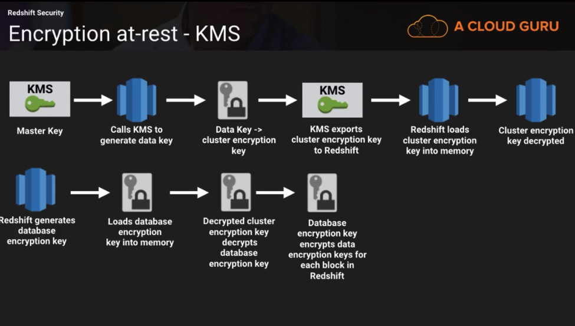
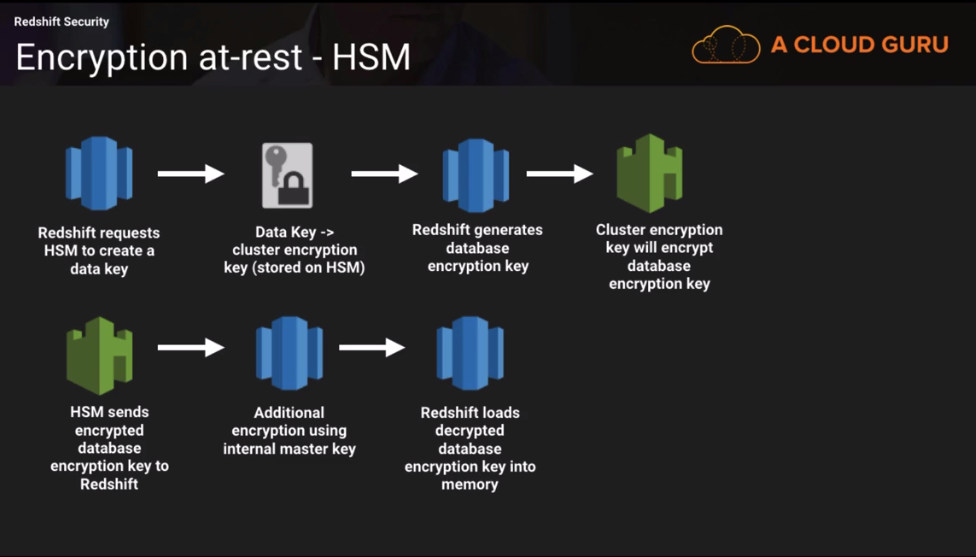
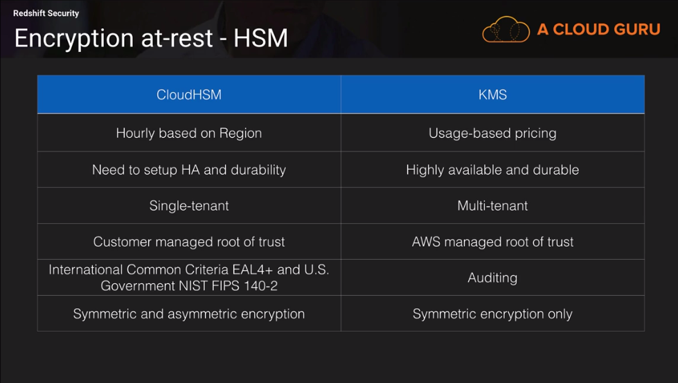

# Security

### EMR Security

#### Security Groups
* There are two types of security groups:
  * EMR  managed security groups
    * When you launch a cluster you are required to select a managed security
      group for the master and core & task nodes
    * When you use EMR for the first time, EMR will create them for you so the
      instances within the cluster can communicate properly
    * Instead of using default security groups you can specify your own managed
      security groups. The advantage is if you have multiple EMR clusters and
      you want to isolate them in terms of security groups then you want them to
      have managed security groups that are separate from your clusters
  * Additional security groups
    * Assign to the master & core nodes
    * Additional security groups provide you with flexibility to add additional
      rules without chainging the rules of a managed security groups
    * E.g. if you want to allow SSH access to your cluster, you can go and
      assign an additional security group
* Roles:
  * If you need access to other AWS resources that's where roles come in
  * EMR Role: The first default role allows EMR to access EC2
  * EC2 instance profile: allows Ec2 instances in your cluster access S3,
    DynamoDB and other services
  * Auto Scaling role: Allows the auto scaling service to add or terminate ec2
    instances when you have auto-scaling setup for your core or master nodes
  * You can use your own roles e.g. when you want to encrypt your cluster and
    you decide to use one of the KMS options, you need to make sure that your
    instance profile role for EMR has a policy attached to it, so your cluster
    can generate KMS keys
* You may need to run your EMR cluster in a subnet based on security
  requirements:
    * You can have a VPC with a private or public subnet
    * If you use private Subnet you need to add a NAT instance or S3 endpoint

> At a high level, you can think of a VPC in AWS as a logical container that separates resources you create from other customers within the Amazon Cloud. It is you defining a network of your own within Amazon. You can think of a VPC like an apartment where your furniture and items are analogous to databases and instances. The walls of your apartment isolate and protect your things from being accessible from other tenants of the apartment complex. Subnets would then be analogous to the different rooms in your apartment. They are containers within your VPC that segment off a slice of the CIDR block you define in your VPC. Subnets allow you to give different access rules and place resources in different containers where those rules should apply. You wouldn't have a big open window in your bathroom on the shower wall so people can see you naked, much like you wouldn't put a database with secretive information in a public subnet allowing any and all network traffic. You might put that database in a private subnet (i.e. a locked closet).

#### Encryption at-rest and in-transit
* In-transit data encryption:
  * For distributed applications
  * Open source encryption functionality
* In-transit data encryption
  * For EMRFS traffic between S3 and cluster nodes (enabled automatically)
  * PEM certificates (Open Source - Open SSL)
  * For Hadoop (encrypted shuffle - during the shuffle phase the files are
    transfered between nodes from mappers to reducers) - there are two files
    that gets updated to setup hadoop encrypted shuffe, the first one is a file
    core-site.xml all the properties are added to the `core-site.xml` file and
    these properties relate to ssl key store information, the second file that
    gets updates is the `mapred-site.xml` - EMR will add ssl enbabled property to
    the file and will set its value to true. The same applies to Tez, Spark, the
    same process happens as with Hadoop.
  * TLS encryption - encryption between moving data inside the cluster between
    ec2 machines
* At-rest data encryption (Local disk encryption - on instance store volumes and
  EBS volumes):
  * For cluster nodes (EC2 instance volumes)
  * Open-source HDFS Encryption
  * LUKS encryption (The Linux Unified Key Setup)
* At-rest data encryption:
  * For EMRFS on S3
  * Server-side or client side encryption (SSE-S3, SSE-KMS, CSE-KMS, or
    CSE-Custom) 


* For the exam:
  * Encryption at-rest (encryption modes and how they work)
  * Encryption in-transit (Hadoop Encrypted Shuffle) - in a shuffle phase the
    data moves between the nodes (from mappers to reducers)


>The Encrypted Shuffle capability allows encryption of the MapReduce shuffle using HTTPS and with optional client authentication (also known as bi-directional HTTPS, or HTTPS with client certificates). It comprises: 1)A Hadoop configuration setting for toggling the shuffle between HTTP and HTTPS. 2)A Hadoop configuration settings for specifying the keystore and truststore properties (location, type, passwords) used by the shuffle service and the reducers tasks fetching shuffle data. 3) A way to re-load truststores across the cluster (when a node is added or removed).


### Redshift Security
* SSL for encryption in-transit (encrypts the connection between the cluster and
  the client)
  * 1st layer of encryption
    * Redshift creates and installed a self-signed ssl certificate on each cluster
    * To set it up you have to make sure you have non-default parameter group in
    Redshift, you cannot change the default parameter group
    * In a parameter group you need to change the `require_ssl` to true save it
    and associate this parameter group with your cluster (cluster parameter
    group)
  * 2nd layer of encryption
    * Is to use a certificate that will provide an extra layer of security by
      validating that the cluster you are connecting to is indeed the redshift
      cluster
    * If you want your redshift client to authenticate the redshift cluster then
      you can install the public key that aws provide
* Encryption at-rest
  * Key Management Service
    * Four-tier hierarchy of encryption keys:
      * Master key
      * Cluster encryption
      * Database encryption key
      * Data encryption keys



  * Hardware Security Module (CloudHSM and On-Prem HSM)
    * Physical devices that saeguard and manage digital keys for storing
      authentication and provide cryptoprocessing
    * Contractual, regulatory requirements may determine if a HSM should be used



  * When you enable encryption at-rest you encrypt:
    * Data blocks
    * System metadata
    * Snapshots
  * Encryption on a Redshift cluster is immutable. You cannot change it later
    means to store your data without encryption. If you want to deactiave the
    encryption you need to `UNLOAD` and reload it into a new cluster.



  * Symmetric encryption is where the same keys are used to perform encryption
    and decryption. An example are the access keys and secret keys that are
    generated when you create an IAM user.
  * Asymmetric encryption uses two keys, a public key for encryption and a
    private key for decryptions (seems like the blockchain stuff). An example is
    the key-pair that you create with ec2. You have the private keys which is
    the key pair and aws has the public key

* Control User Access to Data. Limit data access using views
  * First you create a view with the specific data you want to show to a user
  * Then you create a group and you create a user and attach it to the group
  * Then you give the rights to query the specific view that you have created to
    the group

```sql
select w_warehouse_id, w_warehouse_name from public.warehouse;
create view whouse as select w_warehouse_id, w_warehouse_name from
public.warehosue where w_warehouse_id = 'AAAAAAAACAAAAAAAA';
create group dwusers;
create user dwuser password 'Dw123456' in group dwusers;
grant select on whouse to group dwusers;
```
For the exam:
  * Understand how encryption in-transit works with Redshift
  * Understand the options for managing encryption keys with Redshift
  * Know the differences between CloudHSM and KMS
  * Know how to control user access to data through views

### Quiz:
* Due to compliance or security requirements, you may need to a run an EMR cluster in a private subnet. You can run an EMR cluster in a private subnet with no public IP addresses or attached Internet Gateway. In order to run an EMR cluster in a private subnet, you would need an endpoint for S3 in your VPC in order to access S3 or create a NAT instance for your cluster to interact with other AWS services that do not currently support endpoints in VPC.
* The shuffle phase is the process of transferring data from the mappers to the reducers. This process involves transferring data from node to node within the cluster, and if you want that data to be encrypted in-transit between nodes, then Hadoop encrypted shuffle has to be setup. Encrypted Shuffle capability allows encryption of the MapReduce shuffle using HTTPS. When you select the in-transit encryption checkbox in the EMR security configuration, Hadoop Encrypted Shuffle is automatically setup for you upon cluster launch. 
* In this case, you would use CSE-Custom, where you would encrypt the data before sending it to S3 and also manage the client-side master key. The other encryption options available are: S3 Server-Side Encryption (SSE-S3), S3 manages keys for you; Server-Side Encryption with KMS–Managed Keys (SSE-KMS), S3 uses a customer master key that is managed in the Key Management Service to encrypt and decrypt the data before saving it to an S3 bucket; Client-Side Encryption with KMS-Managed Keys (CSE-KMS), the EMR cluster uses a customer master key to encrypt data before sending it to Amazon S3 for storage and to decrypt the data after it is downloaded. 
* You can use either an on-prem HSM or you can use CloudHSM, or both, to ensure
  high-availability and access to the keys for Redshift
