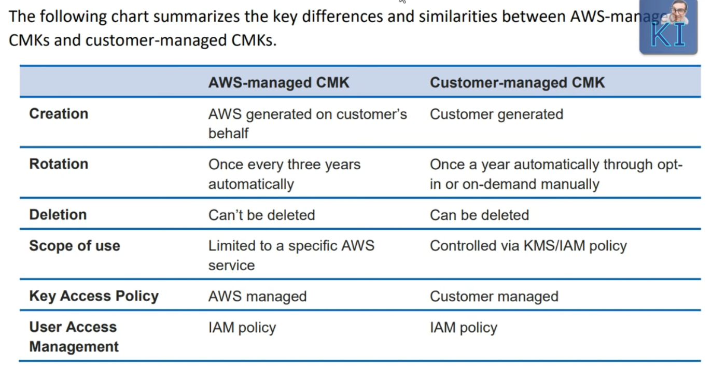
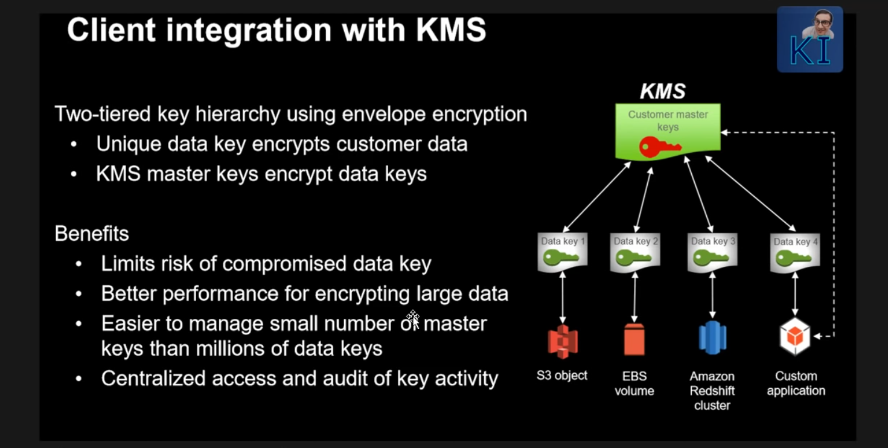
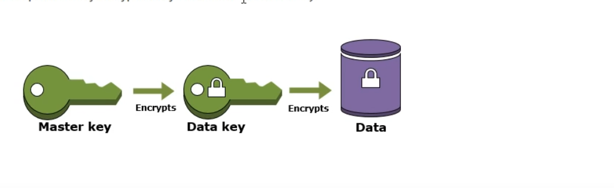

# AWS KMS

* Types of encryption:
  * Symmetric encryption
    * The same key is used to encrypt and decrypt
    * KMS supports only symmetric encryption
  * Asymetric Encryption
    * Public key to encrypt the data and secret key to decrypt the data
    * CloudHSM supports assymetric encryption
* Keys that are supported by KMS
  * Master key: a key created by AWS KMS that can oly be used within the AWS KMS
service. The master key is commonly used to encrypt data keys so that the
encrypted key can be securely stored by your service. However AWS KM master key
can also be used to encrypt or decrypt arbitrary chunks of data that are no
greater than 4KiB. Master keys are categorized as either customer managed keys
or AWS managed keys. Customer managed keys are created by a customer for use by
a service or application. AWS managed keys are the default keys used by AWS
services that support encryption
  * Master keys are used to encrypt data keys, data keys are actually things
that leave AWS. Master key never leaves the AWS system.
  * Data key: a symmetric key generated by AWS KMS for your service. Inside of
your service or custom application, the data key is sused to encrypt or decrypt
data. It can be considered a resource by a service or application, or it can
simply be metadata associated with the encrypted data. The data on EBS gets
encrypted with a data key
  * AWS Managed master key CMK will be created for a particular AWS service



* The scope of the key is a region
* Every key has a scope of region




* You should use different data keys for different services. Don't reuse the
same data key for all of the services
* From a custome master key you can generate a data key
* Your key can be used from another AWS account
  * Under key users you can add an extrenal user
  * It will expose the key to the external account
  * In this account you need to specify who can use the key
* Audit KMS usage with AWS CloudTrail


* AWS managed master key the keys are automatically generated for your. 

* From master key there will be a data key generated, one in plain text
(non-encrypted data key) and another in encrypted data

* Master key decrypts the data encrypted data keys


* The workflow:
  * We have a data keys that encrypts the data and is stored along with the data
  * We have a master key that can decrypt the data key and with the decrypted
data key we can decrypt the data
  * One master key can have many data keys, for each AWS service use different
data keys


* Envelope Encryption:
  * When you encrypt your data, your data is protected, but you have to protect
your encryption key. One strategy is to encrypt it. Envelope encryption is the
practice of encrypting plaintext data with a data key, and then encrypt the data
key under another key.
  * The master key is in a plain text format. Therefore master key never leaves
KMS




* You need the key to encrypt or to decrypt the data. The key is in plain text
format. So in order to secure this operation we have Envelope Encryption where a
master key (plain text) is stored inside AWS and never leaves the AWS. The data
key in plain text encrypts the data, then the data key is encrypted by the
master key and stored along with the data. The data key plain text gets thrown
away. When you want to decrypt the data first, you need to decrypt the data key
into a plain text with a master key and after decryption you'll get a plain text
data key and with that data key you can decrypt the data itself. That's why
master key never leaves the AWS KMS


* From the master key you can generate the data key. See below how to generate a
data key

* If you have services such as S3, EBS all those steps to generate a data key
happens automatically for you


```
aws kms generate-data-key --key-id 79cbe6bd-a14f-1bf51c0a3a20 --key-spec AES_256
{
    "CiphertextBlob": "AQIDAHhGe6QltTHTADQBxP/r1xZuYt2AkbAKLOFiAAAAfjB8BgkqhkiG9w0BBwagbzBtAgEAMGgGCSqGSIb3DQEHATAeBglghkgBZQMEAS4wEQQMWDVrAIIn1milnOfeAgEQgDt8TeBTyJM6mWQ/vjWyjImMGUbamhaK+JVszZrWqlqyZlNNTCmgneqFgjVOuDctOf0Jk5n3T/RCEGV6Gw==",
    "Plaintext": "niK0vRZ7JrO9bBer7igMBS=",
    "KeyId": "arn:aws:kms:eu-central-1:XXXXX:key/79cbe6bd-dede-345345l-a14f-1bf51c0a3a20"
}
```

* When the key rotation happens also the older content of the key is kept safe.
It's like an immutable log, the content of the key still will work
