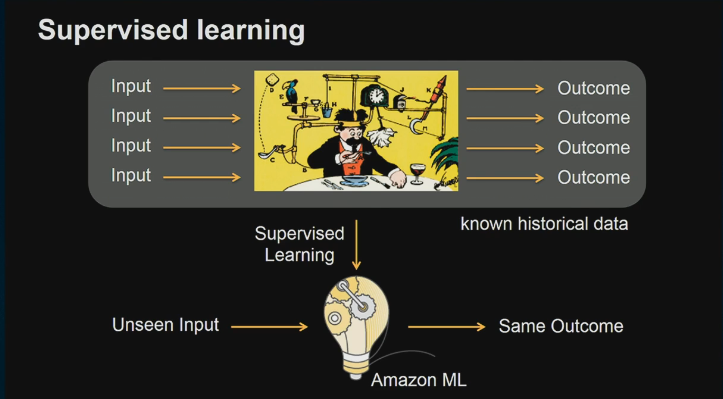

# Customer Churn

[Source](https://www.youtube.com/watch?v=D04dxTiDO3E)

* ML Robotics:
* We can use machine learning to optimize a behavior of a robot e.g. amazon
robots that drive through their inventory  

* ML: Image recognition

* Supervised learning
* We're trying to achieve take an exisiting functioning system and we want to
emulate that system and build a model that behaves in a similar fashion
* Input ---> Output

* Kinesis analytics uses unsupervised machine learning in form of RANDOM_CUT

### Amazon ML servcice

* Binary classification: where given a new input we say true or false (for churn
                                                                       this
                                                                       customer
                                                                       will
                                                                       leave the
                                                                       platform,
                                                                       the other
                                                                       customer
                                                                       will not)

* Multiclass prediction problem: classification of some sort of pictures or
anything into classes or groups

* Numeric regression / linear regression: to forecast like prices of a house in
a specific region

* You can get the historical data set in any business. But there could be some
problems

* The first step to build a model to create a data source e.g. S3 file saved in
S3 or Redshift or MySQL RDS
