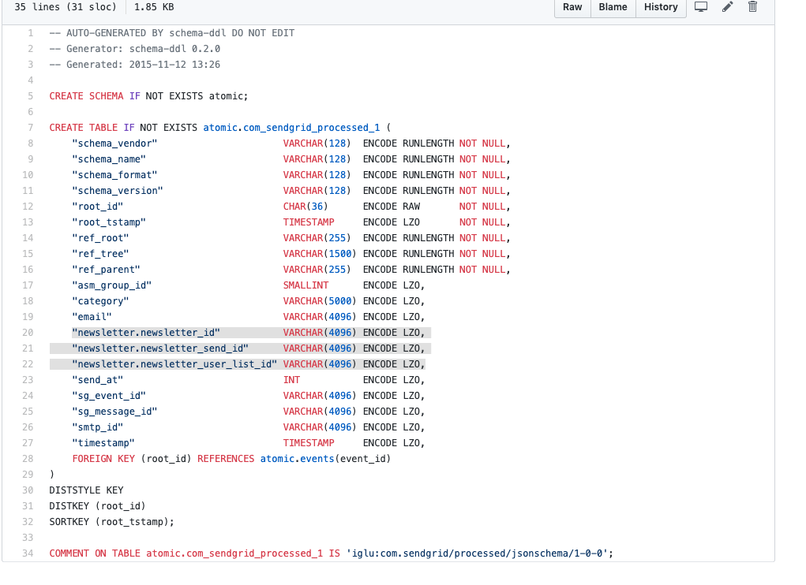
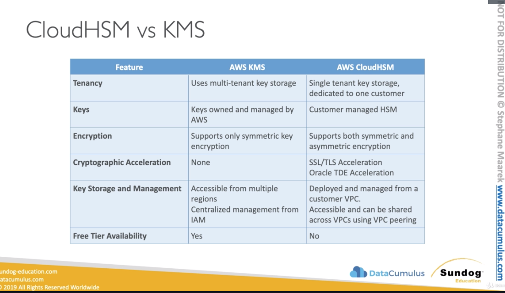
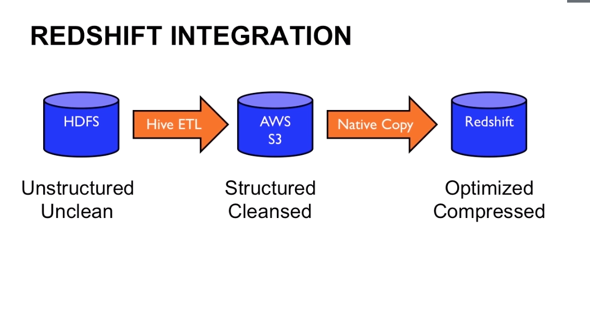

# Introduction

* Redshift is the name of an astrological phenomenon (the expansion of the
  universe)
* The service can handle any amount of data
* Redshift is one of the fastest growing service at AWS

## What is A Data Warehouse?
* History:
  * OLTP: many fast reads & writes (concurrent users reading and writing data in
    realtime, fast queries) - for end users that hit our services
      * Fast (insert / update)
      * Ad-hoc queries
      * Heavily concurrent
      * Havily normalized via 3NF (ensure interity)
      * Not meant for heavy volume (upper limit of few TB)
      * Designed not to be distributed
      * Typically row-oriented
  * ETL: Take some fields from OLTP, do some transformation on that and load
    that information into OLAP
  * OLAP: Online analytics processing. Reporing reads on massive amounts of data
    (Data Warehouse, EDW)
      * Analytics queries on HUGE data sets (knows queries)
      * Query speed not priority
      * Few internal users
      * Aggregated data (for speed)
      * Hugely scalable (100s of TB or PB)
      * Designed to be distributed
      * Typically column-oriented
      * Data is materialized
  * OLTP ----> ETL ----> OLAP (Data warehouse , EDW)
  * Data Mart: Specific to buisiness function and delivers answers to different
    business functions:
    OLTP ---> ETL ---> DM1: Business (best sales, shipping times, regions) && DM2: Marketing (ad source, roi, demographic, purchases etc.)
* High-level architecture
  * Columnar storage: In analytics database we typically interested in a small
    set of the columns e.g. Id, date. We can easily sort the data. The
    compresison is very good that we can get from the column-oriented storage.
  * Row-oriented: In row-oriented if we want to read e.g. Id, data we need to
    read all the data that is stored in the rows

  * STAR Schema: Logical representation of data. 
    * "Fact" table at core: contains aggregated data that we are intersted all
      the time. Foreign key are stored too
    * "Dimension" tables linked via foreign key relationships 
    * When we prematerialized the data we load the data into cubes. We run
      across a data set and pull out the dimensions and load it into 3
      dimensional table. Adding dimensions makes the data analysis complicated.

### Shortcomings of Self-Owned DW
* Costs
  * Oracle, IBM charge you on licence and data (more dimensions = more data =
    more money to spend)
* Growth limitations
* Maintance overhead
  * Internal admins that are going to install: software, hardware, networking,
    space
  * Consultants
  * Maintanance
    * Replacing failed hardware
    * Software patches
  * Upgrading
    * Software
    * Hardware
    * Usually involved multi-day outage
  * Compromising
    * Data cube re-materilization (hours, days of outage)
* Vendor lock-in
  * Per TB storage costs of self owner EDW: around 5-10x that of AWS Redshift

> 70 -90% of the costs of self-managed systems is overhead "undifferentiated heavy lifiting". All the stuff that doesn't differentiate you from other companies.

### Benefits of Public Data Warehouse
* Costs
  * Pay only for what you need only when you need it (turn off/on)
* Inifite scale
  * Keep adding more nodes as your data grows 
  * Scale everything up, have control over CPU, RAM
  * Shutdown the warehouse if not needed anymore (shrink it back to a managble
    costs)
* Workload customizeablity
  * For simple reporting stuff: Needs only general purpose hardware, e.g. 2 nodes (A/B tests, campaigns)
  * If you have reddit first place you need to analyse more data you can add
    e.g. 20 nodes for analysis)
  * For CPU Haevy multi-year data mining: Needs top-end nodes (lots of CPU), you
    can scale it again just by adding nodes that are compute-optimized
* Managed service benefits
  * Pay as you need
    * You don't need to check out budgets etc.
    * You can just turn on DW cluster in 3 minutes
  * On-demand provisioning
  * Efficiency of experts
* Control where you need
  * Top 80% of use cases can be analysed with basic setup
* Drawbacks
  * Efficiency of experts
    * You give up control
  * On-demand provisioning
    * users need understanding of provisiong
  * Scalable and elastic
    * Can be expensive (easy to create = easy to forget)
  * Vendor-lockin
    * Starting using other services SQS, S3, etc.
  * Can increate latency
    * If your data sources are hosted elsewhere
  * Security?
    * The concern that isn't... expect maybe where the NSA is involved

### Benefits of Redshift
* Costs
  * Hourly charge per instance
  * Starts at $0.25 / hr "pay as you go"
  * As low as $1,000 / yr / TB for reservations (buying a reservation, upfornt
    fee - your hourly costs will be reduced)
    * And under $300 / yr for 3x compression (with compression you can uder $300
      / yr / TB)
  * Leader node is free (in multi-node-cluster)
  * Intra-region backups are free
  * Transpare mirroring is free
  * Monitoring is free (CloudWatch service)
  * Intra-region data transfer (like from S3) is free
  * Columnar storage & automagic compression (figures out which compressing
    algorithm to used based on your columns)
* Speed
  * Reduced I/O (disk & network) via compression, columnar storage
  * SSD options for the compute node
  * Data loading & restore in parallel (across your slave / compute nodes in
    parallel)
  * 10Gigabit non-blocking, high-performance networking
  * Zone maps
    * It stores the blocks of your files around the cluster, that it knows where
      each block is. Takes a file, splits it into pieces and stores it. It does
      know where the blocks are stored. Splits data into blocks, when you need
      to query, it skips data that is not needed for the query.
* Ease of use
  * Accessilibity
    * Web GUI, CLI, SDKs, APIs
    * Provision (or restore) a cluster in under 3 minutes
  * Fault tolerance automatic & transparent
    * Mirroring data at least 2 nodes
  * Backups automatic & transparent
    * Will backup into the same region into S3 for free after the size of your
      cluster
    * Incremental only (fast)
      * Want backup the entire system 
  * Resizing is a pushbutton operation
    * New cluster provisioned
    * Old cluster still accesisble (ready only)
    * Copies data to a new cluster
    * Once resizing is done Redshift will move the endpoint to the new cluster
    * No need for downtime, resizing works in parallel
    * Only charged for 1 cluster
* Easy security model
  * Can / should be deployed into VPC
* Multiple load methods:
  * AWS: S3, RDS, DynamoDB, Data Pipeline, Kinesis, EMR
  * Remote hosts: via SSH (from a local system to load data into Redshift)
* Standards-based querying: JDBC, ODBC
* Service Integration
  * Direct load from S3, EMR, DynamoDB via COPY
    * EMR (or any HDFS) can load:
      * Fixed width, character-delimeted, CSV, and JSON
      * Bootsrap action of EMR greatly simplifies load
    * Continuous RDS load capabilities (via FylData and Attunity)
    * Can move data in and out of cluster via Data Pipeline
    * Kinesis connector also available
* On-demand snapshots to S3
  * an be retained lcoally
  * Or auto-shipped to second region
  * Never deleted by Redshift (snapshot persists even after cluster deleted).
    Even when you kill the cluster
    * Can also set retention period
* High availability / Disaster Recovery
   * Node and disk falire handeled automagically
    * Writes only when copies to 2 mirrored drives in the cluster
    * Essentially does a full mirror of all data on 2 drives
   * Backups to S3 automatic & transparent
   * Kinesis (or Data Pipeline) can be used to stream or bulk copy data to 2
     clusters, even in 2 separate regions.
* Security
  * Resource level IAM support (never use root level account, use always IAM
    user accounts) - who can access database tables
  * Encrypted data load to S3 supported
  * Security Groups (Firewall)
    * Point and click firewalls managed by AWS
    * Allow ports / from specific IP address
  * VPC support
    * Gateways to access via VPN
    * Launch clusters into VPC
  * Encrypted SSL endpoints supported (control & query)
  * Hardware accelerated EAS-256 encryption supported (for data at rest)
    * All about 20% peformance penalty
    * All stored data, disk spills (scratch areas), snapshots encrypted
  * Redshift native users & groups
    * Password-protected
    * Controls access to data base objects
    * CREATE_USER, CREATE_GRUP, GRANT, REVOKE
    * GRANT controls who can SELECT, CREATE, INSERT, UPDATE, DELETE from
      database, tables, views
  * Native logging of:
    * Connections
    * Users
    * User actions
  * CloudTrail integration
    * Service level logging (IAM)
  * Both free (S3 charged at normal rates)
* Monitoring
  * Native CloudWatch metrics
    * Stats like CPU utilization, # connections, % disk used, network & disk
      I/O, latency, itc
  * Query & load performance data (inside Redshift)
    * Check if you're getting enough throughput
    * Summary & detailed both available
  * Both captured every minute
  * Both free
* Compatibility
  * JDBC / ODBC endpoints
    * Ubiquotous standards
  * SQL
    * Mostly based around PostgreSQL 8.0.2
      * Removing row-based OLTP functions like secondary indexes and single row
        manipulation

### How Companies Use Redshift
* Pinterest
  * A visual sharing & discovery tool
  * 10s of millions of users
  * Billions of pings
  * Big data uses:
    * Measure KPI
    * Run experiments
    * Build recommendations
    * Fightining spam
  * 100% is hosted on AWS
  * Producers: Kafka, MySQL, HBase, Redis (either on EC2 or managed service RDS)
  * Storage: ETL from Producers to Data lake in S3
  * V1: From Storage they ETL to Hadoop to make data analysis via Hive Queries (Hive is a wrapper around
    MapReduce engine inside Hadoop)
    * Issues: 
      * Slow
        * Hive is just MapReduce 
        * Lots of Disk I/O
        * HiveQL != SQL (not equal, confuses analysts)
  * V2: From Hadoop cluster ETL into Redshift and MySQL database. Hooked their
    business users to Redshift and MySQL so they can run SQL queries out of
    Redshift and nice realtime anlytics dashboads. Still use Hive queries but
    minimize them.

  * We that ETL is everywhere and it causes delays. Where ETL is involved it
    makes the system brital and possibly slow. AirBnB has switched to Preso,
    Preso is basically under the hood of Athena, where you can query raw data in
    Realtime. They moved from Redshift to Presto. 

  * Redshift integration:
    1. HDFS (unstructured / unclean) 
    2. Hive ETL 
    3. AWS S3 (structured / cleansed)
    4. Native copy (super optimized to load data in parallel)
    5. Redshift (optimized / compressed)

> Unline Hadoop where you have hundreds of parameters to tune, Redshift gives you good preformance out of the box. If you want to tune, there are really  only two paramters you car about: 1) System Stats (it's based on Postgres), 2) Your keys (sort key & distribution key) ~ Jie Li, Data Infrastructure at Pinterest
  * Saw 25 -100x performance increase over Hive

* Nasdaq
  * Used a legacy warehouse
    * Millions a year in CAPEX
    * Limited to 1 yr of data capicity
    * Orders, trades, competitve analysis data
    * Extremely sensitive data
  * To enable security aspects, they use:
    * VPC
    * DiectConnect (secure line that is dedicated into the AWS data center)
    * Data encrytiption in flight (SSL via API & JDBC)
      * Secured with certificates
    * Data encryption at rest (S3 & Redshift AES-256)
    * HSM to manage own keys (keys passed to Redshift on as-needed basis)
    * Also turned on native Redshift encryption
  * Migration to Redshift:
    * Completed ~1100 table migration in 7 man-months
    * Reduced cost 43% below legacy
    * Write averages about 3 rows / microsecond
    * Best write rates seen were ~2.76M rows/sec
    * Upwards of 14B rows inserted / day
    * Optimized queries now running faster than legacy
      * SQL rewrites, Key (sort & distribution) changes
    * Increased resilency
    * Multiple clusters in production:
      * NASDAQ data warehouse
      * RMS
      * BI
      * Tradeinfo
    * Use SNS / SQS to notify clients when data is loaded
    * Have passed internal audits for:
      * Information Security
      * Internal audit
      * NASDAQ Ris Committee
    * External
      * SOX
      * SEC

### 3rd Party Visulaization Tools
* Point and click data visualization
* The goal to build analytics dashboards / real-time
* Data sources are disparate:
  * Finance (expenses)
  * Social media
  * Sales (POS)
  * Inventory & supply chain (JIT SCM)
  * Operations (payroll, HR)
  * Log data (web logs, email logs, chat & phone support)
* Commonalities: JDBC / ODBC connectors (data source & back-end agnostic)

### How Redshift differs
* vs RDBMS-based DWs
  * Like Oracle (i9), MySQL, SQL Server
  * Limited size (few TB)
  * Row-based lookups
  * Self-maintained
  * Licencing costs
    * Good for:
      * OLTP
      * Analytics Dashboards
* vs commercial DWs
  * Like Oracle (Exadata), Teradata, Neteeza, IBM
  * Cost
    * Non-transparent
    * Flexibility
  * Complexity
    * Good for:
      * self-managed
      * faster?
      * control?
* vs Hadoop
  * Used for data lake
  * Like Hive, Pig (two interfaces to access the Hadoop data)
  * Slower
  * Self-managed
  * Complexity (100s of parameters to optimize)
  * Costs
    * Good for:
      * Cost effective (at large volumes)
      * Scales higher (no upper limit)
      * Unstructured data support (can dump any sort of data into hadoop)
* vs other cloud-based EDWs
  * Like Google BigQuery 
  * Vendor choice
  * Different pricing models (on number of queries you're running)
  * Probably higher costs for "always on"
  * Good for:
    * Simpler to use
* vs in-memory analysis engines
  * Like Apache Spark, Strom, Kafka, Impala, Kinesis
  * Immature?
  * Self-managed
  * Complxity
  * Much more expensive (RAM load everything in RAM)!!!
  * Good for:
    * Stream processing
    * Much faster (real-time)
* vs NoSQL engines (Storm, Spark)
  * Like CouchDB (document data store), Cassandra (key/value store), HBase
  * Self-managed
  * Complexity
  * Cost
  * Specialized
  * Good for:
    * End-user user-facing data stores
    * OLTP workloads
    * Cost-effective (at large)
    * Concurrent read/writes
* vs columnar databases
  * Like Vertica, Greenplum
  * Both columnar
  * Self-managed
  * Complexity
  * Cost
  * Specialized
  * Good for:
    * Control
* Preso (canibalises a lot of capabilities of Redshift)
  * Open source distributed SQL query engine
  * Queries the data where it lives
  * Suitable for interactive analytics
  * Self-managed (not in case of Athena)
  * Good for:
    * Direct query of S3 data
    * No need to ETL from data lake into Redshift (WE REMOVE THE LATENCY BEHIND
      ETL)
    * Interactive analytics, we can point to any data sources 
    * Good speed

