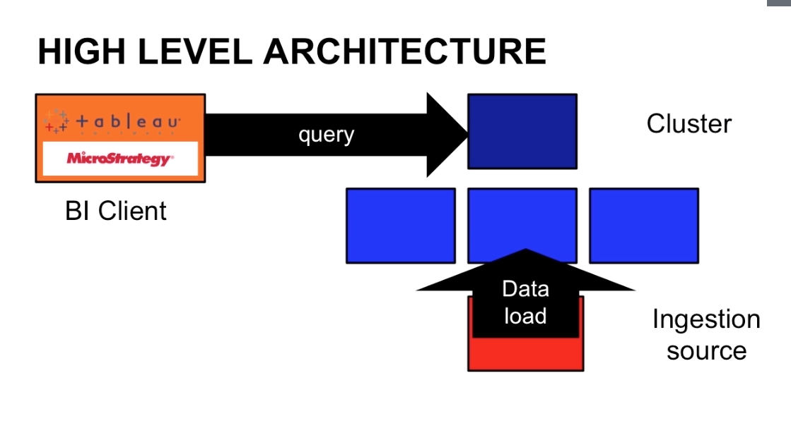
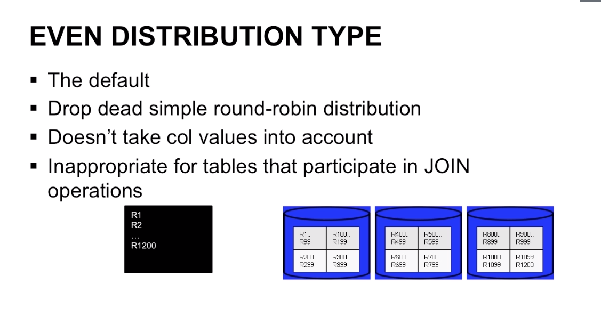
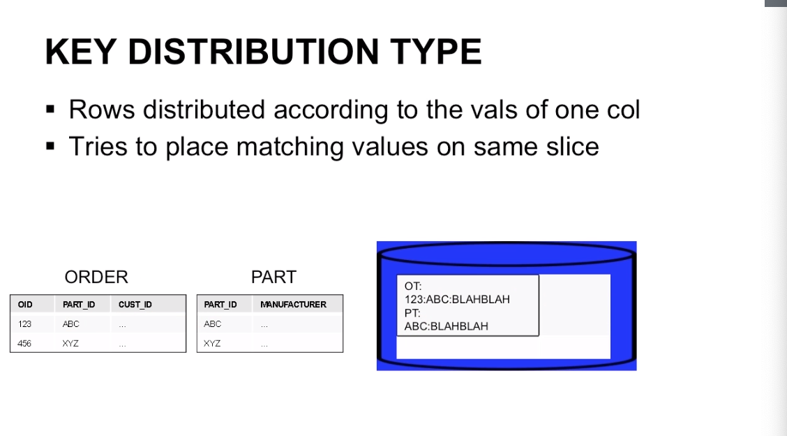
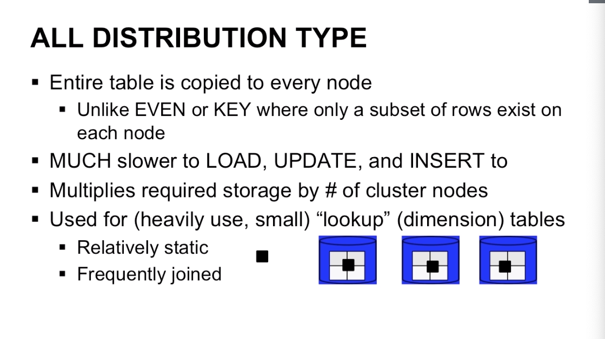

# Redshift Basics

### Architecture 
* The data that comes from ingestion source is directly loaded into the compute
  nodes
* BI queries the leader node



#### Leader node
* Stores "metadata" & statistics
  * These stats heavily influence query performance
* Plans, coordinates & oversees query execution
* PostgresSQL 8.0.2 interfance that we have on the Leader node endpoint
* Can also run "in single node" demo mode w/o compute nodes

#### Compute nodes
* Each contain subset of data
  * In local columanr storage
  * Act as redunand mirros of each other
* Execute queries in parallel
* These compute nodes talk to each other
* Leader node is managing them and nodes communicate and pass the data back and
  forth
* The data load happens in parallel ideally in S3
  * You start with a file
  * You have to chop that file
  * And each individual bit of that file ends up in different compute node
* Ingestion is super fast, goes directly into nodes and happens in parallel, the
  more slices and the more you chop that file up, the faster you can get the
  data into Redshift and run your queries

#### Data Loading
* Options for loading data
* Data distribution concepts
  * Slicing / vacuuming
* Disk storage for each node is diviced into "slices"
  * # of vCPUs = # of slices
  * Like
    * DS2.XL: 4 slices (you can think of these like independend disks on the
      machine)
    * DC2.8XL: 32 slices (you can hink of then like individual disks)
* When Redshift goes to analyse data it pulls of 1 core and dedicate 1 core to
  each slice. And one core gets one processing task. 


#### Basic Load Flow
* Split data into multiple files
  * Enables parallel load speed
* Upload files into S3
* Run COPY command to populate. It allows you to pull in data from a specific
  object into a specific table you've created in Redshift

```sql
copy <table_name>
from 's3://<bucket_name>/<object_prefix>
credential 'aws_access_key_id=<access-key-id>;
aws_secret_access_key=<secret-access-key>';
```

* Once you have imported the data you should query to verfiy data load. Things
  can go wrong and S3 consistency issues
* Split data into multiple files
  * Enables parallel load speed
  * Ideal to have 1 file per slice
    * 3 nodes DS1XL (2n/slice) = 6 files (3x2)
  * Each file should be (about) equal size
  * Ideas (post-compressed) file size between 1MB-1GB
* Options for Data Load
  * COPY command (native)
    * S3 (fastest)
    * DynamoDB
    * EMR
    * Does automatic compresion encoding
  * Alternate methods
    * SSH from remote host (on-prem data damp)
    * Data Pipeline
      * Data pipeline can move the data
      * Data pipeline can process that data
      * Data pipeline can bootstrap EMR cluster, dump those files, do processing
        and the end of processing and dump it back into S3 bucket
    * RDS sync
      * Not AWS native tool


* VACUUM
  * Large # of DELETE/INSERT operations after initial load causes fragmentation
    * VACUUM like a "defrag" for Redshift
    * Should run after any large bulk update or delete
    * Should also run periodically for tables under normal INSERT/UPDATE/DELETE
      load
    * Can be expensive, because it's moving data around on each node slice.
      * But can run specific type of VACUUm (sort, delete, etc)
      * Do it 2am/3am in the morning

#### Data Distribution Concepts
> The distribution strategy that you choose for your database has important consequences for query performance, storage, requirements, data loading, and  maintenance.
* The goals of data distribtion
  * Achieve the best parallel execution possible
    * Ideally, each node works as hard as every other
  * Minimize data movement during query execution
    * Tries to execute joins on nodes which have joined data local
    * Minimize cross node joins, when you need to join co-locate that data on
      the same node
* The 3 types and use cases of each
  * Defined at table creation time
  * Affect speed of joins, disk usage
  * ADN... affects how data is moved from node to node on queries
  * Must be one of:
    * EVEN:
      * The dafault
      * Drop dead simple round robin distribution
      * E.g. 1200 Rows of data and break up those data into slices and put it
        into nodes e.g. we have 3 nodes and each has 4 slices. In this case each
        slice will have around 100 rows a node will have around 400 rows.
      * You use EVEN distribution when you are sure that you want to access all
        the data in the table pretty much all the time
      * It doesn't take col values into account, any sorting 
      * Inappropriate for tables that participate in JOIN operation

    * KEY:
      * Rows distributed according to the values of one column
      * We have two tables Order and Part table
      * We join Order table with a Part talbe based on part_id
      * Redshift will put those both tables on a single node / single slice or
        put the Part table on another slice. Important is that it's on one
        single compute node
      * When we need to join, we don't need to grab this data from other compute nodes and we don't to go over a network
      * Tries to place matching values on same slice 
      * Use for table pairs which will be joined
        * The rows for that join will be collocated on a single slice

    * ALL:
      * Entire table is copies to every node
      * When we start with a 1GB file, it will copy the complete copy of that
        file and move it out to every single compute node
      * The point is that the data exists on every single compute node 
      * Unlike EVEN or KEY where only a subset of reows exists on each node,
        every single row will appear on every single compute node
      * MUCH slower to LOAD, UPDATE, and INSERT to
      * Multiplies required storage amount by # of cluster nodes
      * Used for (heavily use, small) "lookup" (dimension) tables
      * E.g. you have a geo ip database and this is a key data point, you're
        looking information from it based on the user's ip address. When you do
        join those tables, you don't have to have that small table copy all over
        the place. 
        * Relatively static
        * Frequently joined


* Replicate a star schema in Redshift
  * Use Key for primary & foreign keys
  * Use EVEN for denormalized, non-joined tables (single select on and you want
    to select data at once)
  * Use ALL for lookup tables (like product catalog, geo ip etc.)

#### Basic Redshift Usage
* Rules of Names:
  * Must be ASCII letters, digits, underscore or dollar sign
  * Must start with alpaha char or underscore
  * Must be < 127 chars long
  * Must not be reserver word
  * Recommendations:
    * Use only characters, "underscore" between words, all lower case, no "delimited identifers"
* Expressions:
  * [exp] [operator] [exp]
  * "exp" evaluates to a value:
    * Like: "sum(list)", "365", "avg(col"
  * "operator" is operating:
    * Like: "+", "&", "XOR", "||" (concat)
  * Can be compounded, like:
    * `fname || " " lname || ":" || avg(test_scores)` 
* Functions:
  * Leader only node functions (current schema, "now", etc)
  * Aggregates (avg, min, max, count, sum...)
  * Math (bs, rand, exp, pi...)
  * Date (getdate, dateadd, datediff, cmp...)
  * String (substring, regexp_replace, upper, strpos...)
  * JSON (array_length, extract...)
  * Bitwise (or, and)
* Data types:
  
* Conditions:
  * Useful for comparisons of numbers
    * Like: `avg(grade) < 90`
  * Logic:
    * Like: `or`, `and`
  * Pattern matches on text
    * Like: `SIMILAR TO` (regex), `LIKE` (partial match)
  * And others (`NULL`, `EXISTS`, `BETWEEN`)
* Basic Commands
  * CREATE (users, groups, database, tables)
    * SQL - Create User
      * `create group admins;` -- start by creating a group 
      * `create user bob with password "super-secret";` -- next we create an
        individual users
      * `create user bob in group admins;`
      * `grant select on retail_ops to GROUP select_only;` -- on the retail_ops
        table we are giving `GROUP` select_only
      * `grant all on retail_ops to bob;` -- we can grant to bob all rights on the
        table retail_ops
      * `create group select_only with user bob;` -- we can create group with and
        add a user bob to it
    * SQL - Creating Databases, Tables
      * `create database retail_ops;` -- create a database
      * `create retail_ops.pos_data(`  -- create the actual table, we specify the
        database and the table name `.` after `pos_data`
      * `create table pos_data(
        o_id integer not null,
        o_time timestamp not null,
        store_id integer no null,
        products varchar not null, // no arrays! 
        primary key(o_id))` -- end of table definition
        `distkey (store_id),`  -- one per table
        `compound sortkey(store_id, o_id);` -- we can specify multiple sort keys (first sort by store_Id, then by o_id)
 * Compound Sort Key is good for doing GROUP BY an ORDER BY operations 
 * Interleaved Sort Key takes every sort key you specify and gives it equal
   weight. There is no primary key and secondary sort key. Interleaved sort keys
   are good if you're going to run different type of queries at your data or
   working with a very large tables
  * SQL COPY:
    * `copy [table_name] from '[emr|dynamodb|s3://path/to/asset]' credentials
      [creds]` 
    * `copy pos_data from 'dynamodb://post-sales-data' credentials [access,
      secret] readratio 50` -- readratio means that you can make the copy
      command based on the throughput of DynamoDB. We can limit the percentage
      of the read ratio from DynamoDB would be used for the copy command
      (throttling the impact of copy command).
    * Can also load JSON and CSV natively
    * Specify manifest (only pull in certail files from S3 bucket)
    * Pull cross-region
    * Pull encrypted, compressed, from SSH sources
  * SQL ISERT:
    * `insert into pos_data values (12345, 1343534543, 885, "sku-123,sku-456");`
      -- this basically inserts new data into 1,2,3,4 columns
    * `insert into pos_stage (select * from pos_data)`-- if you want to move
      data from one to another table
    * If you have to do inserts, you should better do multi-line inserts or
      multi-value inserts
    * NOT recommended (always try to use COPY instead as it's much faster)
  * SQL SELECT:
    * `select products from pos_data where store_id=885 and o_date between
      ('20151201 00:00:00') AND ('20151201 23:59:59');` -- we're pulling all of
      the data out based on the conditions
    * "group by", "order by", "join" all supported
    * Subqueries
    * Correlated subqueries
  * ANALYZE (updats the stats on the leader node)
  * ALTER (group, user, table)
  * TRANSACTION (begin, commit, rollback)
  * LOCK
  * DROP (group, user, table)

### Tips
* Before you do a query you can always run `select count(*) from tablename;` to
  see how much data is stored there.
* You are charged on Redshift for outcoming data e.g. when you have a local
  client running on your laptop and you pull a lot of data across the network.
  Amazon charges you for bandwidth-out.
* What makes a good distribtuion key is the join against the largest table

* The code below shows joins of different table

```sql
where lo_orderdate = d_datekey
and lo_partkey = p_partkey
and lo_suppkey = s_suppkey
```

```sql
select sum(lo_extendedprice*lo_discount) as revenue  
from lineorder, dwdate
where lo_orderdate = d_datekey /* here we join tables */
``` 

```sql
select c_city, s_city, d_year, sum(lo_revenue) as revenue
from customer, lineorder, supplier, dwdate
where lo_custkey = c_custkey /* here we join tables */
and lo_suppkey = s_suppkey /* here we join tables */
and lo_orderdate = d_datekey /* here we join tables */
```

* There is an overhead to sort keys, don't use them a lot
* Removing a table is done with the following command. `cascade` means any
  relationships with those tables should be also dropped.

```
drop table part cascade;
drop table supplier cascade;
drop table customer cascade;
drop table dwdate cascade;
drop table lineorder cascade;
``` 

* When you run your query first time, the query is very slow because the leader
  node needs to compile them. The second time it is 10x faster.

* Here the full list of SQL queries
  [link](https://docs.aws.amazon.com/redshift/latest/dg/c_SQL_commands.html)
