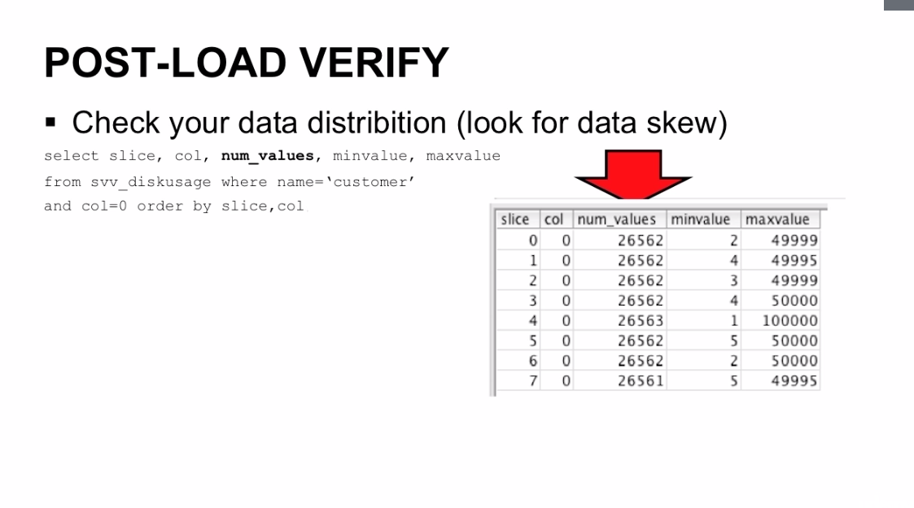

# Advanced Topics

### Data Loading Best Practices

#### Staging data to S3
* Highest throughput available!
* DynamoDB, EMR are 2nd highest
* Can use CTAS when copying from internal table
  * `CREATE TABLE AS` or `INSERT INTO SELECT` 
  * `create table customer_asai as select * from customer where c_region = 'ASIA';`
* If you must use SQL for ingestion:
  * Use multi-row inserts
  * Don't do large # of singleton INSERT, UPDATE, DELETE
* Careful with 'use-east-1' (Verginia) region
  * It's 'eventually consistet for read-after-write
  * It means when you put data you may not immediately see that data backout,
    when you do a `getObject` operation.
  * Use `s3-external-1.amazonaws.com` endpoint only to access
* If you use it, verify data presence before starting COPY
  * Via S3 `listObjects` API call
  * Validate data load after COPY
* ALL regions are eventually consistet for OVERWRITE and DELETE operations. That
  means when you overwrite a file it could be possible that you get the older
  version of the file, or if you delete a file, it could be possible that the
  file is still there.

#### Splitting Data
* When you chop your data up, Redshift creates 1 slice per core (vCPU)
* Ideals load will leverage 1 S3 file per core
  * So if you have 10 DC1.large nodes (2 cores each), how many files?
  * 20 (2 x 10)! - would be the ideal number
  * You are trying to spread the load across all the cores. So you need to chop
    your big file into 20 chunks and start the COPY command. Redshift is going
    automatically start loading the files in parallel.
* Can use linux `split - [#] N` commands for splitting a large file. Used to
  split a file into certain number of rows
  * E.g. you have 500.000 rows in a database dump, you can `split - 500 N` and
    that will split into 500 different files with a 1000 rows each.
* Apply a compression only after the split. Compress AFTER splitting (esp. if
  using GZIP)
  * This format is 'non-splittable'
* Try to ensure even amount of data per split
* Pre-sort data based on Redshift-side "sortkeys"
* Also efficient to split to a multiple of core count (32, 64, 96 etc.)

#### Compression Considerations
* Use either GZIP or LZO
  * LZO good for Char, Varchar
* Compress AFTER splitting (must do if using GZIP)
  * Is 'non-splittable'
* Can additionally encrypt data
  * Transparent if using SSE (server-side encryption on S3 side)
  * Redshift will automatically request decryption keys apply to those files
  * Can also supply own encryption key (then give COPY command the
    "master_symmetric_key" attr)

#### Ongoing Loads
* When you load your data every day, week or month
* Consider granular (daily, weekly) tables PLUS large "everything table". That
  has all the data for all recorded time. If you need that for some sort of
  historical reporting functions. 
    * Route fresh queries on last days, weeks data to the special tables, it
      will accelerate the speed of the queries
    * Can accomplish with CTAS (`create table customers_asia as select *  from customers where c_region = 'ASIA'`). Insert into "main fat" table, then CTAS to
      "daily" table) 
* Consider selectively denormalizing commonly joined data into large fact table
  rather than several joined dimensions
    * Accelerates query speed at the cost of flexibility

#### COPY and VACUUM
* ALWAYS try to use COPY from S3
  * There is an overhead to keeping data sorted
  * Set to run periodically at night
  * Ensure copied data is sorted in sortkey order
* VACUUM when:
  * You don't use COPY
  * You do large # of INSERT, UPDATE, DELETE
  * use ANALYZE comand to refresh statistics

#### Wokrload Manager (wlm)
* Redshift has a Workload Manager (wlm)
* Allows settting of priority queues (slow, fast queries)
* Make sure that slow runnign queries are not blocking fast running queries
* You can do this by setting `wlm_query_slot_count` in the begging of your
  Redshift session, this parameter controls memory allocation
    * Up to 50 (higher the number, fewer the resources for each)
    * Shared by all queues (default)
    * Always use at least 2 (COPY and ANALYZE commands)
    * So if you set it to a lower number, each individual query gets more
      resources
    * Can speed COPY & VACUUM operations

#### Post-load verify
* After loading your data always check your data
* Check your data distribution (look for data skew)
* `select slice, col, num_values, minvalues, maxvalue from ssv_diskusage where
  name='customer and col=0 order by slice, col`
* You get some data back and the most important column is the **num_values**
  column. What you want to see is even or close even number of rows in each
  slice. But if you see the **num_values** in one slice is dramatically higher or
  lower it means that individual slice (cpu) is working against that slice is
  going to work much harde if it's much higher or lower if the value is lower.

#### Debugging Load Errors
* Errors displayed in web console
  * Entire panel dedicated to query performance & erroring
* Stored statically in the STL_LOAD_ERRORS table
  * Can adjust COPY:MAXERROR parameter to throttle or COPY:NOLOAD to validate
    first - especially useful for missing & malformed data
* Also check STL_LOCAD_COMMITS table
  * Shows file-by-file load status

#### Gotaches & Limitations
* Redshift doesn#t support "upsert"
  * Load to stage table, join against those records
* Redshift doesn't support primary key constraint
  * Re-ingesting source data will DUPLICATE records
* Some UTF-8 characters not supported
* Consurrent "read after write" must be scheduled client-side

### Tuning Query Performance

#### Table Design
* You'll almost definitely get it wrong in the beginning
  * and that's OK (it's easy to optimize sort keys, with distkeys it can be a
    pain) 
  * You can always take your data dump it out, reload it with different
    distribution keys or differtent sort keys
* Table design comes down to:
  * sortkey (affets disk layout, compression, speed) - the biggest impact on the
    performance
  * distkey (affects slice distribution, query-time data copy)
  * Keeping leader node stats current (ANALYZE)
* Decide your keys based on access pattern, re-iterate
  * You'll be reiterating and changing the keys at least couple of months
  * Establish baseline (find most popular queries that suck), change one variable (change sort / distkey), validate (check how it is affected)

#### Sort Key Considerations
* There is overhead to keeping data sorted
* When new data is added to a table that has a sort key, that new data is not
  placed into any particular slice. Redshift doesn't recalculate mins/max and
  doesn't shuffle the data around. When you insert into a table it just going to
  pick some slice and drop it over there.
    * Thus the need to run periodic VACUUM and move it to the proper zone map
      (min, max) -and run ANALYZE
* How do I come up with a sort key?
  * It's not 1 per table, you can specify many different columns as sortkey
  * Must specify as INTERLEAVED (even weighting per sort key) or COMPOUND (sets
    a primary and secondary key)
  * When choosing sort key, look at query patterns (you can capture them in
    redhsift console) and add sort keys on columns that are commonlty filtered
  * For queries involving "recent" data, specify timestamp column as sort key
    (don#t put timestamp val in char)
  * For range queries or "equality" ("store_id=885"), use that column as sort
    key
