# My Notes from the Web or Other Courses

### Amazon Kinesis Analytics Streaming SQL Concepts

* In-Application Streams and Pumps: When you configure application input, you
map a streaming source to an in-application stream that is created. Data flows
from the streaming source into the in-application stream. An in-application
stream works like a table that you can query using SQL statements, but it's
called a stream because it represents continuous data flow

* Timestamps and the ROWTIME Column: In-application streams include a special
column called ROWTIME. It stores a timestamp when Amazon Kinesis Data Analytics
inserts a row in the first in-application stream. 

* Continuous Queries: A query over a stream executes continuoulsy over streaming
data. This continuous execution enables scenarios, such as the ability for
application to continuously query a stream and generate alerts

* Windowed Queries: For a time-based windowed query, you specify the window size
in terms of time. This requires a timestamp column in your in-application stream
that is monotonically increasing (The timestamp for a new row is greater than or
                                  equal to the previous row)
  * Stagger Windows: A query that aggregates data using keyed time-based windows
that open as data arrives. The keys allow for multiple overlapping windows. For
example, VPC Flow logs have a capture window of approximately 10 minutes. But
they can have a capture window of up to 15 minutes if you're aggregating data on
the client. Stagger windows are ideal for aggregating these logs for analysis.
  * Tumbling Windows: A query that aggregates data using distinct time-based
windows that open and close at regular intervals
  * Sliding Windows: A query that aggregates data continuously, using a fixed
time or rowcount interval

### KPL Key Concepts

* A KPL user record is a blog of data that has particular meaning to the user.
examples include a JSON blog prepresenting a UI event on a website, or a log
entry from a web server

* A Kinesis Data Streams record is an instance of the Record data structure
defined by the Kinesis Data Streams service API. It contains a partition key,
sequence number, and a blog of data
  
#### Batching

* Batchins refers to performing a single action on multiple items instead of
repeatedly performing the action on each individual item
* In this context the item is a record and the action is sending it to Kinesis
Data Streams. In a non-batching situation, you would place each record in a
separate Kinesis Data Streams record and make one HTTP request to send it to
Kinesis Data Streams. With batching, each HTTP request can carry multiple
records instead of just one.
* The KPL supports two types of batching:
  * Aggregation - Storing multiple records within a single Kinesis Data Streams
record. Aggregation allows customers to increase the number of records sent per
API call, which effectively increases producer thorughput. Kinesis Data Streams
shards support up to 1,000 Kinesis Data Strems records pe second, or 1MB
throughput.

  * Collection - Using the API operation PutRecords to send multiple Kinesis
Data Streams records to one or more shards in your Kinesis data stream. This
increases throughput compared to using no collection because it reduces the
overhead of making many separate HTTP requests. Collection differs from
aggregation in that it is working with groups of Kinesis Data Streams records.
The Kinesis Data Streams records being collected can still contain multiple
records from the user.

```
record 0 --|
record 1   |        [ Aggregation ]
    ...    |--> Amazon Kinesis record 0 --|
    ...    |                              |
record A --|                              |
                                          |
    ...                   ...             |
                                          |
record K --|                              |
record L   |                              |      [ Collection ]
    ...    |--> Amazon Kinesis record C --|--> PutRecords Request
    ...    |                              |
record S --|                              |
                                          |
    ...                   ...             |
                                          |
record AA--|                              |
record BB  |                              |
    ...    |--> Amazon Kinesis record M --|
    ...    |
record ZZ--|
``` 


# Whizlab Exam Iterations

* Kinesis Analytics which options support collection, processing and playback of
videos on demand?
  * Creation, procesing are managed by Kinesis Video Streams while extraction of
data from media sources is supported by Producer library
  * HTTP live straming HLS or GetMedia API support viewing an Amazon Kinesis
video strea, either for live playback or to view archived video
    * HTTP Live Streaming HLS is an industry-standard HTTP-based media streaming
      communication protocol. You can use HLS to view Kinesis video streams for live
      playback or to view archived video
    * GetMedia API allows building own apps to process Kinesis video streams.
  * Kinesis Video Streams supports live playback or to view archived view
through Kinesis Video Streams console

* AWS ML
  * Amazon ML uses logistic regression algorithm through binary classificatin to
solve the business problem
  * Amazon ML uses Area Under the (Receiver Operating Characteristic) Curve
(AUC) to provide accuracy of the model
  * Cross-validation is a technique for evaluating ML models by training several
ML models on subsets of the available input data to detect overfitting which
eventually fails to generalize the pattern

* PMG Group has a lot of exisitng cusomter. They launched a campaign to sell new
products. Management want to know the top 50 books and their quantity very day
that will be sold
  * Multinominal Regression algorithm addressing Multi-class classification
  * Cross-validation for evaluating ML model sto detect overfitting

* HH is using kinesis analytics to build SQL querying capability ons treaming
and palling to use windowed queries to process the data. What kind of windows
queries need to be used to aggregate data continuously, suing a fixed time or
rowcount interfval for e.g. after 1 minute or after 2000 rows
  * Sliding windows queries


* ML Model Insights
  * When you evaluate ML model, AWS provides metric and a number of insights to
review the predictive accuracy of your model:
    * A prediction accuracy metric to report on the overall success of the model
    * Visualization to help explore the accuracy of your model beyond the
prediction accuracy metric
    * The ability to review the impact of setting a score threshold
    * Alerts on criteria to check the validity of the evaluation

* Recommendation of new products based on the history:
  * AWS ML uses multi-nominal logistic regression algorithm through multi-class
classification to solve the business problem
  * Cross-validation is a technique for evaluation ML models by training several
ML models on subsets of the available input data to detect overfitting which
eventually fails to generalize the pattern
  * Amazon uses macro-average F1 score to provide accuracy of the model


# Big Data Architectural Patterns

[Source](https://www.youtube.com/watch?v=a3713oGB6Zk)
[Slides](https://www.slideshare.net/AmazonWebServices/abd201big-data-architectural-patterns-and-best-practices-on-aws?qid=50b8b8c9-ebf7-4c12-9c5c-acde09a1547f&v=&b=&from_search=1)

### Ever increasing big data:
* Volume
* Velocity
* Variety
  * In addition to text, we are getting audit (siri, alexa) and video 

### Big Data Evolution
* Batch processing (Hive) - 10 years ago
  * Stream processing (real-time stream processing) - now
    * Artifical Intelligence: take the pipelines and make batch and real-time predictions
      * Virtual machines (ec2 instnances with ebs and local disks with your
                          software)
        * Managed services (RDS + EMR)
            * Serverless (DynamoDb, you simply specify what you want here is the
                          table here is the primary key, you don't worry about
                          servers, you worry about your programming abstractions)

### Big data challenges?
* Is there a reference architecture?
* What tools should I use?
* How?
* Why?
* How I enable IA of to my application?


### Architectural principles?
* Build decouples systems:
  * Data -> Store -> Process -> Store -> Analyze -> Answers
  * Decouple storing from compute (we replaced Hive to Spark)
* Use the right tool for the job
  * Data structure, latency, throughput, access patterns
  * If we do build a tool, we want to cover 1-2 cases very well
  * One size doen't fit all
* Leverage managed and serverless services
  * Scalalbe/elastic, available, reliable, secure, no/low admin
* Use log-centric design patterns
  * Immutable logs (data lake), materialized views
  * In many question we don't know the questions some one will ask, you need to
have appended structure / immutable data. You can store historical data, and if
you want to build a model you can use that data, you don't need to get a new
data set for that, **DON'T DELETE ANYTHING**
  * Materialized view: If you have services like elastic search or data
warehouse, you can see these services as simply a VIEW on top of your immutable
data. That you will put in your data in your data lake. Your data lake is like a
blockchain, a big immutable ledger
* Be cost-conscious
  * Big data not equal big costs, pick the cheapest service
* Think of IA/ML enable your applications:
  * Think about if you collect some data, if you need later to enable AI/ML
how/what should I collect

### Simplify Big Data Processing

* Data --> Collect --> Store ---> Process/Analyze ---> Consume ---> Answers
  * Store --> Process/Analyze is in cycle, you go forth and back

* Pipeline latency how long you have time to answer. How fast you want your data
to be materialized (Latency)
  * What is the view, or report, let me shape the data in form of your report 
* Pipeline Throughput, how much data will be processed per second
* Costs: how much are you going to pay for this application


### Data Characteristics

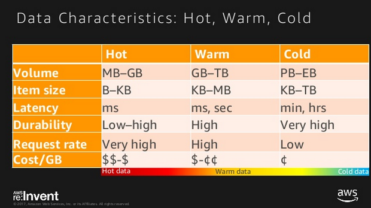

* Having the sense with what type of data you're dealing helps you to pick the
right tools


### Collect

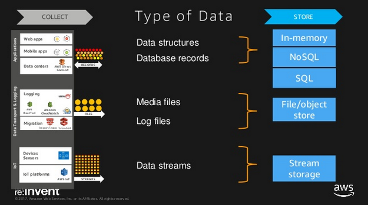


### Why Stream Storage?
* Decouple producers & consumers
* Persistent buffer (24hr to 7 days)
* Collect multiple streams
* Preserve client ordering (producer data will get to specific shard always - so
                            you build windows or make some analysis min/max on
                            data)
* Parallel consuming
* Streaming MapReduce


### What about AWS SQS
* No client ordering
* No streaming MapReduce (no separation into partitions)
* No parallel consuming
  * Visibility timeout - if one client consume something, the other consumers
can't see the message
* Data can be retrieved only once and gets deleted


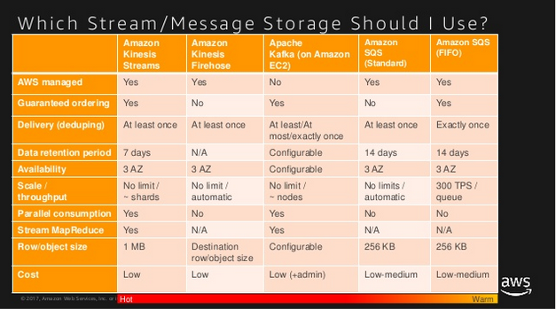

* Important: If you're using Kinesis there could be the case that the records
are doubled. You should deduping your system using DynamoDB. But in Kafka it's
already built-in.

### Use S3 as Your Persistent File Store
* Natively supported by big data frameworks (Spark, Hive, Presto)
* Decouple storage and compute
  * No need to run compute clusters for storage (unlike HDFS)
  * Can run trnasient EMR clusters with EC2 Spot Instances
  * Multiple & heterogeneous analysis clusters and services can use the same data

### What About HDFS & Data Tiering
* More and more HDFS is used like a cache for your hot data sets
* Use HDFS for hottest datasets (e.g. interative read on the same datasets)
* Use S3 different tiers for different data temperature
* Use S3 Aanlytis to otpimize tiering strategy


### Materilaized View
* Application ---> DynamoDB ----> Stream ----> Lambda ---> S3 Immutable log / Kinesis Consumer --->
EalsticCache Cache View ---> CloudSearch Search View


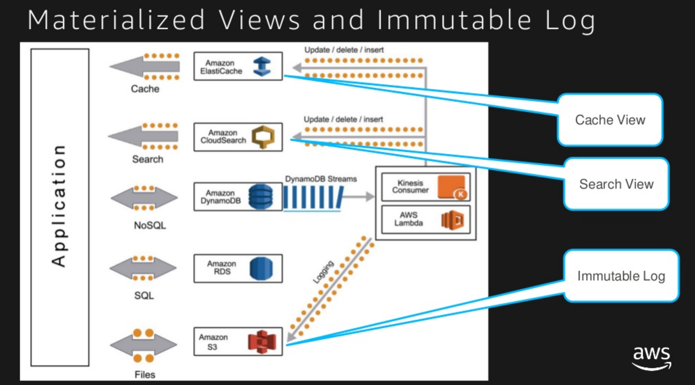


### Which data store should i use?

* You store the data in the form you access it
* Data structure -> Fixed schema, JSON, Key/Value
* Access patterns -> Store data in the form you access it
* Data characteristics -> Hot, warm, cold
* Cost - Right cost

* Data structure
  * Fixed Schema: SQL, NoSQL
  * Schema-free (JSON): NoSQL, Search
  * Key/Value: In-memory, NoSQL
  * Graph: GraphDB
* Access patterns
  * Put/Get (key, value): In-memory, NoSQL
  * Simple relationships -> 1:N, M:N: NoSQL
  * Multi-table joins, transaction, SQL: SQL
  * Faceting, Search: Search (Elastic Search)
  * Graph traversal: GraphDB

* Faceted search is a technique which involves augmenting traditional search techniques with a faceted navigation system, allowing users to narrow down search results by applying multiple filters based on faceted classification of the items. Basically the amazon.com search on the website

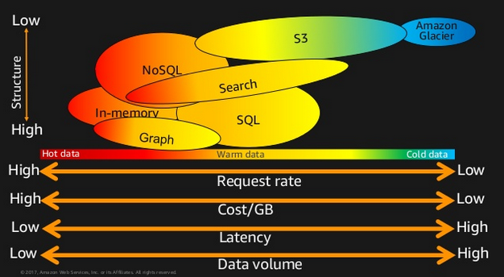


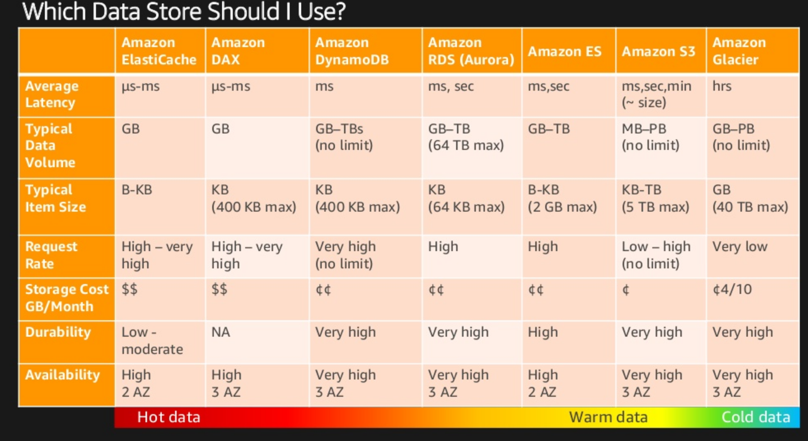


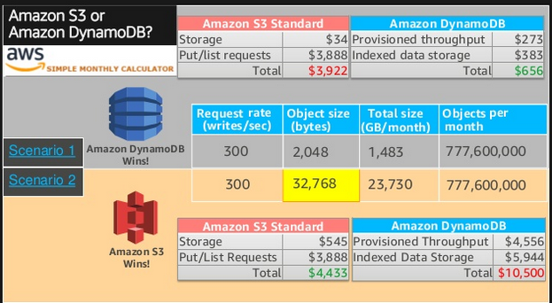


### Predictive Analytics
* API Driven Services
  * Amazon Lex - Speech recognition
  * Amazon Polly - Text to speech
  * Amazon Rekognition - Image analysis
  * Amazon Comprehension - Text classification
* Managed ML Platforms
  * Amazon ML
  * Spark ML on EMR
* Deep Learning AMI (Amazon Machine Learning)
  * Pre-instlal with MXNet, TensorFlow, Caffe2, Theano, Torch, Keras


### Interactive and Batch Analytics
* Amazon ES
  * Managed Service for Elasticsearch
* Amazon Redshift and Amazon Redshift Spectrum
  * Managed Data Warehouse
  * Spectrum enables querying S3
* Amazon Athena
  * Serverless Interactive Query Service
* Amazon EMR
  * Hadoop, Spark, Flink, Presto, Tez, Hive, Pig, HBase


### Stream / Real-time Analytics
* Spark Streaming on EMR
* Kinesis Analytics
* Kinesis KCL (library for stream processing - checkpointing)
* AWS Lambda


### Which Analytics Should I use?

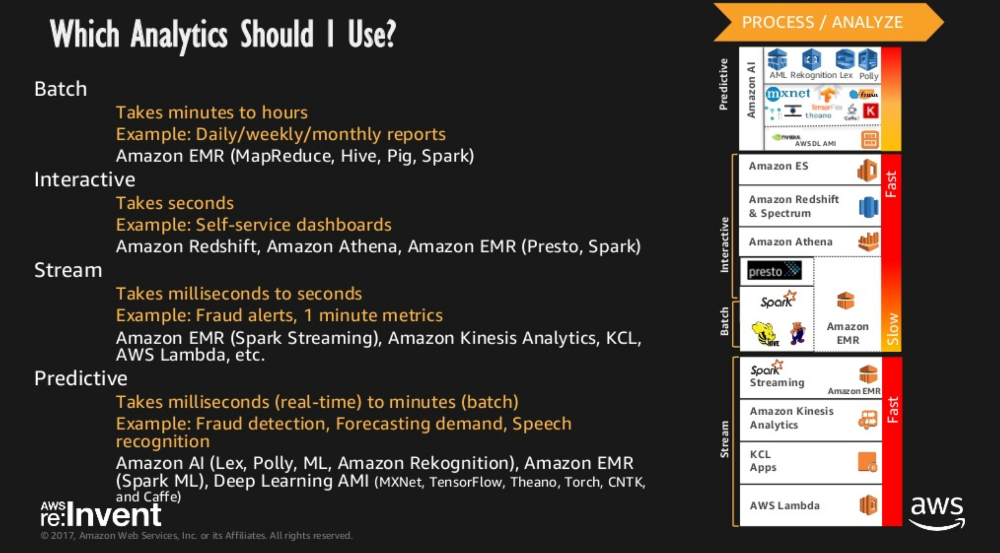


### Which Stream Processing Technology Should I use?

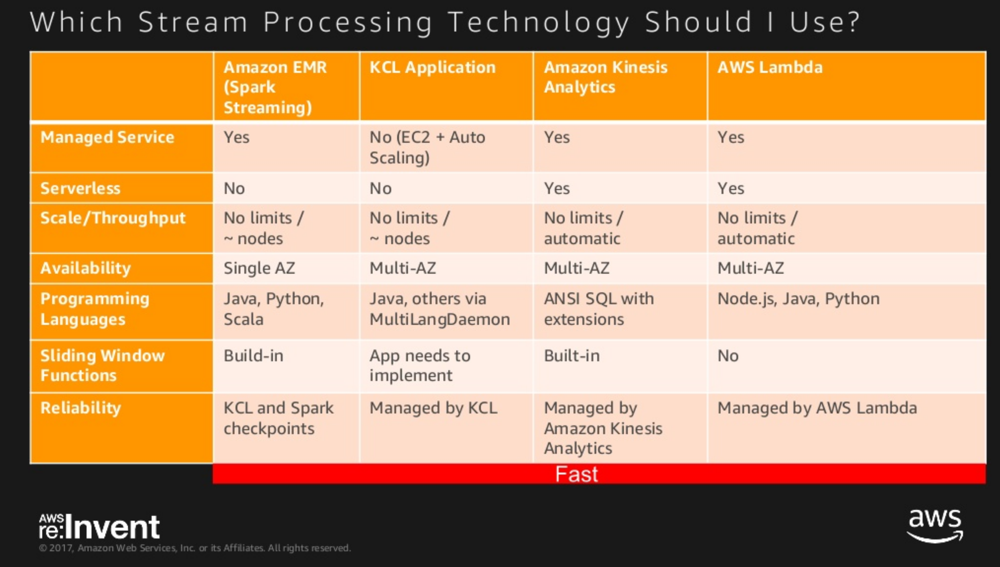


### Which Analytics Tools Should I use?

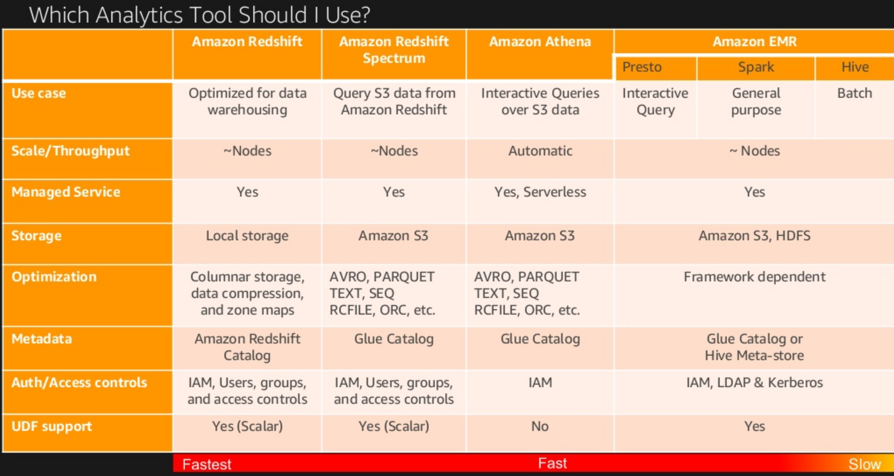


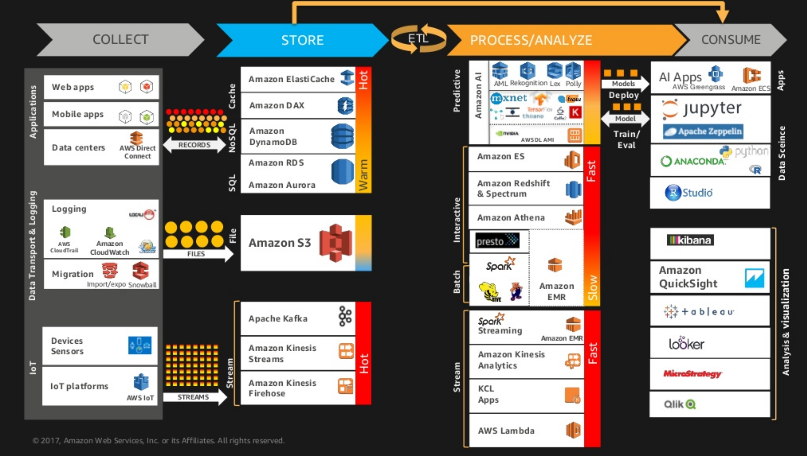


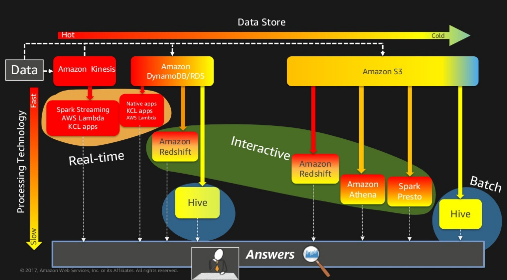


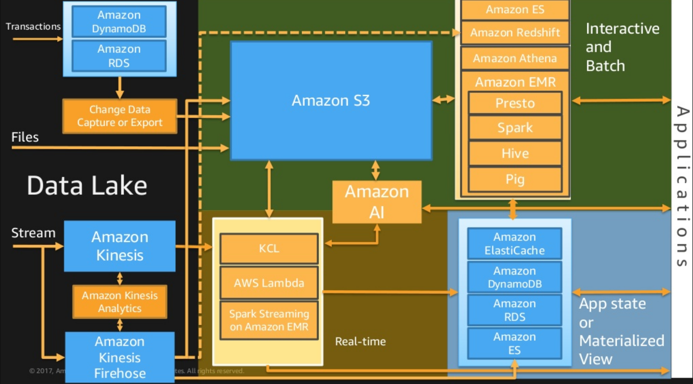


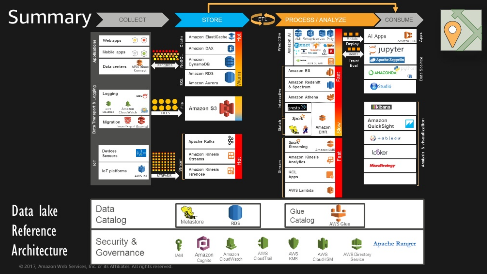


### Some other notes:

* Amazon ML uses the following learning algorithms:
  * For binary classification, ML uses logistic regression
  * For multiclass classification, ML uses multinominal logistic regression
  * For regression, ML uses linear regression

* Cross-validation is a technique for evaluating ML models by training several
ML models on subsets of the available input data to detect overfitting which
eventually fails to generalize the pattern

* ML uses Area Under the (Receiver Operating Characteristic) Curve (AUC) to
provide accuracy of the model


* Binary Classification Model:
  * ML models for binary classification problems predict a binary outcome. To
train binary classification model ML uses logistic regression
  * Is this email spam or not?
  * Will the customer buy this product?
  * I sthis product a book or a farm animal?
  * I sthis review written by a customer or a robot?

* Multiclass Classification Model
  * ML modles for multiclass classification problems allow you to generate
predictions for multiple classes (predict one of more than two outcomes), ML
uses the multinominal logistic regression
  * Is this product a book, movie or clothing?
  * Is this movie a romantic comedy, documentary or thriller?
  * Which category of products is most interesting for this customer?

* Regression Model
  * ML modles for regression problems predict a numeric value, ML uses linear
regression
  * What will the temperature be in Seattle tomorrow?
  * For this product, how many units will sell?
  * What price will this house sell for?


* Kinesis Analytics Windows:
  * For clickstream data use stagger windows
  * Stagger = Staffel
  * Tumbling = taumeln
  * Sliding = schieben

* In ML Visualizaiton explore the accuracy of your model beyond the prediction
accuracy metric

* Amazon ML uses macro-average F1 score to provide accuracy of the model
  * F1 score is used to evaluate the predictive accuracy of a multiclass metric


* Streaming
  * Metrics configured for streams are automatically collected and pushed to
CloudWatch every minute
  * Metrics are archived for two weeks; after that period, the data is discarded
  * Basic stream level data is captured every minute at no additional charge
  * Shard-level data is sent every minute for an additional cost
  * Enhanced shard-level metrics are being sent to cloudwatch every minute.
These metrics are not enabled by default. There is a charge for enhanced metrics
emitted from Kinesis

* Pipeline:
  * When AWS Data Pipeline runs a pipeline; it compiles the pipeline components
to create a set of actionable instances
  * Pipeline components represent the business logic of the pipeline and are
represented by the different sections of a pipeline definition
  * AWS Data Pipeline retries a failed operation. It continues to do so until
the task reaches the max. number of allowed retry attempts.
  * AWS Data Pipeline hands the instances out to task runners to process


* AWS IoT Components:
  * Device gateway: enables devices to securely and efficiently communicate with
AWS IoT
  * Message broker: Provides a secure mechanism for devices and AWS IoT
applications to publish and receive messages from each other.
  * Rules engine: Provides message processing and integration with other AWS
services
  * Security and Identity service: Provides shared responsitbility for security
in the AWS Cloud. Your devices must keep their credentials safe in order to
securely send data to the message broker
  * Registry: organizes the resources associated with each device in the AWS
Cloud. You register your device and associate up to three custom attributes with
each one.
  * Group registry: alloes you to manage several devices at one by categorizing
them into groups
  * Device shadow: a json document used to store and retrieve current state
information for a device
  * Device shadow service: provides persistent representations of your devices
in the AWS Cloud. You can publish updated state information to a device's ahdow,
and your device can sync its state when it connects. Your devices can also
publish their current state to a shadows for use by applications or other
devices
  * Device provisioning service: allws you to provision devices using a template
that describes the resources required for your device: a thing, a certificate,
and one or more policies
  * Custom auth service: you can define custom athorizers that allow you to
manage your own authentication and authorization strategy using a custom
authentication service and a lambda function
  * Jobs service: allows you to define a set of remote operations that are sent
to and executed on one or more devices connected to AWS IoT


* Kinesis Analytics
  * VPC flow Logs have a capture window of approx. 10 minutes. But they can have
a capture window of up to 15 minutes if you're aggregating data on the client. A
stagger windows query. A query that aggregates data using keyed time-based
windows that open as data arrives. The keys allow for multiple overlapping
windows. This is the recommended way to aggregate data using time-based windows

  * A continuous filter is a common query that uses a where clause to select a
portion of your data stream. For this specific query we will apply a filter on
the "status" column to only select and records with equal "fail" and insert them
into a subsequent stream. This common query is useful for alerting on events
that match a particular query. Commonly, they are then forwarded on to other
Kinesis streams, SNS topics or Lambda function
(https://s3-us-west-2.amazonaws.com/kinesis-helpers/workshops/20170405-streaming-data/SF+loft+Kinesis+workshop.pdf)

  * A tumbling window is similar to a periodic report, where you specify your
query and a time range, and results are emitted a the end of a range ex: COUNT
number of items by key for 10 seconds

  * There are 3 different types of windows

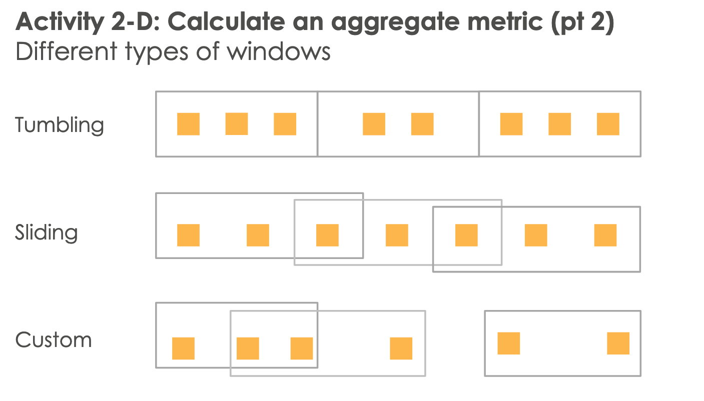

* Tumbling:
  * Fixed size and non-overlapping
  * Use FLOOR() or STEP() function in a GROUP BY statement
* Sliding:
  * Fixed size and overlapping; row boundaries are determined when new rows
enter window
  * Use standard OVER and WINDOW claus (ex count(col) OVER(RANGE INTERVAL '5' MIN)

* Tumbling windows are useful for periodic reports. You can use a tumbling window to compute an average number of visitors to your website in the last 5 minutes or the maximum over past hour. A single result is emitted for each key in the group as spcivied by the caluse the end of the defined window. An important characteristic of a tumbling window is that the bounds do not overlap; the start of a new tumbling window begins the wht end of the old window. 

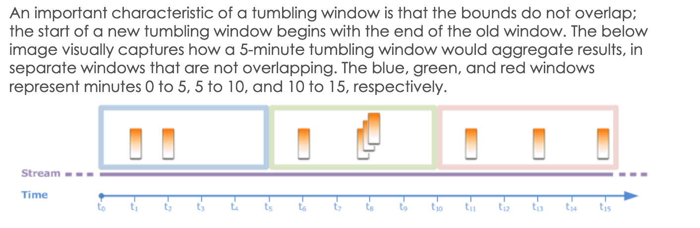

* All of our previous window queries were using ROWTIME, which is the procesisng
                                        time of the application. The processing
                                        time is useful in many real-time use
                                        cases like the previous exercise
                                        (sliding window and filter). However
                                        there are many cases where you need to
                                        use your data's event time. An event
                                        time is a stimestamp generated by a data
                                        producer when the event was created. A
                                        key problem with using event time is
                                        that events arrive out of order. You
                                        could perform sorts on the data but
                                        sorts will leave events out which you
                                        need to reconcile later. An alternative
                                        approach to use both processing and
                                        event time in your windows

 
* Kinesis Firehose:
  * Firehose provides the following Lambda blueprints that you can use to create
                                        a lambda function for data
                                        transformation
  * General Firehose Processing: contains the data transformation and status
                                        model described in the previous section.
                                        Use this blueprint for any custome
                                        transfromation logic
  * Apache Log to JSON
  * Apache Log to CSV
  * Syslog to JSON: syslog is a standard for sending and receiving notification
                                        messages-in a particular format-from
                                        various network devices
  * Syslog to CSV
  * Firehosess Process Record Streams as source: accesses the kinesis data
                                        streams records int he input and returns
                                        them with a processing
  * Firehose CloudWatch Logs Processor: parses and extracts incividual log
                                        events from records sent by CloudWatch
                                        logs subscription filter 


* Redshift / Storage
* when the administrator is not availabe nad we are not sure of the workload, it
                                        is always better to go with no
                                        distribtuion style because Redshift
                                        handles the distribution mechanism

* DynamoDB applies adaptive capacity in real time in response to changing
application traffic patterns, which help you maintain uninterrupted prefromance
indefinitely, even for imbalanced workloads. In addition, instan adaptive
capacity helps you provision read and write throughput efficiently instead of
overprovisioning to accomodate uneven data access patterns. Instant adaptive
capacity is on by default at no additional cost ofr all DynamoDB tables

* Amazon ElasticSearch doesn't support COPY command to load data into Redshift.
The COPY command loads data in parallel from S3, EMR, DynamoDB or multple data
sources on remote hosts. COPY loads large amount of data much more efficiently
than using INSERT statements, and stores the data more effectively as well.
Integration of COPY command with Elasticsearch is not supported

* What types of table/views can help access the performance related infor for
diagnosis?
  * STL system table are generated from Redshift log files to provide a history
of the system. They server Logging
  * STV tables are actually virtual system tables that contain snapshots of the
current system data. They server snapshots
  * The system catalog store schema metadata, such as information about tables
and columns


* Visualisation:
  * Combo chart: on the clustered bar combo chart, bars display for each child
dimension, grouped by the parent dimension. On the stacked bar combo chart, one
bar displays per parent dimension


  * The team identified a dataset that they want to delete, on which some
analysis is already generated. They submitted the deletion. What happens next?
  * You receive a warning if you have any analysises that use the data set you
have chosen for deletion
  * Dataset deletion does not delete the dependet analysis
  * Next time you open any of those analyses, you are prompted to select a new
data set for any visuals that wer based on the delelted dataset

* EMR Notebooks is a Jupyter Notebook environemtn built in to the EMR console
that allows you to quickly create Jupyter notebooks, attach them to Spark
cluster, and then open the Jupyter Notebook in the console to remotely run
queries. EMR notebook is saved in S§ independently from clusters for durable
storage, quick access, and flexibility. You can have multiple notebooks open,
attach multiple notebooks to a single cluster and re-use a notebook on different
clusters
* Jupyter Notebook is an open-source web application that you can use to create
and share documents that contain live code, equations, visualizations, and
narrative text. JupyterHub allows you to host multiple instances of a
single-user Jupyter notebook server. When you create a cluster with JupyterHub,
EMR creates a Docker container on the cluster's master node. JupyterHub, alls
the components required for Jupyter and Sparkmagic run within the container


* IoT
  * Device shadow is a json document used to store and retreive current state
information for a device
  * Device shadow service provides persistent representations of your devices in
the AWS Cloud

* Security
  * Read the question: "TI launched EMR 3.2.1 using EMRFS storage to support
their real-time data analytics"... S3 server-side encryption with KM is not
available when using EMR version 4.4 or earlier
  * You can use AWS KMS customer master key (CMK) set up with policies suitable
for EMR
  * With S3 client-side encryption, the Amazon S3 encryption and decryptin takes
place in the EMRFS client on your cluster. Objects are encrypted before being
uploaded to S3 and decrypted after tehy are downloaded. The provider you specify
supplies the encryption key that the client uses. The client can use keys
provided by AWS KMS (CSE-KMS) or a custom Java sclass that provides the
client-side master key CSE-C. The encrytpin specifiecs are slightly differnt
between CSE-KMS and CSE-C.
  * You cannot audit of encryption and decryption of AWS owned CMK using AWS
CloudTrail
  * Redshift database security:
    * Groups are collections of users that can be collectively assigned
privileges for easier security maintenance
    * By default privileges are granted only to the object owner
    * Redshift database users are named user accounts that can connect to a
database. A user account is granted privileges explicitly, by having those
privileges assigned directly to the account or implicitly by being a member of a
group that is granted privileges
    * Schemas are collections of database tables and other database objects.
Schemas are similar to operatinng sytem directoreis, except that schemas cannot
be nested
  * Amazon ElasticSearch: When encryption of data is enabled, what all aspects
of domain are encrypted?
    * Automated snapshots
    * Elasticsearch logs
    * Swap files
