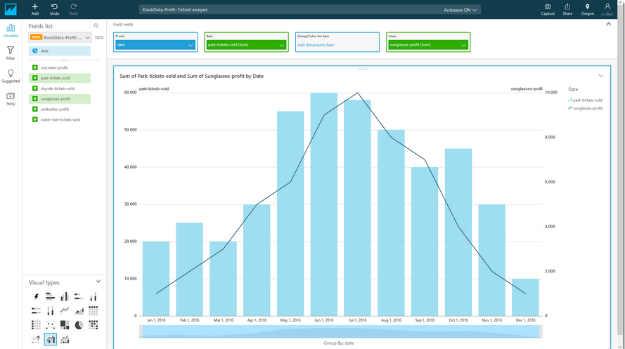
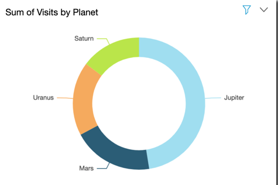
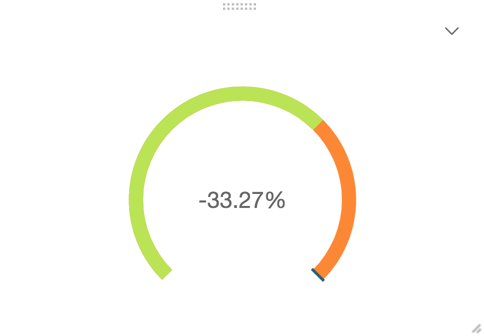
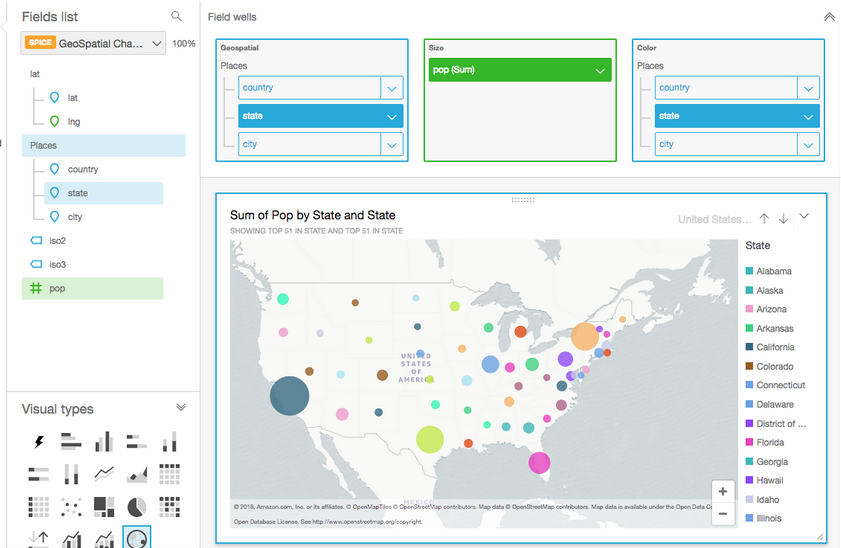
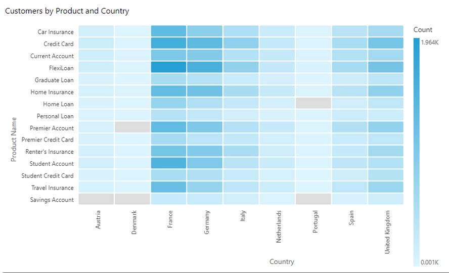
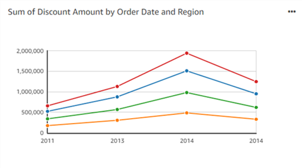
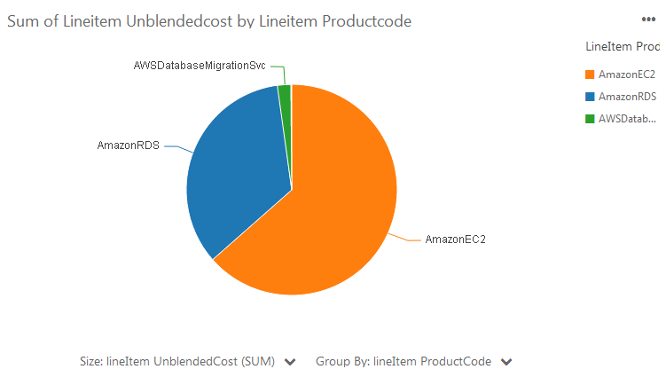
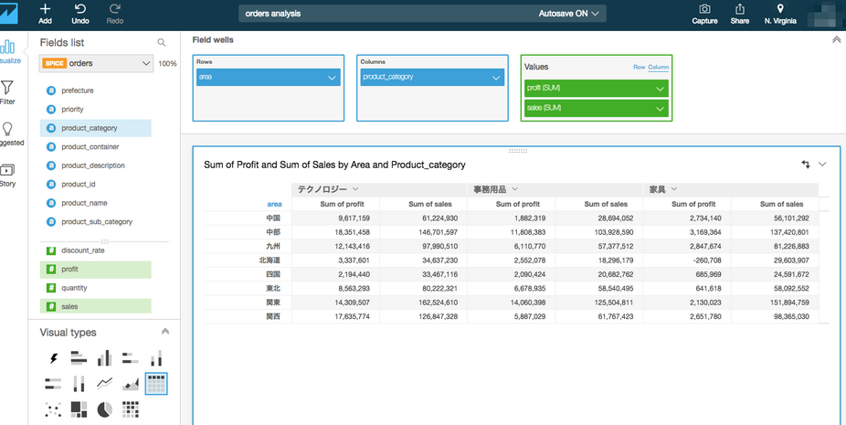
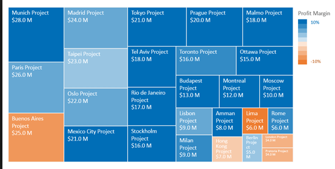

# Working with Visual Types

Amazon QuickSight supports assorted visualizations that facilitate different analytical approaches:

* Comparison and distribution
  * Bar charts (several assorted variants)
* Changes over time
  * Line graphs
  * Area line charts
* Correlation
  * Scatter plots
  * Heat maps
* Aggregation
  * Pie graphs
  * Tree maps
* Tabular
  * Pivot tables

### AutoGraph  

* AutoGraph isn't a visual type itself, but instead lets you tell AWS QuickSight
to choose the visual type for you.

## ComboCharts

* These are also knows as line and column charts
* Use the combo chart visual types to create a single visualization that shows
two different types of data. These two types are individually best suited to a
line chart and a bar chart.
* The difference between these two types can work well for comparing two sets of
data, for example trends and categorical data

## DonutCharts

* Use donut charts to compare values for items in a dimension. The best use for
this type of chart is to show a precentage of a total amount

## Gauge Charts

* Use gauge charts to compare values for items in a measure. You can compare
them to another measure or to a custom measure. In the example below, we are
comparing actual sales to the sales goal and the gaguge shows that we must sell
an additional 33,27% to meet the goal

## Geospatial Charts (Maps)

* Use geospatial charts to show differences in data values across a geographical
map. The map allows you to zoom in and out.

## Heatmaps

* Use heat maps to show a measure for the intersection of two dimensions, with
color-coding to easily differentiate where values fall in the ragen. 

* For example, the following heat map shows which products are most used by the
customers in these countries, measured by a simple count

## KPIs

* Use KPIs to visualize a comparison between a key value and its target value

* A KPI displays a value comparison, the wto values being compared, and a
progress bar. For example, the following KPI shows how closely revenue is
meeting its forecast

## Line Charts

* Use line charts to compare changes in measure values over period of time, for
the following scenarios:
  * One measure over a period of time, for example gross sales by month
  * Multiple measures over a period of time, for example sales and net sales by
month
  * One measure for a dimension over a period of time, for example number of
flight delays per day by airline

## Pie Charts

* Use pie charts to compare values for items in a dimension. The best use for
this type of charts is to show a percentage of total amount. 

## Pivot Tables

* Use pivot tables to show measure value for the intersection of two dimensions
* Heat maps and pitov tables display data in a similar tabular fashion. Use a
heatmap if you want to identify trends and outliers, because the use of color
makes these easier to spot. Use a pivot table if you want to analyze data on the
visuals

## Scatter Plots

* Use scatter plots to visualize two or three measures for a dimension.
* Each buble on the scatter plot represents one item in the dimension. The X and
Y axes represent two different measures that apply to the dimension. A bubble
appers on the chart at the point where the values for the two measures for an
item in the dimension intersect. Optionally, you can also use bubble size to
represent an additional measure

## Tree maps

* Use tree maps to visualize one or two measures for a dimension
* Each rectangle on the tree map represents one item in the dimension. Rectange
size represents the proportion of the value for the selected measure that the
item represents compared to the whole for the dimension.

## Tables as Visuals

* Use a table visual to see a customized table view of your data
