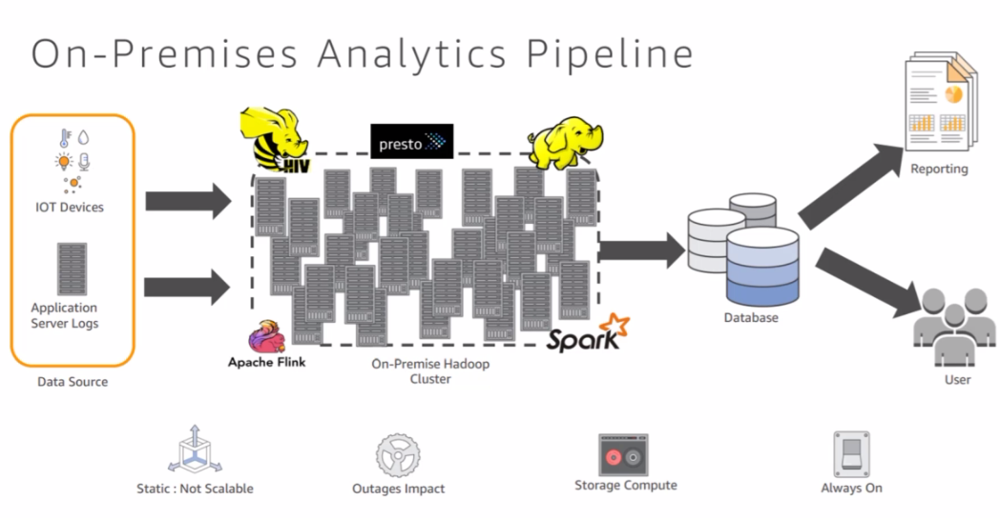
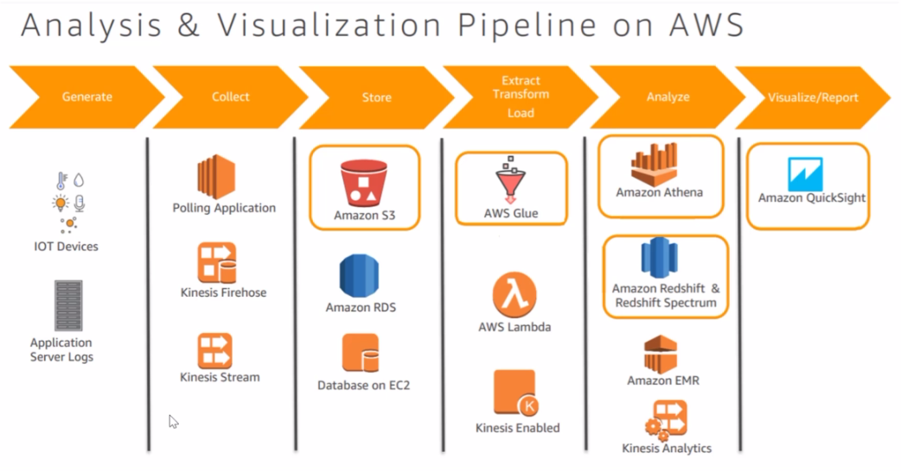
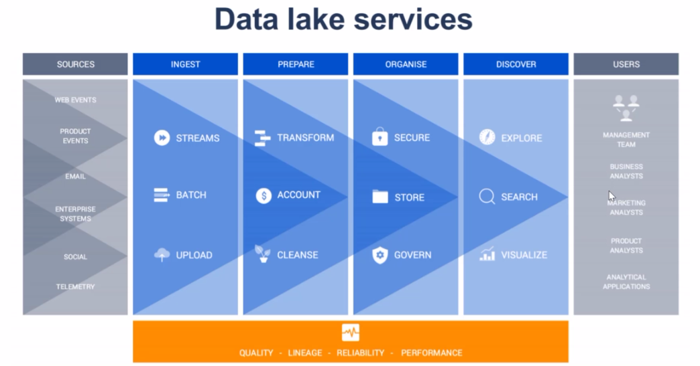
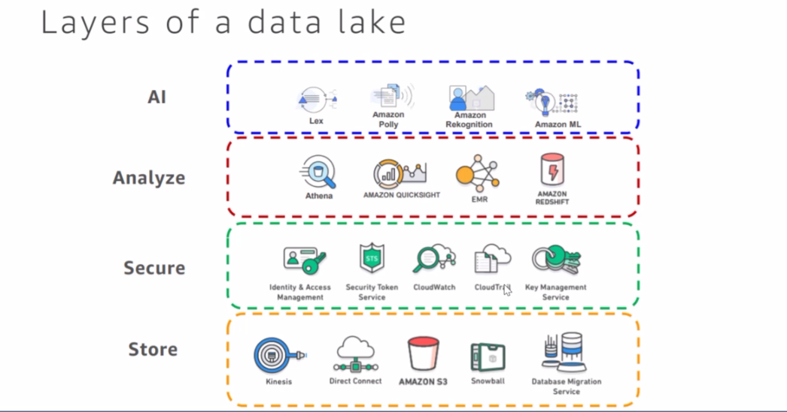
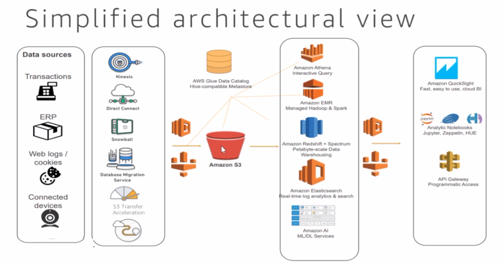

# Section 2

### What is Severless Computing?
* Serve users from zero to planet-scale, all without managing any
  infrastructure ~ Google Cloud Functions 
* Just put your code in the cloud and run it ~ Serverless for Dummies
* IaaS, PaaS, Serverless (only application is important, the underlying
  infrastructure is managed by the provider), SaaS
* On-premise you are not decoupling storage and compute ??
* Run 24h/365 days, can be optimized via Spot instances

* How all these components communicate with each other? See Data Lake

### Data Lake Basics
* Multiple sources and formats are coming every day and the number is growing:
  * Documents and files:
    * Clickstream data
    * Mobile app data
    * Spreadsheets
    * Infrastructure logs
    * Social media
  * Records:
    * Amazon RDS
    * ERP
    * DynamoDB
    * On Premises database
    * Amazon Redshift
  * Streams:
    * AWS IoT
    * Kinesis Streams
    * Device data
    * Kinesis Firehose
    * Sensor data
* Data lake vs. data warehouse
  * Data lake:
    * Semi-structured / unstructured / structured data
    * Schema on read (take the data as it is and store it together)
    * Data scients, predictive analysis, BI use cases
    * Great for storing granular data; raw as well as processed data
    * Separation of compute and storage (store the data on S3, but compute
      depends on what tool you're going to use for analysis)
  * Data warehouse (cetral repository where the data is stored, you create a
    data mart -> for marketing, finance, hr have their own data warehouses):
    * Structured data (STAR or SNOWLFAKE model)
    * Schema on write
    * SQL based BI use cases
    * Grat for storing frequently accessed data as well as data aggregates and
      summary
    * Tightly coupled compute and storage (e.g. Redshift have storage and
      compute is on the same machine)
* Reasons for building a data lake?
  * Exponetial growth in data:
    * Transactions
    * Billing
    * ERP
    * Web logs
    * Sensor data
    * Infrastructure logs
    * Social
  * Diversified consumers:
    * Data scientists (more data is requierd for training and model creation)
    * Applications
    * Business Analysts
    * External Consumers
  * Multiple access mechanisms
    * API Access (web services / micro services)
    * Notebooks (kind of IDE's, Apache Zepplin, Jupyter)
    * BI Tools (endpoint applications)
* Characteristics of a Data lake?
  * Collect and store any data, at any scale, and at low cost (S3)
  * Secure the data and prevent unauthorized access (IAM)
  * Catalogue, search, and discover data (AWS Glue)
  * Decouple Compute from Storage (storage S3 and compute ELT (EMR, Glue))
  * Future Proof against a highly changing complex ecosystem (open for new data
    sources and formats)
* Data Lakes extend traditional warehouse
  * Via Data Catalog Data warehouse can access the data e.g. Spectrum
  * Relational and non relational data
  * Teraybtyes to Exabytes scale
  * schema defined during analysis
  * Diverse analytics engines to gain insights
  * Designed for low cost storage and analytics (no ETL, you can make use of the
    data)
* Decouple storage and compute
  * Legacy design was large databases or data warehouses with integrated
    hardware
  * Big data architectures often benefit form decoupling storage and compute
  * Specturm does the compute, S3 does the storage
  * Athena does the compute, S3 does the storage

* See the point API Gateway to access Athena programatically without having
  direct access to AWS. To make the platform more independent.

* Redshift Specturm can query the data from the Redshift as well as from S3.
  This is how you can mix the data.

