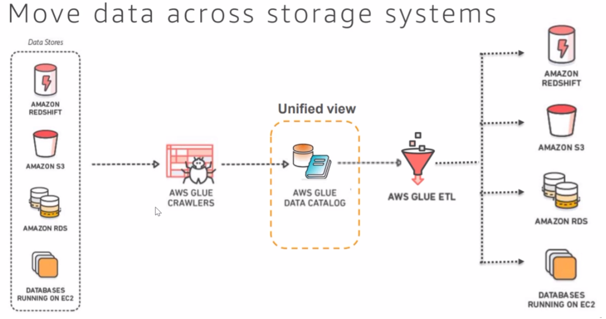
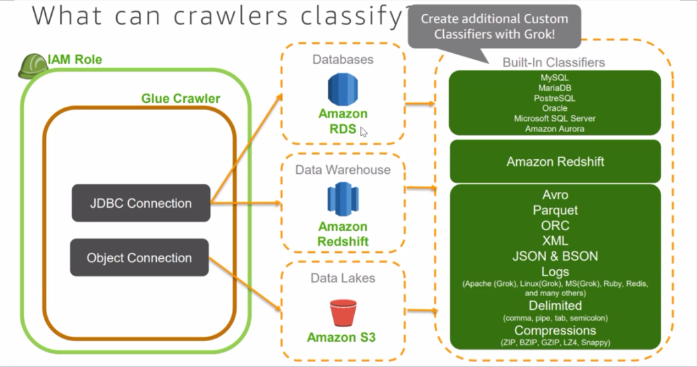
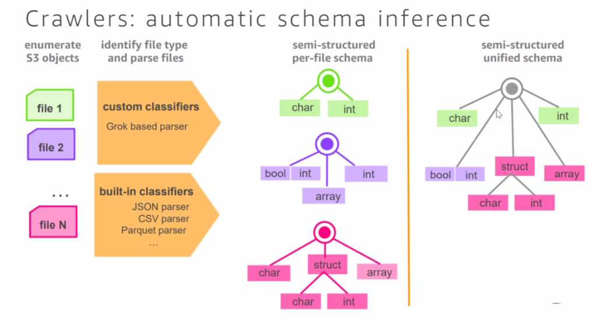
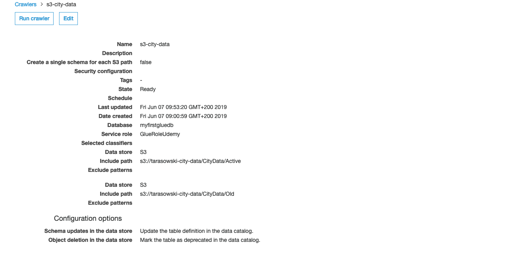

# AWS Glue

### Architecture

* ETL is the most time-consuming part of analytics
* ETL 80% of time spent here. Because the data is not in the right schema, it
  needs to be cleansed etc. before it goes into Data Warehousing.
* ETL is an acronym that stands for for moving data from one source to another
  destination
* When you move the data to S3, you have 3 components until you get the Business
  Insights:
    * ETL 80% of time
    * Data warehousing - Redshift (can plug also Athena but only works on S3,
      but can also be used with Spectrum)
    * Visualizaiton / Insights - QuickSight
* What is Glue?
  * Discover: Automatically discover and categorize your data
    * Hive metastore compatible
    * Automatic crawling
  * Develop: Generate code to clean, enrich, and reliably move data between
    various data sources
      * Auto-generates ETL code
      * Python and Apache / Scala
      * Spark
      * Edit
  * Deploy: Run your jobs on a serverless, fully-managed, scale-out
    (horizontally) environment
      * Serverless execution
      * Flexible scheduling



* You can use Athena Catalog, but the preferred medium is the Glue Data Catalog
* Glue Catalog is just a schema definition, the data lies in S3
* Glue ETL jobs will read the catalog and move the data to S3, Redshift, RDS,
  Databases running on EC2 
* Glue ETL in general can transform the data in S3, before you run crawlers to
  discover the data
* Unstructured data is stored in S3, Glue ETL transforms the data, Glue Crawlers
  will discover the data and store the metadata will be stored in Data Catalog.
  Tools such as Athena, Spectrum, EMR will query the data.
* Developers can create algorithms live via a Zeppelin Notebooks and query the
  data live. Those algorithms can be run periodically on Glue ETL.
* Once the data is in Athena, you can visualize that data in QuickSights

### Terminology
* Glue Data Catalog:
  * The persistent metadata store in AWS Glue. Each AWS account has one AWS Glue
    Data Catalog. 
  * Using the metadata in the Data Catalog, AWS glue can autogenerate Scala or
    PySpark scripts with AWS Glue extentions that you can use and modify to
    perform various ETL operations
  * It is managed service that lets you store, annotate, and share metadata in
    the AWS Cloud in the same way you would in an Apache Hive metastore. It
    provides a uniform repository where disparate systems can store and find
    metadata to keep track of data in data silos, and use that metadata to query
    and transform the data
  * Data Catalog can be versioned
* Table: 
  * A table in the AWS Glue Data Catalog consists of the names of columns, data
    type defintions, and other metadata about a base dataset. The schema of your
    data is represented in your AWS Glue Table defintion. The actual data
    reamins in its original data store, whether it be in a file or a relational
    database table.
  * Table is similar to Tables in DynamoDB, Redshift, RDS
  * A table is a collection of items, and each item is a collection of
    attributes
  * A table is a data structure that is composed of other data types
* Classifier:
  * Determine the schema of your data. AWS Glue provides classifiers for common
    file types, such as CSV, JSON, AVRO, XML and other. You can write your own
    classifierts too.
  * This is also called SCHEMA ON READ.
* Crawler: 
  * A program that connects to a data store (source or target), progresses
    through a prioritized list of classifierts to termine the schema for your
    data, and then creates metadata in the AWS Glue Data Catalog
  * AWS Glue also lets you set up crawlers that can scan data in all kinds of
    repositiers, classify it, extract schema information from it, and store the
    metadata automatically in the Data Catalog. From there it can be used to
    guide ETL operations.
* Connection:
  * Contains the properties that are required to connect to your data store
* Script:
  * Code that extracts data from sources, transfroms it, and loads it into
    targets. AWS Glue generates PySpark or Scala scripts. PySpark is a Pythong
    dialect for ETL programming.
  * Reads the Data Catalog and extracts / loads the data for transformation
* Transform
  * The code logic that is used to maniputate your data into a different format
    / enrich. 
* Job:
  * The business logic that is required to perform ETL work. It is composed of a
    transformation script, data sources, and data tagets. Job runs are initiated
    by triggers that can be scheduled or triggered by events.
* Trigger - Initiates an ETL job. Triggers can be defined based on a scheduled
  time or an event.
* Develpment endpoint - An environment that you can use to develop and test your
  AWS Glue scripts.

### Application of AWS Glue
* You can use AWS Glue to build (populate) a data warehouse to roganize, cleanse, validate,
  and format data
* Discovers and catalogs metadata about your data stores into a central catalog.
* Populates the Data Catalog iwth table definitions from scheduled crawler
  programs
* Schema on read
* Crawlers call classifier logic to infer the schema, format and data types of
  your data. This metadata is stored as tables in teh AWS Glue Data Catalog and
  used in the authoring process of your ETL jobs
* Generates ETL scripts to transform, flatten, and enrich your data from source
  to target
* Detects schema changes and adapts based on your preferences.
* Triggers your ETL jobs based on a schedule or event. You can initate jobs
  automatically to move your data into your data warehouse. Triggers can be used
  to create a dependency flow between jobs
* Gathers runtime metrics to monitor the activities of your data warehouse
* Handles errors and retrieves automatically
* Scales resources as, needed, to run your jobs
* With crawlers, your metadata stays in sync with the underlying data.
* One unified interfance without data silos
* You can create event-driven ETL pipelines with AWS glue
  * You can run your ETL jobs as new data becomes available in S3 by invoking
    Glue ETL jobs from an AWS Lambda function. As soon as new file in the S3
    bucket, you can trigger a Lambda function and Lambda triggers the ETL job.
  * You can also register this new dataset in the Data Catalog as part of your
    ETL jobs
* The Data Catalog also serves as a drop-in replacement for your external Apache
  Hive Metastore. Data Catalog is the central data repository in AWS.
* **Move data from one source to a target event pipeline with Glue**
* **You can create event driven ETL pipelines with Glue where you run a job that transforms the data**
* **You can use Glue to understand your data assets**

### Funamentals of AWS Glue
* Glue uses other AWS services to orchestrate your ETL jobs to build a data
  warehouse 
* Glue calls API operations to transform your data, create runtime logs, store
  your job logic, and create notifications to help you monitor your jobs runs
* You supply credentials and other properties to Glue to access your data
  sources and write to your data warehouse
* Glue is serverless
* Data Catalog is your persistent metadata store. It is a managed service that
  lets you store, annotate and share metadata in the AWS Cloud in the same way
  you would in an Apache Hive metastore
* You define a crawler to populate your Glue Data Catalog with metadata table
  definitions. You point your crawler at a data store, and the crawler creates
  table definitions in the Data Catalog.
* In additionl to table definitions, the Glue Data Catalog contains other
  metadata that is required to define ETL jobs. You use this metadata when you
  define a job to transform your data.
* Glue can generate a script to transform your data. Or you can provide the
  script. You create jobs using table defintion in your Data Catalog. Jobs
  consists of scripts that contain the programming logic that performs the
  transformation.
* Glue runs your ETL jobs in an Apache Spark serverless environment
* Glue accesses customer data only as needed in response to customer requests,
  using temporary, scoped-down credentials, or with a customer's consent to IAM
  roles in their account.

### Glue Costs
* Endpoint charges you as long as the endpoint exists
* ETL job charges you only if you run the jobs
* Data catalog: Free for the first million objects stored. An object is a table,
  table version, partition, or database


### Network Configuration
* To run ETL jobs, Glue must be able to access your data stores. If a job
  doesn#t need to run in your VPC, transforming data from S3 to S3 no additional
  configuration is needed.
* If a job needs to run in your VPC subnet. Glue sets up elastic network
  interfaces that enable your jobs to coennect securley to other resources
  within your VPC
* All JDBC data stroes that are accessed by the job must be available from the
  VPC subnet. To access S3 from within your VPC, a VPC endpoint is required.


### Glue Database Object
* When you define a table in the Glue Data CAtalog, you add it to a database. A
  database is sued to roganize tables in Glue
* You can organize your tables using a cralwer or using the Glue console
* A table can be in only one database at a time
* Your database can contain tables that define data from many different data
  stores
* When you delete a database, all the tables in the database are also deleted
* A database in the Data Catalog is a container that holds tables. You use
  databses to organize your tables into separate categories
* Databases are created when you run a cralwer or add a table manually
* The database list in the AWS glue console displays descriptons of your
  databases
* If you plan to access the database from Amazon Athena, the provide a name with
  only alphanumeric and underscore characters
* To change the database that a cralwer writes to, you must change the crawler
  definition
* You can have tables that can point to different data stores (can contain
  schema of different data sources)
* Database is like a schema definition. It's not a database like in RDS / NoSQL.
  Database is a way to categorize and organise the tables that hold definition
  of the schema.

### Glue Tables
* Table in a prospect of data catalog is different from RDBMS.
* When you define a table in Glue, you can specify the value of classification
  field that indicates the type and for that of the data that's stored in that
  table
* If a crawler creates the table, these classifications are determined by either
  a built-in classifier or a custom classifier
* If you create a table manulla yin the console or by API, you specify the
  classification when you define the table
* When a crawler detects a change in table metadata, a new version of the table
  is created in the AWS Glue Data Catalog. You can compare current and past
  version of a table
* The schame of the table contains a sctructure. You can also edit a schema to
  create a new version of the table
* The table history is also maintained in the Data Catalog
* The version of the schema that was used by an ETL job is also kept in the
  history
* An Glue table defintion of an Amazon S3 folder can describe a partitioned
  table
* Glue table defintions include the partioning key of table
* When Glue evaluates the data in S3 folder to catalog a table, it determines
  whether an individual table or a partitioned table is added.
* You can add tables manually or via a crawler

### Glue Crawlers
* Crawlers automatically build your Data catalog and keep it in sync
* Automatically discover new data, extract schema defintions
  * Detect schema changes and version tables
  * Detect Hive style partions on S3
* Built-in classifiers for pupular types; custome classifiers using Grok
  expression
* Run ad hoc or on a schedule; serverless - only pay when cralwer runs
* A classifier determines the schema of your data. 



#### Cataloging Tables with Crawler
* You can use a crawler to populate the AWS Glue Data Catalog with tables. This
  is the primary method used by most Glue users.
* You add a crawler within Data Catalog to traverse your data stores
* The output of the crawler consists of one or more metadata tables that are
  defined in your Data Catalog
* ETL jobs that you define in Glue use these metadata tables as sources and
  targets. Your crawler uses an IAM role for permission to accss your data
  stores and the Data Catalog
* The role you pass to the crawler must have permissions to access S3 paths that
  are crawled. Some data stores require additional authorization to establish a
  connection.
* When you deifne a cralwer, you choose one or more classifiers that evaluate
  the format of your data to infer a schema.
* When the crawler runs, the first classifier in your list to successfully
  recognize your data store is used to create a schema for your table. E.g the
  crawler goes into S3, sees csv file and uses this classifier first.
* The output of the cralwer is one or more metadata tables defined in Glue
  Catalog
* A table is created for one or more files found in your data store
* If all the S3 files in a folde rhave the same schema, the crawler creates one
  table. If S3 object is partitioned, only one metadata table is created
* If the data store is being crawled is a relational database, the output is
  also a set of metadata tables defined in the Glue Data Catalog
* When you crawl a relational database, you must provide authoritzation
  credentails for a connection to read objects in the database engine
* Depending on the type of database engine, you can choose which objects are
  crawled, such as a database, schemas, and tables.
* If crawler runs more than once, perhaps on a schedule, it looks for new or
  changed files or tables in your data store. The output of the crawler includes
  new tables found since previous run

#### Gotchas
* If the file is compressed the Crawler will download the file in order to
  process it. It will have additional costs because then it involves many other
  resources. Crawler creates a local spark environment to process the files.

#### Crawler Execution Workflow
1. A crawler runs any custom classifiers that you choose to infer the schema of
  your data. You provide the code for custom classifiers, and they run in the
  order that you specify. The first custom classifier to successfully recognize
  the structure of your data is used to create a schema. Custom classifiers
  lower in the list are skipped.
2. If no custom classifier matches your data's schema, built-in classifiers try
  to recognize your data's schema
3. The crawler connects to the data store. Some data stores require connection
  properties for crawler access.
4. The inferred schema is created for your data
5. The crawler writes metadata to the Data Catalog. A table defintion contains
  metadata about the data in your data store. The table is written to a
  database, which is a container of tables in the Data Catalog. Attributes of a
  table include classification which is a label created by the classifier that
  inferred the table schema.

#### AWS Glue Cralwer - Exclude patterns
* After you specify an include path, you can then exclude objects from the
  crawl that you include path would otherwise include by specifying one or more
  Unix-style blog exclude patterns
* When evaluating that to include or exclude in a crawl, a crawler starts by
  evaluating the required include path. For every data store that you want to
  crawl, you must specify a single include path. 

#### Crawlers: automatic schema inference
1. A crawler enumreates all files, creates a list of files
2. Identify file type and parse files:
  * Custom classifiers: Grok based parser
  * Built-in classifiers:
    * JSON parser
    * CSV parser
    * Parquet parser etc.
3. Create unified schema (it creates a schema of all files unified)



#### Glue Partition
* Single unified data
* When a crawler scans S3 and detects multiple folders in a bucket, it
  determines the root of a table in the folder structure and which folders are
  partitions of a table
* The name of the table is based on S3 prefix or folder name. You can provide an
  Include path that points to the folder level to crawl
* When the majority of schemas at a folder level are similar, the crawler
  creates partitions of a table instead of two separate tables
* To influence the crawler to create separate tables, add each table's root
  folder as a separate data store when you define the crawler

```
SELECT * FROM "myfirstgluedb"."citydata" where partition_0='Active'
``` 

#### Glue Partitioned Tables
* We can provide a filtered condition to create a table based on the partitions
* Separate table for different partitions
* We can do it by creating a crawler with a specific include path. The crawler
  then will create a table with the partion we have chosen e.g.
  `s3://tarasowski-city-data/CityData/Active` but if we want to create another
  table under `Add another data store` we can choose `Yes` and we can choose
  another path `s3://tarasowski-city-data/CityData/Old` this is how another
  table gets created.


### AWS Glue Authoring Workflow
1. You choose the data sources for your job. The tables that represent your data
   source must already be defined in your Data Catalog. If the source requires a
   connection, the connection is also referenced in your job.
2. You choose the data targets of your job. The tbles that represent the data
   target can be defined in your Data Catalog, or your job can create the target
   tables when it runs. You choose a target location when you author the job. If
   the target requires a connection, the connection is also referenced in your
   job.
3. You customize the job-processing environment by providng arguments for your
   job and generated script.
4. Initially, AWS glue generates a script, but you can also edit your job to add
   transforms.
5. You specify how your job is invoked, either on demand, by a time-based
   schedule, or by an event.
6. Based on your input, AWS glue generates a PySpark or Scala script. Youc an
   tailor the script based on your business needs.

### AWS Glue Job Features
* A job consists of the business logic that performs extract, transform, and
  load (ETL) work in AWS. 
* You can monitor job runs to understand metrics such as success, duration, and
  start time
* The output of a job is your transformed ata, written to a location that you
  specify
* Jobs runs can be initiated by triggerts that start a job when they fire
* A job contains a script that connects to your source data, process your data
  using the script's logic, and then writes it out to your data target
* A job can have multiple data sources and multiple data targets
* You can use scripts that are tenerated by AWS Glue to transforms data, or you
  can provide your own. The AWS Glue generator can automatically create an
  Apache Spark API (PySpark) script gives a source schema and target location or
  schema.
* You can use this script as a starting point and edit it to meet your goals
* AWS Glue can write output files in several data formats, including JSON, CSV,
  ORC, Parquet, Avro.
* For some data formats, common compression formats can be written


### AWS Glue Job Properties
* IAM role - Specify the IAM role that is used for authorization to resources
  used to turn the job and access data stores.
* Generated or cusom script - The code in the ETL script defines your job's
  procedural logic. The script can be coded in Python or Scala. You can choose
  whether the script that the job runs is generated by AWS Glue or provided by
  you.
* Temporary director - Provide the location of a working directory in S§ where
  temporary intermiediate results are written when AWS Glue runs the script.
  This directory is used when AWS Glue reads and writes to Redshift and by
  certain AWS Glue transforms.
* Job bookmark - Specify how AWS Glue processes state information when the job
  runs. You can have it remember previously processed data, update state
  information, or ignore state information.
* Server-side encryption - if you select this option, when the ETL job writes to
  S3 the data is encrypted at rest using SSE-S3 encryption. Both your S3 data
  target and any data that is written to an S3 temporary directory is encrypted. 
* Script libraries - if your script required it, you can specify locations for
  Python library path / Dependent jars path / Referenced files path.
* Consurrent DPUs per job run - A data processing unit (DPU) is a relative
  measure of processing power that is used by a job. Choose an integer from 2 to
  100. The default is 10. A single DPU provides processing capacity that consists of 4 vCPUs compute and 16 GB of memory.
* Max concurrency - Sets the max. number of concurrent runs that are allowed for
  this job. The default is 1. An error is returned when this treshold is
  reached. The max. value you can specify is controlled by a service limit. For example,
  if a previous run of a job is still running when a new instance is started,
  you might want to return an error to prevent two instances of the same job
  from running concurrently.
* Job timeout - Sets the max. execution time in minutes. The default is 2880
  minutes. If this limit is greater than the execution time, the job run state
  changes to "TIMEOUT"
* Delay notification threshold - Sets the trehsold (in minutes) before a delay
  notification is sent. You can set this threshold to send notification when a
  RUNNING, STARTING, or STOPPING job run takes more than an expected number of
  minutes. 
* Number of retries - Specify the number of times, from 0 to 10, that AWS Glue
  should automatically restart the job if it fails.
* Job parameters - A set of key-value pairs that are passed as named parameters
  to the script invoked by the job. There are default values that are used when
  the script is run, but you can overrride them
* Target path - S3 target location, provide the location of a directory in S3
  where your output is written when Glue runs the script

### AWS Glue Authoring Jobs with Scripts
* A script contains the code that extracts data from sources, transforms it, and
  loads it into targets.
* AWS Glue runs a script when it starts a job
* AWS glue ETL scripts can be coded in Pythong or Scala
* Python scripts use a language that is an extention of PySpark Python dialect
  for extract, transform and load (ETL) jobs.
* When you automatically generate the source code logic for your job, a script
  is created. You can edit this script, or you can provide your own script to
  process your ETL work
* Use the script editor in AWS glue to add arguments that specify the source and
  target, and any other arguments that are required to run
* Scripts are run by jobs, and jobs are started by triggers, which can be based
  on a schedule or an event
* In the AWS Glue console, the script is represendted as code. You can also view
  the script as a diagram that uses annotations (##) embeded in the script
* These annotations describe the parameters, transfrom types, arguments,
  inpurts, and other characteristics of the script that are used to generate a
  diagram in the AWS Glue console.

### AWS Glue Authoring Jobs with Scripts
* The diagram of the script shows the following: Source inputs to the script,
  Transforms, Target outputs written by the script.
* Script contain the following annotations:
  * @params - Parameters from the ETL job that the script requires
  * @type - Type of node in the diagram, such as the transform type, data
    source, or data sinnk
  * @args - Arguments passed to the node, expept reference to input data
  * @return - Variable returned from script
  * @inputs - Data input to node

### Built-in Transformations
* AWS Glue provides a set of built-in transforms that you can use to process
  your data
* You can call these transforms from your ETL script
* Your data passes from transform to transform in a data structure called a
  DynamicFrame, which is an extension to an Apache Spark SQL DataFrame
* The DynamicFrame contains your data, and you reference its schema to process
  your data
* Transfroms:
  * ApplyMapping - Maps source columns and data types from a DynamicFrame to
    target columns and data types in a returned DynamicFrame. You specify the
    mapping arguments, which is alist of tuples that contain source columns,
    source type, target, column, and target type.
  * DropFields - Removes a filed from a DynamicFrame. The output DynamicFrame
    contains fewer fileds that the input. You specify which fieldds to remove
    using the path argument. The path argument points to a field in the schema
    tree sctructure using dot notation. For example, to remove field B, which is a
    child of field A in the tree, type `A.B` for the path.
  * DropNullFields - Removes null fields from a DynamicFrame. The output
    DynamicFrame does not contain fields of the null type in the schema.
  * Filter - Selects recoreds from a DynamicFrame and retuns a filtered
    DynamicFrame. You specify a function, such as a Lambda function, which
    determines whether a record is outpput (function returns true) or no (function
    returns false)
  * Join - Equijoin of to DynamicFrames. You specify the key fields in the schema
    of each frame to compare for equality. The output DynamicFrame contains rows
    where keys match
  * Map - Applies a function to the records of a DynamicFrame and returns a
    transformed DynamicFrame. The supplied function is applied to each input
    record and transforms it to output record. The map transform can add fields,
    delete fields, and perform lookups using an external API operation. If there
    is an exception, processing continues, and the record is marked as an error
  * MapToCollection - Applies a transofrm to each DynamicFrame in a
    DynamicFrameCollection
  * Rationalize - Converts a DynamicFrame to 
