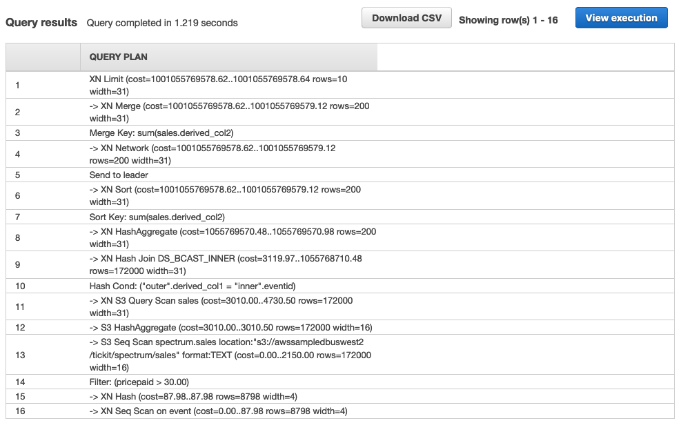

# AWS Redshift Spectrum
* Redshift Spectrum can work on the data lake and data warehouse


### Redshift Spectrum Architecture
* Extends the data warehouse to your S3 data lake
  * Exabyte Redshift SQL queries against S3
  * Join data across Redshift and S3
  * Scale compute and storage separately
  * Stable query performance and unlimited concurrency
  * Parquet, ORC, Grok, Avro, & CSV data formats
  * Pay only for the amount of data scanned
    * Serverless
    * But you need Redshift cluster to run it
  * Multiple clusters access same data: You don't need to load it into Redshift,
    just scan the data from S3 from different Redshift clusters
  * Encrypt S3 data using SSE and KMS

#### Redshift Spectrum Data Catalog Access
* The AWS Glue Data Catalog provides a unified metadata repository across a
  variaety of data sources and data formats, integrating not only with Athena,
  but with S3, RDS, Redshift, Redshift Spectrum, EMR, and any application compatible with
  the Hive metastore.
* In regions where Glue is supported Athena uses the Glue Catalog as a central
  location to store and retrieve table metadata throughout an AWS account.
* Athena execution engine requires table metadata that instructs it where to
  read data, how to read it, and other information necessary to process the data


#### Redshift Spectrum Benefits
* Leverages Redshifts advanced const-based optimizer
* Pushes down projectictions, filters, aggregations and join reduction
* Dynamic partition pruning to minimize data processed
* Automatic parallelization of query execution against S3 data
* Efficient join processing with the Redshift cluster


#### Redshift Spectur Benefits
* You pay for your Redshift cluster + $5 per TB data scanned from S3
* Each query can leverage 1000s of Redshift Spectrum nodes
* You can reduce the data scanned and improve query performance by:
  * Partitioning data
  * Using a columnar file format
  * Compressing data
* Redshift Spectrum can efficiently query and retrieve structured and
  semi-structured data from files in S3 without having to load the data into
  Redshift tables
* Redshift Spectrum queries employ massive parallelism to execute very fast
  against large datasets
* Much of the processing occurs in the Redshift Spectrum Layer, and most of the
  data remains in S3
* Multiple csulters can concurrently query the same dataset in S3 without the
  need to make copies of the data for each cluster
* Redshift Spectrum resides on dedicated Redshift servers that are independed of
  your cluster
* Redshift Spectrum pushes many compute-intensive tasks, such as predicate
  filtering and aggregation, down to the Redshift Spectrum layer. Thus, Redshift
  spectrum queries use much less of your cluster's processing capacity that
  other queries
* Redshift Spectrum also scaled intelligently. Based on the demands of your
  queries, Redshift Spectrum can potentially use thousands of instances to take
  advantage of massively parallel processing
* Redshift Spectrum uses Glue data ctalog (in regions it exists). In other
  regions it uses Athena data catalog.
* You can add Redshift Spectrum tables to multiple Redshift clusters and query
  the same data on S3 from any cluster in the same region. When you update S3
  data files, the data is immediately available for query form any of your
  Redshift clusters.

#### Redshift Spectrum Limitations
* Redshift cluster and S3 bucket must be in the same region
  * Your cluster can't have enhanced VPC routing enabled
  * External tables are read-only. You can't perform insert, update, or delete
    operations on external tables
  * You can't control user permissions on an external table. Instead, you can
    grant or revoke permissions on the external schema
  * To run Redshift Spectrum queries, the database user must have permission to
    create temporary tables in the database
* Redshift Spectrum doesn't support nested data types, such as Struct, Array,
  Map
* When using Athena data catalog, the following limits apply:
  * A max. of 100 databases per account
  * A max. of 100 tables per database
  * A max of 20k partitions per table
  * These limits don't apply to an Hive metastore


**Important:** Schema and Table are interchangeable in Redshift Spectrum


#### Hands-on Redshift Spectrum

```sql
create external schema spectrum
from data catalog
database 'spectrumdb'
iam_role 'arn:aws:iam::XXXXXXXX:role/RedshiftSpectrum'
create external database if not exists;
``` 

```sql
create external table spectrum.sales (
  salesid integer,
  listid integer,
  sellerid integer,
  buyerid integer,
  dateid smallint,
  qtysold smallint,
  pricepaid decimal(8,2),
  commission decimal(8,2),
  saletime timestamp)
  row format delimited
  fields terminated by '\t'
  stored as textfile
  location 's3://awssampledbuswerst2/tickit/spectrum/sales/'
  table properties ('numRows'='172000');
```
* Create external table means we are registering/creating a table in the metadatastore
  such as Glue Catalog or Hive metastore!!!

* Associate data from Redshift cluster (event table - stored in redshift) and from outside Redshift
  (sales table - is stored in the data lake s3)

```sql
select top 10 spectrum.sales.eventid, sum(spectrum.sales.pricepaid) from spectrum.sales, event
where spectrum.sales.eventid = event.eventid
and spectrum.sales.pricepaid > 30
group by spectrum.sales.eventid
order by 2 desc;
```

* Add `explain to the query` to see the query plan

```sql
explain select top 10 spectrum.sales.eventid, sum(spectrum.sales.pricepaid) from spectrum.sales, event
where spectrum.sales.eventid = event.eventid
and spectrum.sales.pricepaid > 30
group by spectrum.sales.eventid
order by 2 desc;
``` 



* There is no separate interface for Spectrum. You query the data from your SQL
  client, you create an external table and query the data that is stored in the
  S3
