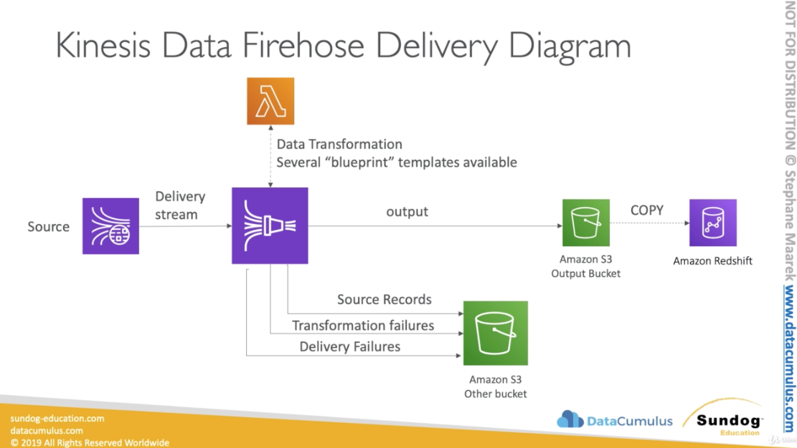

# Collection Introduction

* RealTime Collection - Where we can perform immediate action on our data 
  * All these services allow you in your application to react realtime events or
    data that is happening in your infrastructure
  * Kinesis Data Streams (KDS)
  * Simple Queue Service (SQS)
  * Internet of Things (IoT)

* Near-real time - Reactive actions
  * Kinesis Data Firehose (KDF)
  * Database Migration Service (DMS)

* Batch - Historical Analysis (not very close to realtime). Is needed when you
  want to move large amount of data for historical analysis into AWS to do some
  big data analysis on that.
  * Snowball
  * Data Pipeline

## AWS Kinsis Overview

* An very important exam topic and overall a collection topic for AWS if you
  want to perform big data.

* Kinesis is a managed alternative to Apache Kafka. It's great to gather data in
  realtime
* Great for application logs, metrics, IoT, clickstreams
* Great for "real-time" big data
* Integrates with streaming processing frameworks (Spark, NiFi, etc...)
* Data is automatically replicated synchronously to 3 AZ (highly available
  setup)

### Kinesis services

* Kinesis Streams: low latency streaming ingest at scale (low latency describes
  a computer network that is optimized to process a very high volume of data
  messages with minimal delay (latency).
* Kinesis Analytics: perform real-time analytics on streams using SQL
* Kinesis Firehose: load streams into S3, Redshift, ElasticSearch & Splunk

### Architecture of Kinesis

* Amazon Kinesis:
  * Streams: can take data from click streams, OoT devices (e.g. connected bike), Metrics & Logs
  * Analytics: if you want to analyse data in realtime e.g. you want to build
    alerts
  * Firehose: when you have all your data and you want to store it somewhere for
    later analysis (visualization) - near real-time --> Redshift, S3, Splunk,
    ElasticSearch

### Kinesis Streams
* Streams are diviced in ordered Shards / Partitions
* Data retention is 24 hours by default, can go up to 7 days (time to consume
  the data)
* Ability to reprocess / replay data. Once you processed that data the data is
  not gone from Kinesis streams, it will be gone based on data retention period.
  But you are able to read over the same data as long as the retention period
  is.
* Multiple applications can consume the same stream
* Real-time processing with scale of throughput. 
* Kinesis stream is not a database. Once data is inserted in Kinesis, it can't
  be deleted (immutability). It's an append only stream

#### Kinesis Streams Shards
* One stream is made of many different shards or partitions
* Billing is per shard provisioned, can have as many shards as you want
* Batching available or per message calls
* The number of shards can evelove over time (reshard / merge)
* Records are ordered per shard. They are ordered based on the information when
  they were received.

#### Kinesis Streams Records
* What is a record made of?
  * Data Blob: data being sent, serialized as bytes. Up to 1 MB.
    Can represent anything - 1MB
  * Record Key:
    * sent alongside a record, helps to group records in Shards. Same key = Same
      shard. The key helps Kinesis to which shard to send that data to.
    * Use a highly distributed key to avoid the "hot partition" problem. The key
      has to be super distrubuted. You can choose e.g. user Id if you have a
      million users and they will allow you to avoid the hot partition problem
      where all the data goes to the same shard.
  * Sequence number: Unique identifier for each records in put in shard. Added
    by Kinesis after ingestion (not made by producer)

#### Kinesis Data Streams Limits to know
* Producer:
  * 1 MB/s or 1000 messages/s at write PER SHARD (if you have 10 shards, you'll
    get 10MB/s or 10.000 messages)
  * If you go over that limit you'll get "ProvisionedThroughputException"
    otherwise 
* Consumer Classic:
  * 2 MB/s at read PER SHARD across all consumers
  * 5 API calls per second PER SHARD across all consumers
* Consumer Enhanced Fan-Out:
  * 2 MB/s at read PER SHARD, PER ENHANCED CONSUMER
  * No API calls needed (push model)
Data Retention:
  * 24 hours data retention by default
  * Can be extended to 7 days

#### Kinesis Producers
* How can we produce data in Kinesis?

  * **Kinesis SDK**: allows you to write code or use the CLI to directly send data
  into Amazon Kinesis Streams. Uses PutRecrod(s) API
    * APIs that are used are PutRecord (one) and PutRecords (many records)
    * PutRecords uses batching and increases throughput => less HTTP requests
    * If you go over your througput you'll get ProvisionedThroughputExceeded if
      you go over the limits
    * + AWS Mobile SDK: Android, iOS, etc.
    * **When to choose to use producer SDK**: low throughput, higher latency,
      simple API, AWS Lambda
    * Managed AWS sources for Kinesis Data Streams:
      * CloudWatch Logs, you can send your logs directly into Kinesis
      * AWS IoT
      * Kinesis Data Analytics
    * Kinesis API - Exceptions:
      * ProvisionedThroughputExceeded Exceptions: Happens when sending more data
        (exceeding MB/s or TPS for any shard)
        * Make sure you don't have a hot shard (such as your partition key is
          bad and too much data goes to that partition) e.g. you have a device
          id as the key and 99% of devices are being iPhones, you're going to
          get a hot key
      Solution:
        * Retries with backoff. Retry maybe after 2 seconds, if no working try
          in 4 seconds, 8 seconds etc.
        * Increase shard (scaling)
        * Ensure your partition key is a good one (very distributed one)

  * **Kinesis Producer Library (KPL)**: The library has some advanced features and
    allows you to write better code. Allows to get enhanced throughput into
    Kinesis stream.
      * Easy to use and highly configurable C++/ Java library
      * Used when you want to build high performance, long-running producers
      * Automed and configurable retry mechanism (in the SDK there is no such a
        mechanism built-in)
      * It has two kinds of API:
        Synchronous: the same as the SDK
        Asynchronous API (better performance for async)
      * In the exam if we need to send data asynchronously, usually Kinesis
        Producer Library (KPL) is the way to do it
      * Submits metrics to CloudWatch for monitoring. Everytime you write an
        application with KPL, you can monitor it in CloudWatch.
      * It supports **Batching** (both turned on by default) - increase
        throughput, decrease cost: 
          * **Collect** Records and Write to multiple shards in the same
            PutRecords API call
          * Aggregate - increased latency 
            * Capability to store multiple records in one record (go over 1000
              records per second limit)
            * Increase payload size and imporive throughput (maximize 1MB/s
              limit)
      * Compression must be impleted by the user
      * KPL Records must be de-coded with KCL or special helper library 
      * Kinesis Producer Library KPL Batching:
        * We're sending a record to Kinesis of 2kb. It's not going to be sent
          right away, it's going to see if more records are coming in. The next
          record is of 40kb, the next record is of 500kb. The producer Library
          will at some point aggreate it into One Record < 1MB. So instead of
          sending 3 records now, we're sending 1 Record and it's still less than
          1MB.
        * Here we have Aggregation to aggreate records into 1 < MB. And we can
          put all the records into a collection of PutRecords. The producer
          Library will at some point aggreate it into One Record < 1MB. So
          instead of sending 3 records now, we're sending 1 Record and it's
          still less than 1MB.
        * How does Kinesis knows how long to wait to aggregate a Record? We can
          infulce the batching efficiency by introducing some dely with
          RecordMaxbufferedTime (default 100ms)

  * **Kinesis Agent**: is a linux program that runs on a server and allows to get a
    log file and send that reliably to Kinesis streams (log aggregation at
    scale)
      * Monitor log files and sends them to Kinesis Data Streams
      * java-based agent, buiilt on top of KPL
      * Install in Linux-based server environments
      * Features:
        * Write from multiple directories and write to multiple streams
        * Routing feature based on directory / log file
        * Pre-process data before sending to streams (single line, csv, to json,
          log to json)
        * The agent handles file rotation, checkpointing, and retry upon
          failures
        * Emits metrics to CloudWatch for monitoring

  * **3rd pary libraries**: Spark, Log4j, Appenders, Flue, Kafka Connect, Nifi

#### Kinesis Consumer - Classic

* Kinesis SDK or CLI to read data from Kinesis Streams
  * Kinesis Consumer SDK - GetRecords
  * Classic Kinesis - Records are polled (means if you need more data you need
    to poll the traget shards, making api calls) by consumer from a shard
  * Each shard has 2 MB total aggregate throughput (each shard 1MB of producer
    and 2MB of consumer) - e.g. 3 shards 6MB throughput for read
  * GetRecords returns up to 10 MB of data (then throttle for 5 seconds) or up
    to 10000 records. It throttles because 10 MB are going over 2MB/s, you need
    to wait 5 seconds to get another 10MB of data. Or you distribute the polling
    per second 2MB read.
  * Maximums of 5 GetRecords API calls per shard per second = 200ms latency.
    IMPORTANT.
  * **Example: If 5 consumers application consume from the same shard, means every
    consumer can poll once a second and receive less than 400KB/s**

* Kinesis Client Library (KCL) - so we produce with the KPL and read with the
  KCL
  * Is used to de-aggregate record from the KPL
  * Java-first library but exists for other languages too (Golang, Python, Node)
  * Read records from Kinesis produced with the KPL (de-aggregation)
  * Share multiple shards with multiple consumers in one "group", shard
    discovery
  * Checkpointing feature to resume progress. When one application goes down and
    comes up again, it's able to remember when it was consuming last in order to
    resume the progress. It uses Amazon DynamoDB table to checkpoint progress
    over time (save the progress) and synchronize who is going to read which
    shard.
  * Leverages DynamoDB for coordination and checkpointing (one row in the table per shard)
    * Make sure you provision enough WCU/ RCU
    * Or use On-Demand for DynamoDB
    * Otherwise DynamoDB my slow down in KCL (there might be an exam question my
      KCL is not reading fast enough, even throughputs in my Kinesis. The
      problem is that you have underprovisioned DynamoDB)
    * Record processors will process the data. It makes easy to threat messages
      one by one.

* Kinesis Connector Library
  * Older Java library (2016), leverages the KCL library under the hood
  * Is used to write data to Amazon S3, DynamoDB, Redshift, ElasticSearch
  * The connector library must be running on an **EC2 instance** for it to
    happen.
  * It's an application that the whole thing is to take data from Kinesis
    Streams and send it to all the above mentioned applications.
  * For something you can use Kinesis Firehose (for S3 and Redshift) for others you can use Lambda
  * Kinesis Connector Library is depricated and is replated by Firehose and
    Lambda (but can appear in the exam)

* AWS Lambda sourcing from Kinesis
  * Lambda can source recordds from Kinesis Data Streams (read)
  * Lambda consumer has a library to de-aggregate record from the KPL
  * You can produce with the KPL and reading with Lambda using a small library
  * Lambda can be used to run lightweight ETL to:
    * S3
    * DynamoDB
    * Redshift
    * ElasticSearch
    * Anywhere you want
  * Lambda can be used to trigger notifications / send emails in real time
  * Lambda has a configurable batch size (to regulate throughputs)

* 3rd pary libraries: Spark, Log4j, Flume, Kafka, Appenders, Connect...

* Kinesis Firehose

* Kinesis Consumer Enhanced Fan-out
  * New game-changing feature from August 2018
  * Works with KCL 2.0 and AWS Lambda (Nov 2018)
  * **Each Consumer get 2 MB/s of provisioned throughput per shard**
  * Producer -> Kinesis Data Streams <------- SubscribeToShard() Consumer Appliation A
                                     -------> Push data 2 MB/s (not polling
                                     anymore)
  * That means 20 consumers will get 40 MB/s per shard aggregated
  * No more 2 MB/s!
  * Enhanced Fan Out: Kinesis pushes data to consumers over HTTP/2. The added
    benefits:
      1) We can scale a lot consumer application
      2) We get reduced latency (~70ms) - before we had 200ms per consumer, so
      it could only poll 5 times per second.
  * It costs more, you need to check the pricing
  * Enhanced Fan-Out vs. Standard Consumers: When to use what?
    * Standard consumer:
      * Low number of consuming aplications (1,2,3...)
      * Can tolerate ~200ms latency
      * Minimize cost
    * Enhanced Fan Out Consumers:
      * Multiple Consumer applications for the same Stream (5 or 10 applications
        at the same time)
      * Low Latency requirements ~70ms
      * Higher costs 
      * Default limit of 5 consumers using enhanced fan-out per data stream

#### Kinesis Scaling

* Kinesis Opeerations - Adding Shards (Increase Throughput)
  * Also called "Shard Splitting"
  * Can be used to increase the Stream capacity (1 MB/s data in per shard) 
  * Can be used to divide a "hot shard"
  * The old shard is closed and will be deleted once the data is expired. New
    shards will be added so the old one get's splitted by new shards. The second
    shard is hot: `[shard1][shard2][shard3] ---> Splitting shard 2 ---> [shard1][shard4][shard5][shard3]` 

* Kinesis Operations - Merging Shards (Decrease Throughput)
  * Decrease the Stream capacity and save costs
  * Can e used to group two shards with low traffic
  * Old shards are closed and deleted based on data expiration
  * `[shard1][shard4][shard5][shard3] ---> Merging 1 and 4 ---> [shard6][shard5][shard3]`  

* Kinesis Operations - Auto Scaling
  * Auto Scaling is not a native feature of Kinesis
  * The API calls to change the number of shards is UpdateShardCount
  * We can implement Auto Scaling with AWS Lambda (manually to make it work)
  * Limitations:
    * Resharding cannot be done in parallel. Plan capacity in advance
    * You can only perform one resharding operation at a time and it takes a few
      seconds
    * For 1000 shards, it takes 30K seconds (8.3 hours) to double the shards to
      2000 (remember)
    * **You can't do the following**: (you don't need to know them for the exam)
      * Scale more than twive dor each rolling 24-hours period for each stream
      * Scale up to more than double your current shard count for a stream
      * Scale down below half your current shrad count for a stream
      * Scale down below half your current shard count for a stream
      * Scale up tot more than 500 shards in a stream
      * Scale a stream with more than 500 shards down unsless the result is
        fewer than 500 shards
      * Scale up to more than the shard limit for you account

#### Kinesis Security
  * Big part of the exam, dedicated section
  * Control access / authorization using IAM policies
  * Encryption in flight using HTTPS endpoints (data that we send to Kinesis
    will be incrypted)
  * Encryption at rest using KMS
  * Client side encryption must be manually implemeted (harder)
  * VPC Endpoints available for Kinesis to access within VPC

### Kinesis Data Firehose
  * Fully Managed Service, no administration
  * Near RealTime (60 seconds latency minimum for non full batches)
  * Load data into Redshift / Amazon S3 / ElasticSearch / Splunk
  * Automatic scaling built-in
  * Supports many data formats
  * Data Conversion from JSON to Parquet / ORC (only for S3)
  * Data Transformations through AWS Lambda (e.g. (CSV -> JSON)
  * Supports compression wehn target is Amazon S3 (GZIP, ZIP, and SNAPPY)
  * Only GZIP is the data is further loaded into Redshift
  * Pay for the amount of data going through Firehose (no provisioned capacity,
    only billed for used capacity)
  * Exam will threat you that Spark / KCL can read form KDF. Spark / KCL cannot
    read from Firehose, they only read from Kinesis Data Streams

#### Kinesis Data Firehose Diagram
  * Source that can write to Firehose:
    * SDK: Kinesis Producer Library (KPL)
    * Kinesis Agent
    * Kinesis Data Streams
    * CloudWatch Logs & Events
    * IoT rules actions
  * Transformation:
    * Lambda function: The data can be transformed on the fly. Lambda takes the
      data, transform it and sends it back before it gets to it's destinations
      (delivery)
    * There is a bunch of blueprints available for AWS Lambda to help you
      transform the data in the format you want.
  * Delivery (Destinations):
    * Amazon S3
      * Source Records can be configured to be stored into another S3 bucket.
        Means when we apply the transformation with Lambda, we can use 1 bucket
        for that, and the source data that comes in can be stored into another
          bucket.
      * Transformation Failure we can archive that transformation failure into
        an Amazon S3 bucket
      * Deliver Failure we can archive that data into an Amazon S3 bucket
      * **Important:** You don't loose data with Kinesis Firehose, either it
        ends in your targets, or you will have recollection in other buckets.
    * Redshift: If Redshift is your destination, the data goes into S3 and there
      is a copy command that is issued to put that data into Redshift
    * ElasticSearch
    * Splunk

  

#### Firehose Buffer Sizing
  * Firehose accumulates records in a buffer (from the source) 
  * The buffer is not flushed on the time, it's flushed on some rules. It's
    flushed based on time and size rules
  * Buffer Size (e.g. 32MB): if that buffer size is reached, it's flushed
  * buffer Time (e.g. 2 minutes): if that time is reached, it's flushed
  * Firehose can automatically increaese the buffer size to increase throughput
  * High throughput --> Buffer Size will be hit and buffer will be flushed (min.
    few mb)
  * Low throughput --> Buffer Time will be hit and buffer will be flushed (time
    min 1m)

### Kinesis Data Streams vs. Firehose
  * Streams:
    * Going to write customer code (producer / consumer)
    * Realtime (~200ms latency for classic, ~70ms latency for enhanced fan-out)
    * Must manage scaling (shard splitting / merging)
    * Data Storage for 1 to 7 days, replay capability, multi consumers
    * Use with Lambda to insert data in real-time to ElasticSearch (for example)

  * Firehose:
    * Fully managed, send to S3, Splunk, Redshift, ElasticSearch
    * Serverless data transformation with Lambda
    * Near real time (lowest buffer time is 1 minute)
    * Automated Scaling
    * No data storage
  * With KPL you can produce either into Streams or Firehose
