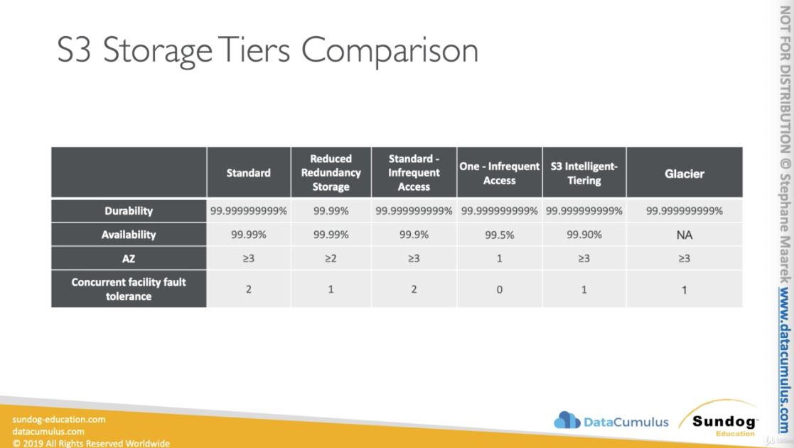
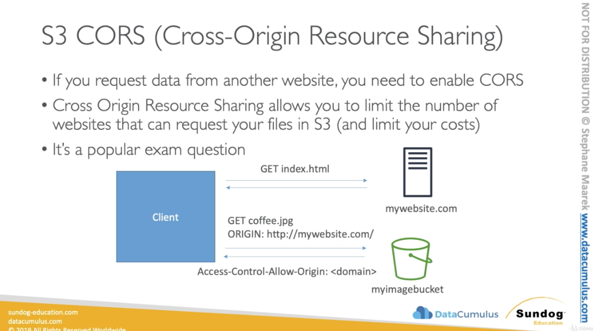
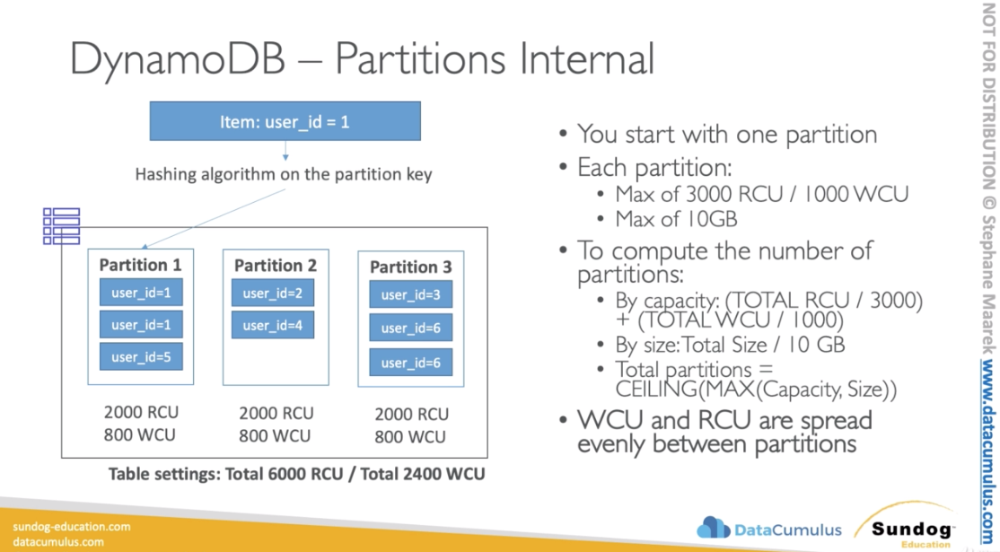

# Storage

### AWS S3 Overview - Buckets

* Amazon S3 allows people to store object (files) in "buckets" (directories)
* Buckets must have a globally unique name
* Buckets are defined at the region level
* Naming convention
  * No uppercase
  * No uderscore
  * 3 - 63 char long
  * Not an IP
  * Must start with lowercase letter or number

#### AWS S3 Overview - Objects

* Objects (files) have a Key. The key is the Full path:
  * <my_bucket>/my_file.txt
  * <my_bucket>/my_folder/another_folder/my_file.txt
* There's no concept of "directories" within buckets (although the UI will trick
  yo to think otherwise)
* Just keys with very long names that contain slashes ("/")
* Object Values are the content of the body:
  * Max size is 5 TB
  * If uploading more than 5GB, must use "multi-part upload"
* Metadata (list of text key / value pairs - system or user metadata)
* Tags (Unicode key / value pair - up to 10) - useful for security / lifecycle
* Version ID (if version is enabled)

#### AWS S3 - Consistency Model

* Read after write consistency for PUTS of new object. Means as soon as you
  write an object you can retreive it
    * As soon as an object is written, we can retrieve it e.g. (PUT 200 -> GET
      200)
    * This is true, expect if we did a GET before to see if the object existed
      e.g. GET 404 -> PUT 200 -> GET 404 - eventually consistent. The last GET
      404 comes form a result that the first time you tried to GET the object
      you've got 404 (you need to write 1-2 second)

* Eventual Consistency for DELETES and PUTS of existing objects
  * if we read an object after updating, we might get the older version e.g. PUT
    200 -> PUT 200 -> GET 200 (might be older version)
  * If we delete an object, we might still be able to retrieve it for a short
    time e.g. DELETE 200 -> GET 200

#### S3 Storage Tiers

* Amazon S3 Standard - General Purpose
  * High durability (99.99999%) ov ogject across multiple AZ
  * We are getting eventual consitency because the data has to be replicated
    across differen AZ
  * If you store 10,000,000 objects with Amazon S3, you can on average expect to
    incur a loss of a single object once every 10,000 years
  * 99.99% Availability over a given year
  * Sustain 2 concurrent facility failures
  * Use cases: Big data analytics, mobile & gaming applications, content
    distribution
* Amazon S3 Standard-Infrequent Access (IA)
  * Suitable for data that is less frequently accessed, but required rapid
    access when needed
  * It's cheaper to store but when you want to retrieve that data you need to
    pay an access fee.
  * High durability 99.9999999% of objects across multiple AZs
  * 99.9% Availability
  * Low cost compared to Amazon S3 Standard
  * Sustain 2 concurrent facility failures
  * Use cases: As a data store for disaster recovery, backups, or big data
    analysis only once every month 
* Amazon S3 One Zone-Infrequent Access (IA)
  * Same as IA but data is stored in a single AZ
  * High durability 99.9999999% of object in a single AZ; data lost when AZ is
    destroyed
  * 99.5% Availability
  * Low latency and high throughput performance
  * Supports SSL for data at transit and encryption at rest
  * Low cost compared to IA (by 20%)
  * Use cases: stroing secondary backup copies of on-premise data, or storing
    data you can recreate.
* Amazon S3 Reduced Redundancy Storagee (deprecated) - RRS
  * Designed to provide 99.99% durability
  * 99.99% availability of object over a given year
  * Designed to sustain the loss of data in a single facility
  * Use cases: noncritical, reproducible data at lower levels of redundancy then
    Amazon S3's standard storage (thumbnails, transcoded media, processed data
    that can be reproduced)
* Amazon S3 Intelligent Tiering (new)
  * Some low latency and high troughput performance of S3 Standard
  * Small monthly monitoring and auto-tiering fee
  * Automatically moves objects between two access tiers based on changing
    access patterns
  * You save const and S3 does move your data between different tiers for you
  * Designed for durability of 99.9999999% of object across multiple AZ
  * Resilient against events that impact an entire AZ
* Amazon Glacier
  * Low cost object storage meant for archiving / backup
  * Data is retained for the longer term (10s of years)
  * Alternative to on-premise magnetic tape storage
  * Average annual durability is 99.99999999%
  * Cost per storage per month ($0.00$ / GB) + retrieval cost
  * Each item in Glacier is called "Archive" (up to 40TB)
  * Archives are stored in Vaults
  * Restore links can expire
  * 3 retrieval options:
    * Expedited (1 to 5 minutes retrieval) - $0.03 per GB and $0.01 per request
    * Standard (3 to 5 hours) - $0.01 per GB and 0.05 per 1000 requests
    * Build (5 to 12 hours) - $0.0025 per GB and $0.025 per 1000 requests

#### S3 Lifecycle Rules

* Set of rules to move data between different tiers, to save storage costs
* Example: Genreal Purpose -> Infrequest Access -> Glacier
* Transition actions: It defines when object are transitioned to another storage
  class. E.g. We can choose to move objects to Standard IA class 60 days after
  you created them or can move to Glacier for archiving after 6 month
* Expriration actions: Helps to configure objects to exprire after a certain
  time period. S3 deletes expired object on your behalf. E.g. access log files
  can be set to delete after a specified period of time.
* Moving to Glacier is helpful for backup / long term retention / regulatory
  needs
* Under management in s3 console. You can create lifecycle rules:
  * Filter can be set to apply to prefix/tags e.g. prefix "stores/"
  * You can apply as many lifecycle events as you like
  * Transition: Storage class transition e.g. transition to Standard-IA after 30
    days
  * Transtion: Transition to Glacier after 60 days
  * Experitation: Delete Current version or Previous versions. Delete previos
    version after 365 days

#### S3 Versioning
* You can version your files in AWS S3
* It is enabled at the bucket level
* Same key overwrite increment the "version" 1,2,3
* It's best practice to version your buckets:
  * Protect against uninteded deletes
  * Easiy roll back to previous version
* Any file that is not versioned prior to enabling versioning will have version
  "null"
* You can "suspend" versioning

#### S3 Cross Region Replication (async)
* In S3 console, under management, you can set a replication rule
* Must enable versioning (source and destination) - You need to enable
  versioning on both buckets in order the replication to work!!!
* Buckets must be in different AWS regions
* Can be in different accounts
* Copying is asynchronous
* Must give proper IAm permissions to S§
* Use cases: complience, lower latency access, replication across accounts
* You can also choose a tier for replication. You could use Glacier for
  replication or any other inferequently accessed mode.

#### S3 ETags (Entity Tag)

* Allows us to verify if the has been uploaded to S3 and the content of the file
  is what we expect
* Names work, but how are you sure the file is exactly the same?
* For this, you can use AWS ETags:
  * ETag is a formula for simple uploads (less than 5GB), it's the MD5 hash. MD5
    hashing technique is to obtain a signature of the file that is unique.
  * For multi-par uploads, it's more complicated, no need to know the algorithm
* Using ETag, we can ensure integrity of files, when we upload them and ensure
  that the content is expected what it should be.
* ETag allows you to calculate the MD5 hash.
* We can compute the md5 locally and compare it with the version uploaded
* Cool stuff: You can run `md5 filename.suffix` in order to make a hash in the terminal

#### S3 Performance - Key Names Historic fact and current exam

* When you had > 100 TPS (transactions per second), s3 performance could degrade
* Behind the scene, each object goes to an S3 partition and for the best
  performance, we want the highest partition distribution
* In the exam, and historically, it was recommended to have random characters in
  front of your key name to optimize performance:
    * <my-bucket>/5r4d_my_folder/my_file1.txt
    * <my-bucket>/a91e_my_folder/my_file2.txt

* The randomness allowed use to maximize the performance and never to use data
  to prefix keys: Because dates can be reused many many times:
    * <my-bucket>/2018-09-09_my_folder/my_file1.txt
    * <my-bucket>/2018-09-10_my_folder/my_file2.txt

* **Important:** There was an update (maybe not in exam yet) to increate request
  rate preformance.

* As of July 17th 2018, we can scale up to 3500 RPS for PUT and 5500 RPS
  (request for second) for GET for EACH PREFIX
* This s3 request rate optimization increase removes any previous guidance to
  randomize object prefix to achieve faster performance.

* Faster upload of large object (>5GB), use multipart upload:
  * parallelize PUTs for greater throughput
  * maximize your network bandwidth
  * decreate time to retry in case a part fails
* Use CloudFront to cache S3 objects around the world (improves reads)
* S3 Transfer Acceleration (uses edge location) - just need to change the
  endpoint to write to, not the code.
* If using SSE-KMS encryption, you may be limited to your AWS limits for KMS
  usage (~100s - 1000s downloads / upload per second)

#### S3 Encryption for Objects (at rest)
* There are 4 methods of encryption objects in S3
  * SSE-S3 (Amazon Master Key): encrypts S3 object using keys handled & managed by AWS
    * encryption server-side
    * the kys are managed by the AWS and you don't even see them
    * Object is encrypted server side
    * AES-256 encryption type
    * To make it work, you must set a header when you send your data to S3:
      `x-amz-server-side-ecryption: AE256` 
    * Object --- HTTP/S + Header ----> Object + S3 Managed Key --- encryption --> Bucket
  * SSE-KMS: leverage AWS Key Management Service to manage encryption keys
    * encryption server-side
    * KMS Advantages: user control + audit trail
    * Object is encrypted server side
    * Must set header: `x-amz-server-side-encryption: aws:kms` 
    * Object --- HTTP/S + Header ---> Object + KMS Customer Master Key (CMK) ---
      encryption ---> Bucket
  * SSE-C: when you want to manage your own encryption keys
    * server-side encryption
    * the keys are fully managed by you (customer) outside of AWS
    * HTTPS must be used
    * Encryption key must provided in HTTP headers, for every HTTP requirst made
    * Object + Client side data key --- HTTPS only + Data Key in Header --->
      Object + Client-provided data key -- encryption ---> Bucket
  * Client Side Encryption
    * You need to use a client library such as the AWS S3 Encryption Client
    * Client must encrypt data themselves before sending to S3
    * Clients must decrypt data themselves when retrieving from S3
    * Customer fully manages the keys and encryption cycle
    * Object + client side data key -- encrypt --> HTTP/S ---> Bucket

* **Important:** It's important to undestand which ones are adapted to which
  situation for the exam

#### S3 Encryption in Transit

* AWS S3 exposes:
  * HTTP endpoint: non encrypted traffic
  * HTTPS endpoint: encryption in flight
* You're free to use the endpoint you want, but HTTPS is recommended
* HTTPS is mandatory for SSE-C
* Encryption in flight is also called SSL / TLS in the exam!!!

#### S3 Security
#### S3 CORS (Cross-Origin Resource Sharing)
* If you request data from another website, you need to enable CORS. You will
  allow or limit of sites that can request your resources in your S3 bucket and
  will limit your costs.
* Cross Origin Resource Sharing allows you to limit th enumber of websites that
  can request your files in s3 (and limit your costs). My s3 bucket can only be
  accessed to only specific domains.

#### S3 Access Logs

* For audit purpose, oyu many want to log all access to S3 bucket
* Any request made to S3, from any account, authorized or denied, will be logged
  into another S3 bucket
* That data can be analyzed using data anylsis tools
* Or Amazon Athena
* User -- request --> my-bucket --> log all request --> loggin bucket

#### S3 Security

* User-based:
  * IAM policies - which API calls should be allowed for a specific user from
    IAM console
* Resource Based:
  * Bucket Policies - bucket wide rules from the s3 console - allows cross
    account
  * Object Access Control List (ACL) - finer grain
  * Bucket Access Control List (ACL) - less common

#### S3 Bucket Policies

* JSON based policies:
  * Resources: buckets and objects
  * Actions: Set of API to Allow or Deny
  * Effect: Allow / Deny
  * Principal: The account or user to apply the policy to
* Use S3 bucket for policy to:
  * Grant public access to the bucket
  * Force object to be encrypted at upload
  * Grant access to another account

#### S3 Default Encryption vs. Bucket Policies

* The old way to enable default encryption was to use a bucket policy and refuse
  any HTTP command without proper headers
* The new way is to use the "default encryption" option in S3
* Note: Bucket policies are evaluated before encryption setting

#### S3 Security - Other
* Networking:
  * Supports VPC Endpoints (for instances in VPC w/o www internet)
* Logging and Audit:
  * S3 access logs can be stored in other S3 bucket
  * API calls can be logged in AWs CloudTrail
* User Security:
  * MFA can be required in versioned bucket to delete object
  * Signed URLs: URLs that are valid only for a limited time (e.g. premio video
    service for logged in users)

#### Glacier + Vault Policies & Vault Lock
* Exam tip: archival from S3 after xxx days -> we would use lifecycle policy and
  use Glacier maybe for that
* Vault is a collection of archives
* Each Vault has:
  * One valult access policy
  * One vaault lock policy
* Vault Policies are written in JSON
* Vault Access Policy is similar to bucket policy (restrict user / account
  permissions)
* Vault Lock Policy is a policy you lock, for regulatory and complience
  requirements:
    * The policy is immutable, it can never be changed (that's why it's called
      LOCK)
    * Example: forbid deleting an archive if less than 1 year old
    * Example: implement WORM policy (write once read many) - file cannot be
      overwritten, but read many times

### DynamoDB
* Fully managed and highly available with replication across 3 AZ
* NOSQL database
* Scales to massive workload
* Millions of request per seconds, trillions of row, 100s of TB of storage
* Fast and consistent in performance (low latency on retrieval)
* Integrated with IAM for security, authorization and administration
* Event driven programming with DynamoDB Streams
* Low cost and has auto-scaling built-in
* item = row
* attributes = columns (can be added over time - can be null)
* Max. size of a item is 400KB in S3 up to 5GB per object
* Data types:
  * Scalar Types: String, Number, Binary, Boolean, Null
  * Document Types: List, Map
  * Set Types: String Set, Number Set, Binary Set

#### Primary Keys
* Option 1: Partition key only (HASH)
  * Partition key must be "diverse" so that the data is distributed
* Option 2: Partition key + Sort Key
  * Data is grouped by partion key
  * Sort key == range key

* Movide database:
  What is the best partition key to maximize data distribution?
    * movie_id has the highest cardinality so it's a good candidate

#### DynamoDB in Big Data (for hot data vs. S3 for cold data but bigger)
* Use cases:
  * mobile apps
  * gaming
  * digital ad serving
  * love voting
  * adueince interaction for live event
  * sensor network
  * log ingestion
  * Access controlf or web-based content
  * shopping carts
* Anti-pattern:
  * Prewritten application tied to a traditional relational database: use RDS
    instead
  * Join or complex transactions
  * BLOB data: store data in S3 & metadata in DynamoDB
  * Large data with low I/O rate: use S3 instead

#### RCU / WCU
* You can use auto-scaling if you don't know how to calculate RCU / WCU
* If you exceed temporarily you can using burst credit
* If burst credit are empty, you'll get a "ProvisioedThroughputException"
* If then advied to do exponetial back-off retry (after 2s, 4s, 8s)

#### Compute WCU
* One wcu represents one write pre second for an item up to 1kb in size
* If the item are larger than 1kb, more WCU are consumed
* Example: we write 10 object per second of 2Kb each
  * We need 2 * 10 = 20 WCU
* Example: we wrtite 6 object per second of 4.5KB each
  * We need 6 * 5 = 30 WCU (4.5 gets rounded to the upper KB)
* Example: we write 120 object per minute of 2KB each
  * We need 120 / 60 * 2 = 4 WCU

#### Stronlgy Consisten Read vs. Envetually Consistent Read
* Eventually consistent read: if we read just after a write, It's possible we'll
  get unexpected responce bacause of replication
* Strongly consistent read: if we read just after a write, we'll get the correct
  data
* By default: DynamoDb uses Eventually Consistent Reads, but you can set it to
  true

#### Compute RCU
* One rcu represents one strongly consistent read per second or two eventually
  consistent reads per second, for an item up to 4kb in size
* Example: 10 strongly consistent reads per second of 4kb each
  * We need 10 * 4kb / 4kb = 10 RCU
* Example: 16 eventually consistent reads per second of 12KB each
  * We need (16 / 2) * (12 / 4) = 24 RCU
* Example: 10 strongy consistent reads per second of 6KB each
  * We need 10 * 8KB / 4 = 20 RCU (we have to round up 6KB to 8KB)

#### DynamoDB Throttling
* if we exceeded our RCU or WCU, we get ProvisionedThroughputExceededExceptions
  * Reasons:
    * Hot keys / partitions: one partiton key is being read too many times
    * Very large items: remember RCU and WCU depends on size of items
  * Solutions:
    * exponential backoffs already in SDK
    * distribute partition keys as much as possible
    * if RCU issue, we can use DynamoDB Accelerator (DAX)

#### DynamoDB - Partitions Internal

* You start with one partition (when you start with DynamoDB)
* Each partition:
  * Max of 3000 RCU / 1000 WCU
  * Max of 10GB
* To compute the number of partitions:
  * By capacity: (TOTAL RCU / 3000) + (TOTAL WCU / 1000)
  * By size: Total Size / 10GB
  * Total partitions = CEILING(MAX(Capacity, Size))
* WCU and RCU are spread evenly between partitions
* Since the WCU and RCU are divided between partitions, you can still get
  throttling because of the hot key in one specific partition e.g. user_id=1

#### DynamoDb - Writing Data
* PutItem (full replacement)
* UpdateItem (partly update)
* Conditional writes have not impact on performance

#### DynamoDb - Delete Data
* DeleteItem
* DeleteTable (much quicker than delete item on every item)

#### Batch Writes
* BatchWriteItem
  * Up to 25 PutItem and or / DeleteItem in one call
  * Up to 16MB of data written
  * Up to 400kb of data per item
* Allows to save in latency by reducing the number of APi calls done again
  DynamoDb
* Operations are done in parallel
* Its possible to fail and you need to retry it your own

#### Reading Data
* GetItem
  * By default eventually consistent read
  * ProjectionExpression can be speicifed to include only certain attributes
* BatchGetItem:
  * up to 100 items
  * up to 16MB of data
  * Items are retrieved in parallel to minimize latency

#### Query
* Query returns item based on 
  * PartitionKey (must be = operator)
  * Filter does client-side filtering not server-side
* Returns
  * Up to 1MB of data
* Enables pagination

#### Scan 
* Scan the entire table and filter out data (inefficient)
* Return up to 1mb of data - use pagination to keep on reading
* Consumes a lot of RCU
* Limit impact using Limit or reduce the size of the result and pause
* For faster performenace, use parallel scans:
  * Multiple instances scan multiple partitions at the same time
  * Increases the throughput and RCU consumed
  * Limit the impact of parallel scans just like you rwould for Scans
* ProjectionExpression + FilterExpression (no charge to RCU)
