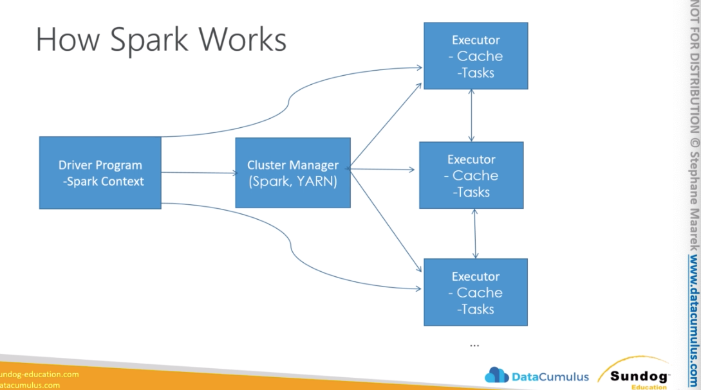

# Processing

### Lambda
* A way to run code snippets "in the cloud"
  * serverless
  * continuous scaling
* Often used to process data as it's moved around
* Some services don't talk directly to each other, so Lambda as a glue between them.
* Use cases:
  * Real-time file processing
  * Real-time stream processing
  * ETL (light-weight)
  * Cron replacement
  * Process AWS events
* Languages:
  * Node.js
  * Python
  * Java
  * C#
  * Go
  * Powershell
  * Ruby
* Lambda triggers:
  * S3, SES, Kinesis Streams/Firehose (Lambda polling data from a Stream, Kinesis is not pushing the data into Lamda), DynamoDB, SNS, SQS, AWS config, IoT, Lex, CloudWatch,
    CloudFormation, Gateway, Cognito, CodeCommit
* S3 --- triggers --> Lambda ----> Elasticsearch Service
* S3 --- triggers --> Lambda -- activates the pipeline --> Data Pipeline
* S3 --- triggers --> Lambda ----> Redshift (not efficient, better to batch them up and send them together)
  DynamoDB - streams ->      ----> Redshift (how to batch? We can use DynamoDb,
  it can keep track the progress checkpoints in DynamoDB, when some threshold is
  reached the data gets to be copies a batch to redshift)

#### Lambda + Kinesis
* Your Lambda code receives an event with a batch of stream records (lambda
  won't be invoked for every event)
  * You specify a batch size when setting up the trigger (up 10,000 records)
  * Too large a batch size can cause timeouts! (15m max time lambda can run)
  * Batches may also be split beyond Lambda's payload limit (6 MB)
* Lambda will retry the batch until it succeeds or the data expires
  * This can stall the shard if you don't handle errors properly
  * Use more shards to ensure processing isn't totally held up by errors
* Lambda processes shard data synchronously!!! As data is received from Kinesis
  that data is sent to Lambda and Kinesis shard sits there and waits for a response
  from Lambda. When Kinesis get stuck waiting for response from Lambda or get
  stuck because it's retriying Lambda function that keeps erroring out on it,
  that going to stall a shard.


#### Cost Model 
* Pay for what you use
* $0.20 / million requests
* $0.00001667 per GB / second

#### Other Promises
* High availability
* Unlimited scalability
  * 1000 concurrency lambda per region
* High performance
  * But you do specify a timeout! This can cause problems. Max is 900 seconds!

#### Anti-patterns
* Long-running applications (should use ec2 instead or chain multiple lambda
  functions together, split processing into steps to do heavy processing)
* Dynamic websites (ec2 and cloudfront)
* Stateful applications (but you can store state in DynamoDb or S3 that can
  share state between Lambda invocations)

* **Important:** The Kinesis stream should be in the same account as the Lambda. Lambda must be in the same account as the service triggering it, in addition to having an IAM policy granting it access.
* Although you think of a trigger as "pushing" events, Lambda actually polls your Kinesis streams for new activity.


#### AWS Glue (Table Defintions & ETL)
* It can provide structure to unstructured data
* Serverless discovery and defintion of table definitions and schema
  * S3 "data lakes"
  * RDS
  * Redshift
  * Most other SQL databases
* Custom ETL jobs
  * Under the hood it uses Apache Spark (you don't have to worry about it, it's
    serverless and managed)
  * Trigger-driven, on schedule, or on demand
  * Fully managed

#### Glue Crawler / Data Catalog
* Glue crawler is one component of Glue. 
  * It scans your data in S3 and often the Glue crawler will infer a schema
    automatically just based on the structure of the data it finds there in s3
    buckets. If you have some Csv or tsv data sitting in s3 it will
    automatically break-out those columns for you automatically and even name
    them for you.
  * You can schedule the cralwer periodically to run to. If you know you get new
    data just popping into s3 at random times. Glue can discover those
    automatically and run on the schedule discover and automatically pick up
    that data so other service downstream can see it and process it
  * The Glue crawler will populate the data catalog.
* Glue catalog:
  * Is a central meta data repository used by other tools that might alanalyze
    that data. 
  * The data itself remains where it was originally in S3, only the table
    definition itself is stored by Glue in the Glue data catalog. That means
    like the column names, the types of data in those columns, where that data
    is stored. That's what Glue catalog stores and vending to other services
    like Redshift, Athena or EMR. The data itselfs stays in s3, the data catalog
    just itself tells other services how to interper that data and how it's
    structured. Once it's catalogued, the data is immediately available for
    analysis in Spectrum, Athema, EMR. Once you have that in place you can
    visualize that data and run reports using Amazon QuickSight 
* Glue and S3 Partitions
  * Glue crawler will extract **partitions** based on how your S3 data is organized
  * How partitions are structured it can have impact on your partitions
  * Think up front about how you will be querying your data lake in S3
  * Example: devices send sensor data every hour
  * Do you query primarily by time ranges?
    * If so, organize your buckets as yyyy/mm/dd/device
  * Do you query primarely by device?
    * If so, organize your buckets as device/yyyy/mm/dd
  * If you know that you are going to query on one attribute. Make sure that
    your data get's structured that physically that information is in the same
    place, and you can do that by smartly choosing your directory structure in
    S3.

#### Glue + Hive
* Hive is a service that runs on ElasticMapReduce that allows you to issue
  SQL-like queries on data accessible to your EMR cluster. 
* Glue can integrate with Hive. You can use your AWS Glue Data Catalog as your
  meta (data) store for Hive. Also you can import a Hive meta store into Glue.

#### Glue ETL
* Automatic code generation
* It runs on Spark under the hood. Spark runs on Scala or Python.
* Scala or Python
* Encryption
  * Server-side (at rest)
  * SSL (in transit)
* Can be event-driven
* Can provision additional "DPU's" (data processing units) to increate
  performance of underlying Spark jobs
* Errors reported to CloudWatch

### Glue cost model
* Billed by the minute for crawler (extract information for the schema) and ETL (transforming that data on demand) jobs
* First 1M objects stored and acceses are free for the Glue Data Catalog
* Development endpoints for developing ETL code charged by the minute

#### Glue Anti-patterns
* You shouldn't use Glue for streaming data (Glue is batch oriented, minimum 5 minute intervals)
* If you need to ETL your data while you're streaming it in, it's better idea to
  perform your ETL using Kinesis store the data in S3 or Redshift and trigger
  Glue to continue transforming it.
* Multiple ETL enginges. Glue ETL is implemented in Spark. When you want to use
  other enginges such as Hive, Pig. So data pipeline or EMR might be a better
  choice for doing that ETL then glue ETL.
* Glue doesn't support NoSQL databases such as DynamoDB. And it wouldn't make
  sense anyway, because NoSQL databases don't require rigid schema. That's the
  whole point of Glue it provides schema for unstructured data for databased or
  analysis tools that require some sort of structure at data that they are
  looking at.

* Glue can integrate with most SQL databases, regardless of whether they are AWS services.
* You want to load data from a MySQL server installed in an EC2 t2.micro
  instance to be processed by AWS Glue. What applies the best here? A: Instance
  should be in your VPC.
* You can run your existing Scala or Python code on AWS Glue. Simply upload the code to Amazon S3 and create one or more jobs that use that code. You can reuse the same code across multiple jobs by pointing them to the same code location on Amazon S3.


### EMR (Elastic MapReduce)

#### What is EMR?
* Elastic MapReduce
* Managed Hadoop framework on EC2 instances
* In addtion of Hadoop it includes other tools that runs on top of Hadoop: Spark, HBase, Presto, Flink, Hive & more
* EMR Notebooks
  * Allows you interactively query data on your EMR cluster
  * Using python from a web browser
  * Sounds like a cloudera. It runs on ec2 and has built-in integration to other
    AWS services
* Several integration points with AWS

#### An EMR Cluster
* A cluser is a collection of ec2 instances
* Each ec2 instance is refered as a node
  * Each ec2 instance has a role, that is called a role type
* Master node: manages the cluser  (monitors health, does runs other services to
  keep the whole cluser runnning. Sometimes also called as a leader node)
  * Single EC2 instance
* Core node: Hosts HDFS data and runs tasks (have software components that run
  tasks and store data in the hadoop distributed file system - a file system
  that is spread out across your entire cluster)
  * Analyze the data on the cluster
  * Can be scaled up & down, but with some risk (you can loose some partial
    data, that's why we have task nodes available)
* Task node: Runs tasks, does not host data (they don't store the data, they
  just analyse that data, so there is no risk of data loss as e.g. with a core
  node)
  * You can add them as needed, without a risk
  * No risk of data loss when removing
  * Good use of **spot instances**. You can get cheap instance availability and
    use them on demand as needed to quickly scale up and down the computing
    capacity of the cluster as a whole.

#### EMR Usage
* Transient Cluser (can be automatically terminated - perform a taks and
  terminate) vs. Long-Running Clusers (termination is deactivated by default)
  * Can spin up task nodes using Spot instances for temporary capacity
  * can use reserved instances on long-running clusters to save $
* Connect directly to master to run jobs
* Submit ordered steps via the console

#### EMR / AWS Integration (what makes a service unique)

* Amazon EC2 for the instances that comprise the nodes in the cluster
  * So instead trying and provision your Hadoop nodes itself, you letting AWS
    doing it for your. It gives also to choose the instances like spot to save
    $$$.
* Amazon VPC to configure the virtual network in which you launch your instances
* Amazon S3 to store input and output data
  * Normally on a Hadoop cluster you're limited to the storage, but on EMR, you
    can use S3
* Amazon CloudWatch to monitor cluster perfromance and configure alarms
* AWS IAM to configure permissions
* AWS CloudTrail to audit requests made to the service
* AWS Data Pipeline to schedule and start your clusters
  * If you have self-contained job to spin up and shutdown, you can do it with
    Data Pipeline

#### EMR Storage
* Normally Hadoop cluster only uses (HDFS), but on EMR you have many choices:
  * HDFS: 
      * Distributes your data to store across different data clusters. It allows
        you to run the code that analyzes your data on the same instance the data
        is stored. It means a good performance optimization. However if you
        shutdown your cluster the data is lost. That's the downside!
      * Each file in HSDF is stored as blocks and is distributed across entire
        Hadoop cluster. Means if you have large file it's going to be broken into
        blocks, and those blocks are going to be stored in multiple places for
        backup purposes. By default the block size is 128MB. So if you have a big
        file and it's going to be store in HDFS it's going to be split into 128MB
        chunks.
      * HDFS is ephemeral. When you terminate your cluster the data is gone.
        However it's useful for caching intermediate result of processing or for
        workloads that have significant random IO. If you are going to run your
        cluster without a shutting down, it's now a problem. But if you want to
        do some cost optimization and need to shutdown your cluster, you should
          be look for durable storage. See EMRFS (EMR file system)
  System). 
  * EMRFS: access S3 as if it were HDFS
    * Creates a system that looks like HDFS but it's backed by S3. If you
      terminate your cluster, your data will still live in S3 and you don't
      loose anything
    * EMRFS extends Hadoop. You can use HDFS or S3.
    * EMRFS Consistent View - Optinal feature for S3 consistency
      * You have a consistency problem, if you have bunch of different nodes
        write or read data from S3 at the same time. What happens if one nodes
        writes to the same place, while other tries to read data from. An HDFS
        there is no such an issue, because that is processed on the same node
       where it's stored. But in S3 you have a consistency problem. That is what
       EMRFS consistent view solves for you. When you create a cluster with this
       feature enabled, EMRFS will use DynamoDB to store object meta data and
       track consistency for you.
    * Uses DynamoDB to track consistency
  * Local file System: locally conntected disks. Useful for storing temp data,
    buffers, scratch data, data that changes often.
  * EBS for HDFS: EMR automatically attaches EBS 10gb volume as the root device
    to enhance your performance. You can additional EBS. You can also save costs
    to reduce EBS if you don't needed. EMR will delete this values once the
    cluster is shutdown.
      * You cannot attach EBS to a running cluster. You can only attach EBS when
        launching a cluster. And when you manually detach it, EMR will treat it
        as a failure. 

#### EMR Promises
* EMR charges by the hour (in additional to EC2 charges) - not a serverless. You
  provision a fixed amount of servers. If you need to store your data you need
  to run it consistently.
  * Plus Ec2 charges
* Provisions new nodes if a core node fails
* Can add and remove tasks nodes on the fly
  * Spot instances as task nodes adding
* Can resize a running cluster's core nodes
 
#### So... what's Hadoop?

* The 3 components are the core of Hadoop
  * MapReduce: Is a software framework for easily writing applications that
    process wast amounts of data in parallel on large clusters commodity
    hardware in reliable fault-tolerant matter. A map reduce program will
    consist of map functions that maps data to sets of key/value pairs, called
    intermediate results and reduce functions that combine the intermediate
    results applies additional algorithms and produces the final output from
    your system. And all this can be parallelized across your entire cluster.
    You don't see MapReduce using these days, because there are newer systems
    that can perform the same operations
  * YARN: yet another resource negotiator. It's a component that centrally
    manages Hadoop resources for multiple data processing frameworks. What gets
    run where!
  * HDFS: distributed file system for Hadoop. It distributes the data across the
    instances in the cluster and it stores multiple copies of that data on
    different instances to ensure that no data is lost if an instance fails.
      * Ephemeral storage, that data will be lost if you terminate your EMR
        cluster. It's stored on the cluster itself.

#### Apache Spark

* The things that is now taking place of MapReduce is Apache Spark
* It's an open source distributed processing system commonly used for big data
  workloads.
* It's secret is using in-memory caching. It does a lot of working in-memory
  instead on disk. 
* It uses direct cyclic graphs to optimize it's query execution
* Spark provides development APIs in Java, Scala, Python and R. You do need to
  write code in order to use Spark. However there are lot of libraries you can
  use.
    * Use cases:
      * Streaming: can be used with Apache Streaming, allows you to process data
        collected from Amazon Kinesis but also things outside of AWS system such
        as Apache Kafka or any other data stream.
      * Streaming Analytics: in a fault tolerant-way and you can write those
        results to HSFS or S3. 
      * Machine Learning: it includes library called ML lib. Which is a library
        for ML that work on data at massive scale.
      * Interactive SQL: using Spark SQL used for low latency interactive
        queries. We're using either SQL or HiveQL.
* Spark is not made for OLTP or batch processing. Spark jobs take some time to
  complete because it's distributed work across the cluster, and collect the
  result back to it.
* It's not meant for realtime usage, usually more for analytics applications.
  Doing larger tasks on a regular schedule

#### How Spark Works?



* Spark processes are spread through entire cluster. The driver of the whole
  thing is called Spark Context. It is within your main program, the main
  program is calles as a driver program or driver script. That's the actual code
  of your program/script that tells the Spark cluster what you want to do with
  your data.
* Spark context will connect the different cluster managemers that will take
  care of allocating all the resources that your driver script needs across
  different applications. In a case of EMR, it's going to be using Apache YARN.
  Because that's a component of Hadoop installed on a cluster. However you can
  also use Apache Spark outside of a Hadoop cluster, it has it's own cluster
  manager that you can deploy. So you can have a cluster that just runs Spark
  and nothing else. Once the cluster manager has decided how to distribute that
  work. Spark will require Executors.
* Executors on nodes of the cluster. Executors are processes that run
  computations and store the data for your applications. The application code is
  then sent to each executor. And in the final step the Spark Context sends the
  taks to the Executors to run.


#### Spark Components
* Spark Core (it's the foundation for the platform responsible for memory
  management, fault recovery, scheduling, distributing and monitoring jobs and
  interactive with stores systems):
  * Spark Streaming: is also built on top of Spark core. It integrates with
    Spark SQL to use data sets as well. Streaming is a real-time solution that
    leverages Spark core fast scheduling capabilities to do streaming analytics.
    It ingest data in mini batches and it enables analytics on that data with
    the same application code you would write for batch analytics. It supports
    data from different streaming sources inc. Kafka, Flume, HDFS, ZeroMQ,
    Kinesis.
  * Spark SQL: is a distributed query engine that provides low latency
    interactive query up to a 100x faster than MapReduce. It includes a cost
    based optimizer, columnar storage and code generation for faster queries.
    And it supports various data sources such as json, hdfs, hive, orc and
    parquet. You can import data into Spark from pretty much anything. Also
    supports quering Hive tables using SQL. It contains a construct that is
    knows as a data set: it basically let's you view the data that you have on
    Spark as a giant database. And using SQL to interact with your data, it
    makes the development of Driver scripts a lot more simple. When you write
    Spark code, it uses the data sets that are exposed through SQL.
  * MLLib: is built on top of Spark core and it's a library to do machine on
    data at large scale. Can read data from HDFS, HBase or any Hadoop data
    source as well as S3 on EMR.
    learning
  * GraphX: distributed Graph processing framework. Graphs in the data structure
    sense e.g. Graph of social network users. 


#### Spark Structured Streaming

* Spark applications usually use a data set in your code to refer to your data. 
* A dataset is treated like a database table. With Spark Streaming and
  structured streaming in particular. You can think of your streaming as a
  database that keeps growing forever. As new data is received by the stream, it
  just keeps adding more and more rows to that virual database table in form of
  a data set. You can query this data by using windows (time)


#### Spark Streaming + Kinesis
* Kinesis Producer(s) ---> AWS Kinesis Data Streams ---> Spark Dataset
  implemented from KCL (built on top of KCL)

#### Spark + Redshift
* Redshift is a massive distributed warehouse
* spark-redshift package allows Spark datasets from Redshift
  * It's a Spark SQL data source
* Useful for ETL using Spark
* Amazon S3 ----> Redshift ---> Amazon EMR (Spark) (ETL) ----> Redshift


### Apache Hive
* Hive helps you to execute SQL code on underlying unstructured data that lives
  in Hadoop Yarn or S3 in the case of EMR.
* Hive sits on top of MapReduce to figure out how to distribute the processing
  of SQL in the underlying data
* There is also another engine `Tez` that can take place of MapReduce. `Tez`is
  kinda Apache Spark and uses a lot of in-memory to accelerate things.
* Hive exposes SQL interface to your underlying data stored on your EMR cluster.

#### Why Hive?
* Uses familiar SQL syntax (HiveQL)
* Interactive - you can log into cluster and from a webpage type your SQL  queries
  * It' interactive but not that fast
  * But easier and faster than Apache Spark code or MapReduce code
* Scalable - works with "big data" on a cluster
  * Really most appropriate for data warehouse applications
* Easy OLAP queries - WAY easier than writing MapReduce in Java
* Highly optimized
* Highly extensible - external apps can communicate with Hive from outside.
  * user defined functions
  * Thrift server 
  * JDBC / ODBC driver
* Hive is not for OLTP

#### Hive Metastore

* Hives tries to provide interface for unstructured data that can be used with
  SQL
* It's basically sitting on top of massive csv files or something you store on
  HDFS or EMRFS or what ever you have on your cluster
* So somewhere the metadata about the data has to be stored such as:
  * This is what this columns in raw data mean
  * This are the data types etc.
* This information is stored in Hive Metastore
* See below the code how to organize the data
* Hive maintains a "metastore" that imparts a structure you define on the
  unstructured data that is stored on HDFS
 

```SQL
CREATE TABLE ratings(
  userID INT,
  movieID INT,
  rating INT,
  time INT)
ROW FORMAT DELIMETED
FILEDS TERMINATED BY `\t`
STORED AS TEXTFILE;

LOAD DATA LOCAL INPATH `${env:HOME}/ml-100k/u.data`
OVERWRITE INTO TABLE ratings;
```

#### External Hive Metastores

* Metastore is stored in MySQL database on the master node by default
  * It should be stored in one place so everyone has access to it, to have a
    consistent view how this data should be interpreted across your cluster.
* This is not great e.g. if you shut down your master node or something happens
  to it. 
* Hives offer the ability to have an external metastores (outside of the cluster) offer better resiliency / integration
  * AWS Glue Data Catalog
  * Amazon RDS
* You can store that metastore in alternative places
  * Hive metastore sounds like a lot a Glue Data catalogue. They server the same
    functions. They basically maintaining structure information on unstructured
    data. How do I map that unstructured data to table columns and names and
    data types that will allow me to treat that data as straight up SQL table.
* You can store the Hive Metastore within AWS Glue catalog itself. You can
  expose the data directly on Hive where AWS EMR can get to it. But also exposes
  the same metadata to AWS Redshift, Amazon Athena and it can refer to
  underlying data stored in S3, but use the metadata stored in the AWS Glue Data
  Catalog to impart structure on it.
* This allows you to centralize metadata in one place not just for Hive or for
  everything else that required metadata in the AWS ecosystem.
* It's alow possible to store your Hive metastore on external Amazon RDS system
  e.g. Amazon Aurora. So instead of storing you Hive metastore in the MySql
  database in the master node, you can choose to store that in external RDS, it
  will be persistent.


#### Other Hive / AWS integration points (with EMR)
* Load table partitions from S3 
  * You can store your data in S3 under different subdirectories
    yyyy-mm-dd/device or device/yyyy-mm-dd etc.
  * Those are going to be translated into table partitions and you can do it
    automatically with Hive on EMR (alter table recover partitions)
* Write tables in S3
* Loads scripts from S3
  * For custom MapReduce operations
  * Hive can pick that up directly
* DynamoDB as an external table
  * You can process DynamoDB data to process with Hive on EMR
  * Load the results back to DynamoDB or copy to S3
  * Allows to copy data from DynamoDB to HDFS or EMRFS or vice versa
  * Using Hive on EMR you can perform join operations between tables

#### Apache Pig on EMR
* Pig as well as Hive are pre-installed on EMR
* Pig is an alternative interface to MapReduce
* Writing mappers and reducers by hand takes a long time.
* Pig introduces Pig Latin, a **scripting language** that lets you use SQL-like
  syntax to define your map and reduce steps.
    * Instead of writing Java code for MapReduce code. It's sort of abstraction
      on top of that. It allows you to use high level language.
* Highly extensible with user-defined functions (UDF's)
  * You can expand Pigs functionality with your own functions
* Allows you to analyse your code in a distributed manner. It looks like SQL,
  it's not but also not to hard too.


#### Pig / AWS Integration
* Ability to use multiple file systems (not just HDFS)
  * query data in S3 through EMRFS
* Load JAR's and scripts from S3

#### HBase
* Comes pre-install on EMR
* Non-relational, petabyte-scale database (distributed on EMR cluster)
* Based on Google's BigTable, on top of HDFS
  * You have unstructured data spread across your entire Hadoop cluster. HBase
    can treat that like a non-relationsal NoSQL database and allows you to issue
    fast queries on it.
* In-memory
  * That's the reason why it's so fast
* Hive integration
  * You can use Hive to issue SQL style commands 

#### HBase sounds like a lot like DynamoDB
* If you want to store your data on the EMR cluster
* Both are NoSQL databases intended for the same sort of things
* But if you're all-in with AWS anyhow, DynamoDb has advantages
  * Fully managed (auto-scaling)
  * More integration with other AWS services
  * Glue integration
* HBase has some advantages though:
  * Efficient storage of sparse data
  * Appropriate for high frequency counter (constent reads & writes)
  * High write & update throughput
    * If you do a lot of writes, HBase can be a better solutions
  * More integration with Hadoop
* **Important:** At the end of the day it comes to what eco-system you're trying
  to integrate with? If it's AWS, DynamoDB is a good choice. However if you want
  to integrate with Hadoop itself, you should use HBASe

#### HBase / AWS integration
* Can store data (StoreFiles and metadata) on S3 via EMRFS
* Can back up to S3


### Presto on EMR
* It can connect to many different "big data" databases and data stores at once,
  and query across them
* **Interactive** queries at **petabyte scale**
* Familiar SQL syntax
* Optimized for OLAP - analytics queries, data warehousing
* Developed, and stil partially maintained by Facebook
* This is what Amazon Athena uses under the hood
  * Athena is a serverless version of presto with a nice interace!!!
* Exposes JDBC, Command-Line and Tableau interfaces
* Presto connectors:
  * HDSF
  * S3
  * Cassandra
  * MongoDB
  * HBase
  * SQL
  * Redshift
  * Teradata
* Presto is even faster than Hive
* Presto can be launched with EMR in minutes
* Processing is done in-memory
* Not appropriate choice for OLTP or batch processing
* Presto is suited for OLAP queries

### Apache Zeppelin on EMR
* If you're familiar with iPython notebooks - it's like that
  * It's a web-browser interace that let's you write code and shows it
    interactively
  * Lets you interactively run scripts / code agains your data
  * Can interleave with nicely formatted notes
  * Can share notebooks with others on your cluster
* Spark, Pythong, JDC, HBase, Elasticsearch + more

#### Zeppelin + Spark
* Can run Spark code interactively (like oyu can in the Spark shell)
  * This speeds up your development cycle
  * And allows easy experimentation and exploration of your big data
* Can execute SQL queries directly agains SparkSQL
* Query results may be visualized in charts and graphs
  * You can visualize the data immediately and see what you're getting
* Makes Spark feel more like a data science tool
* In the world of data science people use iPhyton notebooks

#### EMR Notebook
* Similar concepts like Zeppelin, with more AWS integration (PySpark)
* Notebooks backed up to S3
* Provison clusters from the notebook!
* Hostend inside a VPC
* Accesses only via AWS console

### Hue on EMR
* Hadoop User Experience
* Graphical front-end for application on your EMR cluster (like a manager for
  your entire cluster)
* Operation insights on the cluster
* Front-end management console for your entire EMR cluster
* IAM integration: Hue Super-users inherit IAM roles
* S3: Can browse & move data between HDFS and S3


### Splunk
* Splunk / Hunk "makes machine data accessbile, usable, and valuable to
  everyone"
* Operational tool - can be used to visualize EMR and S3 data using your EMR
  Hadoop cluster.

### Flume
* Another way of streaming your data into your cluster
  * Something like Kinesis or Kafka may do
* Made from the start with Hadoop in mind
  * Built-in sinks (HDFS sink) for HDFS and HBase
* Originally made to handle log aggregation
* A way of streaming of log data from external sources into your EMR cluster

### MXNet
* Like Tensorflow, a library for building and accelerating neural networks
* Included on EMR
* Is a framwork to write deeplearning operations that are distributed across the
  entire EMR cluster

### S3DistCP
* Tool for copying large amount of data
  * From S3 into HDFS
  * From HDFS into S3
* Uses MapReduce to copy in a distribued manner
  * Able to split up the copying of the object across all the machines in your
    cluster
* Suitable for parallel copying of large numbers of objects
  * Across buckets, across accounts

### Other EMR / Hadoop Tools
* Ganglie (monitoring)
* Mahout (machine learning)
* Accumulo (another NoSQL database)
* Sqoop (relational database connector) - import data from other data sources
  into your cluster - parallelize the importing of data between external and
  your cluster
* HCatalog (table and storage management for Hive metastore)
* Kinesis Connector (directly access Kinesis streams in your scripts)
* Tachyon (accelerator for Spark)
* Derby (open source relational DB in Java)
* Ranger (data security manager for Hadoop)
* Install whetever you want


### EMR Security
* IAM policies
  * Can grant and deny permissions or what other EMR service your EMR cluster
    can talk to
  * IAM EMRFS request to S3
* Kerberos
  * Is another way to provide authentication through secret key cryptography
  * Network authentication protocol that ensures that passwords are sent
    securely over the network
* SSH
  * Secure way to connect to a command line on the cluster
  * AWS Key pairs or Kerberos can be used to connect to SSH
* IAM roles
  * Each cluster has to have a service role and ec2 role

### EMR: Choosing Instance Types
* Master node:
  * m4.large if < 50 nodes, m4.xlarge if > 50 nodes
* Core & task nodes:
  * m4.large is usually good
  * If cluster waits a lot on external dependecies (i.e. web crawler), t2.medium
  * Improved performance. m4.xlarge
  * Computation-intesive applications: high CPU instances
  * Database, memory-caching applications: high memory instances
  * Network / CPU-intensive (NLP, ML) - cluster compuer instances
* Spot instances:
  * Good choice for task nodes
  * Only use on core & master if you're testing or very cost-sensitive; you#re
    risking partial data loss
