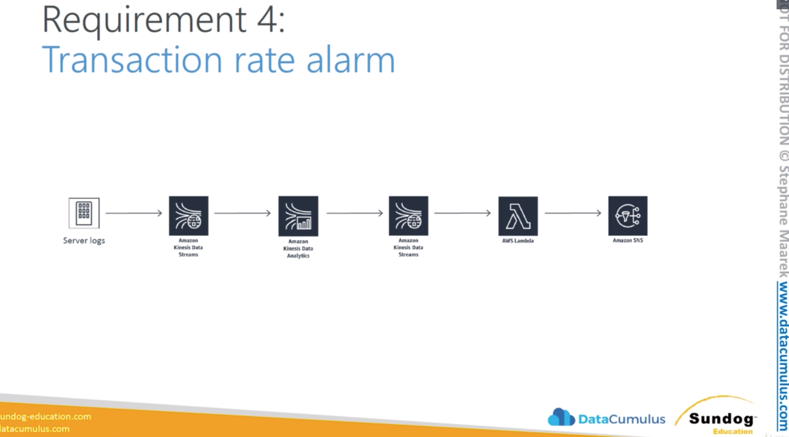
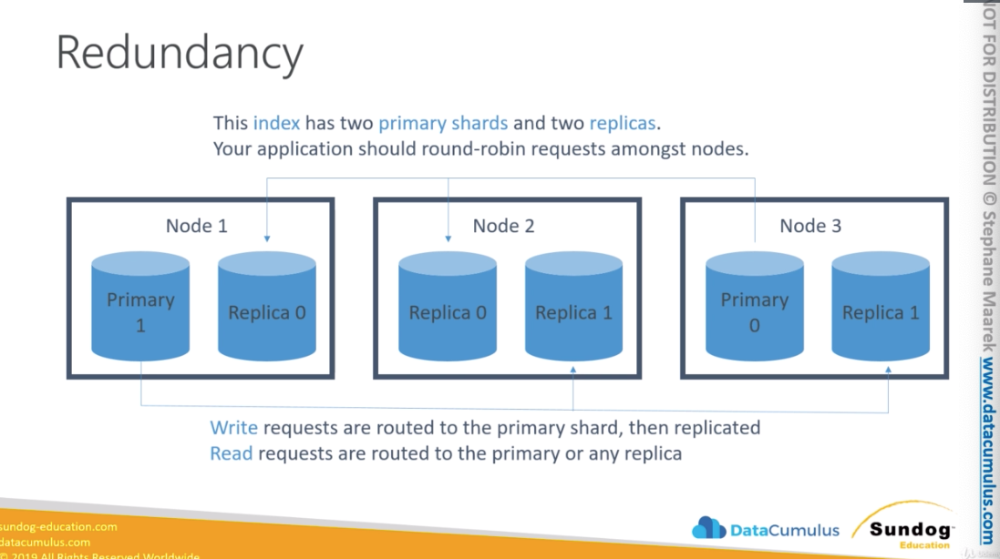

# Analysis

### Kinesis Analytics
* Querying streams of data (similar to spark streaming)
* Kinesis data analytics can receive data from Amazon Kinesis Data Streams or
  Firehose
* Just like in Spark Streaming Analytics you can set windows you can look back
  and aggregate the data, and analyse data across.
* Always receiving never ending data and you can write SQL to analyze data and
  turn around and split out the results to another stream or analytics tools of
  your choice.
* There are 3 main parts of Kinesis Analytics:
  * Source / Input data: this is the data to be streamed is coming from. The
    data come cam from Data Streams / Firehose. You can also optionally
    configure a reference data source to enrich your data stream within the
    application, that is resulted in a reference table. Some sort of a lookup
    data that you want to refer to within your SQL in your analytics job. In
    order to use it, you need to store your reference data as an object in S3.
    When Kinesis Analytics starts it will read the S3 object and create an
    in-application table, so you can refer to that data you wish.
  * Realtime Analytics: here sits the application code. Where the actual
    analysis happens and it's going to perform realtime analytics just using SQL
    queries on your stream of information. The stuff that forms the application
    code is just an SQL code, these are SQL statements which will be processed
    on the streaming data and reference table. It can operate on windows on
    time, so you can look back to fix time period as new data has been received.
      * There can be multiple applications e.g. multiple in-app streams that can
        differently process data and send this data to different destinations.
        One in-application stream can process data every 10seconds and the other
        in-application can pick up this data an do something with it every 1
        minute.
  * Destinations: Where the processed data will go. Once the data is processed
    it can be sent to Kinesis stream back again or to another Firehose stream.
    From there is can go where you want. Lambda can be involved too. If errors
    are encountered, those are sent to the Error stream. Kinesis Analytics will
    provide an Error stream for every application. If the application has
    problems to process any records that error will be written into Error
    Stream.

#### Kinesis Analytics Use Cases
* Streamin ETL
  * You can built an application that continiously reads data stored in a
    Kinesis Stream, organize that data by the sensor type, remove that data,
    normalize the data per specified schema and deliver that data to Amazon S3.
* Continuous metric generation
  * You can build a live leader board for a mobile game. By generating it every
    minute and send it to Amazon DynamoDB. You can check the traffic of your
    website by calculating the number of unique visitors every 5 minuts or so
    and sending the processs results to Amazon Redshift for further analysis.
* Responsive analytics
  * In application computing the availability or success metric of a customer
    facing API overtime and send those results to Amazon CloudWatch. 
  * You can use Kinesis Analytics ---> Kinesis Streams ---> SES to notify a
    customer.

#### Kinesis Analytics
* Pay only for resources consumed (but it's not cheap)
* Serverless; scales automatically
* Use IAM permissions to access streaming source and destination(s)
* Schema discovery
  * How the column names are in your SQL found
  * Can analyze the incoming stream and infer the schema

#### RANDOM_CUT_FOREST
* Detects anamalies and outliers in a streaming data
* SQL function used for anomaly detection on numeric columns in a stream
* They're especially proud of this because they published a paper on it
* It's a novel way to identify outliers in a data set so you can handle them
  however you need to
* Example: detect anomalous subway ridership during the NYC marathon

* While you might in turn connect S3, Redshift, or Lambda to your Kinesis Analytics output stream, Kinesis Analytics must have a stream as its input, and a stream as its output.
* If a record arrives late to your application during stream processing, what happens to it? The record is written to the error stream
* You have heard from your AWS consultant that Amazon Kinesis Data Analytics elastically scales the application to accommodate the data throughput. What though is default capacity of the processing application in terms of memory? Kinesis Data Analytics provisions capacity in the form of Kinesis Processing Units (KPU). A single KPU provides you with the memory (4 GB) and corresponding computing and networking. The default limit for KPUs for your application is eight.
* You have configured data analytics and have been streaming the source data to the application. You have also configured the destination correctly. However, even after waiting for a while, you are not seeing any data come up in the destination. What might be a possible cause? Issue iwth IAM role, Mismatched name for the output stream, Destination service is currently unavailable

### Amazon Elasticsearch Service
* Petabyte-scale analytics and reporting
* Elasticsearch started as a search engine but it's not a search engine anymore.
  It's more for analysis and reporting.
* For some applications it can analyse massive data sets much faster than Apache
  Spark can do it. For the right source of queries ES can be a good choice for
  getting answers back really quickly across massive data sets across an entire
  cluster

#### What is Elasticsearch?
* The elastic stack (Elasticsearch is just a component of the stack):
* Elasticsearch is distributed version of Lucene. They took the open source
  version of Apache Lucene and made it distributed so it can work across many
  machines. It's has expanded over the year to include more tools
* A search engine
* An analysis tool
* A visualization tool (Kibana)
  * You can store a semi-structured data
* A data pipeline (Beats / is package of Beats LogStash)
  * Feed data at scale to Elasticsearch
  * Import from other sources data into Elasticsearch cluster
  * You can use Kinesis too
* Horizontally scalable
  * Lucene scaled out indifinetely
* Kibana + ElasticSearch is a good alternative to Google Analytics

#### Elasticsearch applications
* Analysing logs is the market of Elasticsearch or a niche that they cover
* Full-text search
* Log analytics
* Application monitoring
  * Based on incoming log data to visualize what happens in realtime
  * Adobe uses ES can easily see traffic patterns and error rates for developers
* Security analytics
* Clickstream analytics
  * [Hearst cooperation use case how to build clickstream engine](https://www.youtube.com/watch?v=6cwbbqi36k8)
  * [slides](https://www.slideshare.net/AmazonWebServices/bdt306-how-hearst-publishing-manages-clickstream-analytics-with-aws)

#### ElasticSearch Main Concepts
* Documents: Documents are the things you#re searching for. They can be more
  than text - any structured JSON data works. Every document has a unique ID,
  and a type.
* Types: A type defines the schema and mapping shared by documents that
  represent the same sort of thing. (a log entry, an encyclopedia article etc.)
  (deprected). Thing about documents and indicies, but in an exam it could be
  asked.
* Indices: An index powers search into all documents within a collection of
  types. They contain inverted indicies that let you search across everything
  within them at once.
    * An index is split into shards
    * Documents are hashed to a particular shard
    * Each shard may be on a different node in a cluser
    * Every shard is a self-contained Luecene index of its own (every shard is
      it's own little mini search engine)

#### Redundancy
* This index has to primary shards and two replicas.
* Your application should round-robin request among nodes.
  * So you don't need to put that load just only on the primary shard 
  * You can use those replica nodes to expand your read throughput as well
* Write request are routed to the primary shard, then replicated to how many
  replicas you specify
* Read request are routed to the primary or any replica

#### Amazon Elasticsearch Service
* Fully-managed (but not serverless)
  * You need to think about how many servers do you need (nodes)
* Scale up or down without downtime
  * But this isn't automatic
* Pay for what you use
  * Intance-hours, storage, data transfer
* Network isolation
  * With Amazon VPC
  * Encrypt your data at rest and in transit
* AWS integration
  * S3 buckets (via Lambda to Kinesis)
    * Use Lambda as Glue between S3 and pipe the data to Kinesis
  * Kinesis Data Streams
  * DynamoDB Streams
  * CloudWatch / CloudTrail
  * Integrates with IoT services of AWS
  * Zone awareness
    * You can allocate ES nodes across two different availability zones in the
      same region, by doing that you can increase your availability of each
      service but it can increase latency

#### Amazon ES options
* How many dedicated master node(s)
  * How many of them and what instance type 
* Domains
  * AWS service domain is a collection of all the resources needed to run an ES
    cluster. It contains all the configuration for the cluster as a whole. So
    basically a cluster in Amazon ES is a domain
* Snapshots to S3
  * For data backup processes. If you accidentally shutdown your cluster you
    will keep the data
* Zone Awareness
  * Increased availability on the price of higher latency

#### Amazon ES Security
* Resource-based policies
  * You can attach those to the service domain. That determines what actions
    principals can take on Elastic Search API's. Where principals are users, an
    account or a role that can be granted access.
* Identity-based policies
  * Using AIM policies
* IP-based policies
  * To tight specific actions to specific IP ranges
* Request signing
  * Sign your request. When you send a request from AWS SDK's to ES. You need
    digitally sign all the request are going in. So they're basically secure the
    traffic in flight. 
* VPC
  * You can put a cluster into a VPC instead of making it public. VPC is not
    accessible from the outside world. But it makes it hard to connect to your
    cluster and use tools like Kibana
  * You have to decide upfront if your cluster is going to live in the VPC or be
    publically accessible. You can't change that later.
* Cognito
  * It integrates with Cognito and primarily it used in the context with Kibana.

#### Securing Kibana
* If you host your cluster inside a VPC, how to you access Kibana. You have to
  access Kibana through a web interface.
* Cognito - The simplest way to do it using Cognito. It allows users to log into
  Kibana though an enterprise identity provider such as microsoft active
  directory using Saml 2.0 or Google, Amazon, Facebook. Cognito allows you to
  access the cluster via Kibana even if it's inside a VPC. 
* Getting inside a VPC from outside is hard...
  * Some ways around it
    * Nginx reverse procy on EC2 forwarding to ES domain
    * SSH tunnel for port 5601 (which is what Kibana listens on)
    * VPC Direct connect
    * VPN

#### Amazon ES anti-patterns
* OLTP
  * No transactions
  * RDS or DynamoDB is better
* Ad-hoc data querying
  * Athena is better
* Remember Amazon ES is primarily for search and analytics
