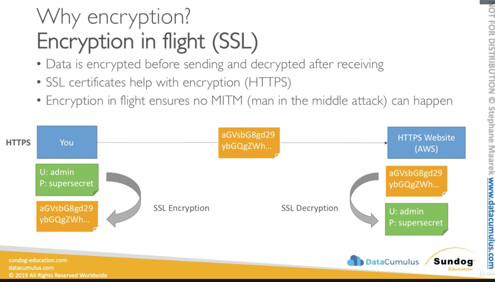

# AWS Security & Encryption
* KMS, Encryption SDK, SSM Parameter Store

### Why encryption?
#### Encryption in flight (SSL)
* When I send very sensitive information e.g. credit card to a server to make a
  payment online, I want to make sure that no one where my packet is going to
  travel no one can see my credit card number.
* Data is ecrypted before sending and decrypted after receiving (only me and
  server knows how to do this things)
* SSL certificates help with encryption (HTTPS)
* Anytime we are dealing with an AWS service and it has an HTTPS endpoint that
  guarantee us that there is encryption in flight.
* Encryption in flight ensures no MITM (man in the middle attack)
* Only a server knows how to decrypt the information received from a client. A
  client encrypts the information that it wants to send.

#### Server side encryption at rest
* Data is encrypted after being received by the server 
* The server stores the data on its disk and encrypts the data
* Data is decrypted before being sent back to our client
* It is stored in an ecnrypted form, thanks to a key (usually a data key)
* The encryption / decryption keys must be managed somewhere and the server must
  have access to it. Usually it's called a KMS (Key Management Service). A
  server must **have the right** to talk to that KMS.

#### Client Side Encryption
* Data is encrypted by the client (us) and never decrypted by the server
* Server stores the data but don't know what the data is
* Data will be decrypted by a receiving client
* The server should not be able to decrypt the data
* Could leverage Envelope Encryption

